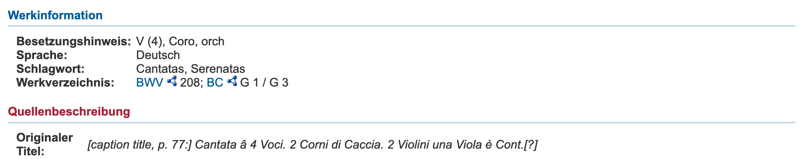
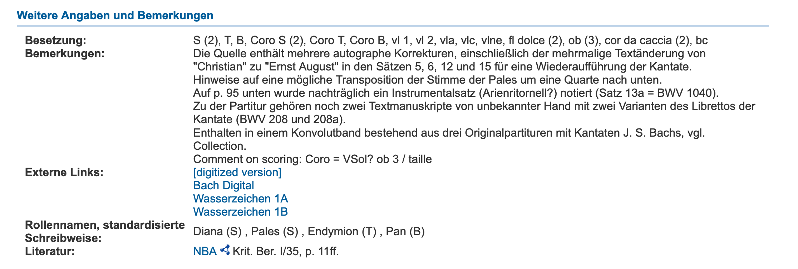

**+++ ACHTUNG: zu überarbeiten: klingend/notiert ist falsch / Grundstimmung / obertonreine Stimmung / relative Stimmung bleibt? +++**
# Erschließungspraxis bei Instrumentalbesetzungen

Im folgenden Kapitel soll, ausgehend von der derzeitigen Praxis bei der Erschließung von Quellen mit musikinstrumentenbezogenen Metadaten, eine exemplarische Bestandsaufnahme der Problemstellung – hier am Beispiel eines RISM-Datensatzes[^8661] versucht werden. Die Kenntnis dieser bildet die Grundlage für das Entwickeln denkbarer Lösungsansätze.
Um ein möglichst breitgefächertes Bild zeichnen zu können, ist es eingangs geeignet, eingangs jeweils ein Beispiel aus dem bibliothekarischen Umfeld, dem Museumswesen sowie aus dem Editionswesen zu untersuchen.

Es finden sich im Datensatz[^23b1] an zwei [**auch bei "Besetzungshinweis"**] Stellen Informationen zur Besetzung: Zum einen unter "Quellenbeschreibung / Originaler Titel" (MARC-Feld #245\$a (Title))[^9a22] der String "Cantata â 4 Voci. 2 Corni di Caccia. 2 Violini una Viola è Cont.[?]".

Zum anderen unter "Weitere Angaben und Bemerkungen" im Unterfeld "Besetzung" (MARC-Feld #594$a (freies Feld))[^1d26]. 

Dabei scheint es sich um ein kontrolliertes Vokabular zu handeln.[^8647] Mehreres fällt an dieser Stelle auf:

1. Die Bezeichnungen der Instrumente in Originaltitel und im Feld "Besetzung" weichen voneinander ab (etwa "Corn[o] da Caccia" vs. "cor da caccia").
2. Die Besetzung in den MARC/XML- bzw. RDF/XML-Dateien ist nicht maschinenlesbar.[^eaa6]
3. Auch auf der Benutzeroberfläche sind die (teils kryptischen) Abkürzungen nicht mit einem Vokabular oder einer disambiguierenden Seite verlinkt.
4. Die Bezeichnung *cor da caccia*[^1807] ist ungebräuchlich und somit als normierter Term – zumal ohne Disambiguierung – wenig geeignet.

Die Vieldeutigkeit des Terms *cor da caccia* lässt sich dabei auch durch eine Internetrecherche nicht einfach lösen: Die Google-Suche[^43a9] ergibt neben Treffer zum *Corno da Caccia* auch viele Treffer zu Oboen-Instrumenten wie der *Oboe da Caccia*, dem *Englischhorn* oder zu einem modernen terompetenartigen *Corno da Caccia* mit Ventilen.[^714c]

Tatsächlich handelt es sich bei der Frage um die Verwendung von Blechblasinstrumenten in der Musik Bachs um auch in der Musikwissenschaft umstrittene Fragestellungen.[^8646] Doch lassen sich durch Konsultation des autographen Quellenmaterials[^cbf9] durchaus gewisse verbindliche Aussagen treffen:

* Die Instrumente sind in F gestimmt – das in F-notierte "eingestrichene c" (c') entspricht, dies wird im Bezug zum Basso Continuo deutlich, dem klingenden "kleinen f" (f).
* Es handelt sich aufgrund der stereotypen Stimmführung zwischen den Instrumenten keineswegs um oboenartige Instrumente, sondern um Blechblasinstrumente.
* Angesichts der Lage und der Stellung der Naturtöne lässt sich eine Aussage in Bezug auf die Länge und den Ambitus des Instruments treffen.
* Eingedenk der raumzeitlichen Dimension in der das Stück entstanden ist, ließen sich Verbindungen zu änhlichen erhaltenen Instrumenten herstellen.

Gleichwohl eine solche Erschließungstiefe nicht notwendigerweise bei der Katalogisierung vorausgesetzt werden kann, handelt es sich bei diesen Schlüssen doch um wesentliche Informationen, die eine Disambiguierung – eigentlich Sinn und Zweck eines kontrollierten Vokabulars – in diesem Fall überhaupt erst ermöglichen. **[Das ist gerade bei Instrumenten wichtig, da diese keineswegs eindeutig sind (besonders zu der Zeit)]** Doch auch eine alternative Benennung als "Corno da Caccia"[^008d] würde wenig zur eigentlichen Begriffsbestimmung beitragen können. Es wird deutlich, dass die semantische Eindeutigkeit der hier untersuchten Entität – wie auch immer sie benannt sein mag – sich letztlich vor allem durch ihre Eigenschaften (Stimmung, Lage etc.) und ihrer Beziehungen zu anderen Entitäten (etwa dem historischen Instrumententyp, der sich in einem Objekt manifestieren könnte) ergibt.[^aafd] Erst mit diesen versehen, hat der Term *cor da caccia* eine aussagekräftige Bedeutung.

# Desiderat

Mit Blick auf die am Beispiel des RISM-Datensatzes identifizierten Mängel und Chancen lassen sich mehrere Schlüsse ziehen:

1. Es liegt auf der Hand, dass das verwendete Vokabular nicht ideal ist. Abgesehen von der offenbarten Unschärfe ist das Vokabular nicht öffentlich einsehbar[^c1f9] – terminologische Kontrolle somit nicht nachvollziehbar. Um ein alternatives Vokabular zu verwenden, wäre eine philologische Auswertung verfügbarer Klassifikationen und Taxonomien bzw. entsprechender Crosskonkordanzen hinsichtlich ihrer Präzision und Anwendbarkeit erfolgsversprechend.[^8648]
2. Es sind noch eine Vielzahl weiterer – wie gezeigt wurde: durchaus signifikanter – Aussagen zum verwendeten Instrumentarium sinnvoll.
3. Leider mangelt es an etabliertem, geschweige denn maschinenlesbarem Vokabular, solcherlei Aussagen in eindeutiger Weise treffen zu können.

Wie bereits dargestellt ist eine ausführliche Auseinandersetzung mit musikinstrumentalen Klassifikationen und Taxonomien im Umfang dieser Arbeit nicht sinnvoll. Das augenscheinliche Fehlen von Ausdrucksfähigkeit in Bezug auf bestimmende Eigenschaften von Musikinstrumenten hingegen birgt enormes Potential und bildet mangels entsprechender Vorarbeiten ein wichtiges Desiderat.

Für den Fortgang dieser Arbeit erscheint dabei die Klärung der folgenden Fragestellungen als insbesondere relevant:

1. Welche Eigenschaften fehlen in den einschlägigen Vokabularen?
2. Existieren bereits Vokabulare, womöglich auch aus dem nicht-musikalischen Bereich, die prinzipiell imstande wären, gewünschte Sachverhalte abzubilden?
3. Welche Aussagen können vermöge dieser Vokabulare nicht getroffen werden?
4. Welche Mittel können ergriffen werden, um diese Aussagen doch zu ermöglichen?

Zu 1.: Es existieren zahllose Musikinstrumente. Diese wiederum besitzen unzählige charakteristische Eigenschaften. Es erscheint daher unumgänglich, sich in dieser Arbeit auf ein Instrument oder auf eine Instrumentengruppe zu beschränken. Dieser Schritt ist auch insofern legitimiert, indem die Demonstration grundsätzlicher ontologischer Zusammenhänge eine heuristische Übertragbarkeit des in der Arbeit entwickelten Modells zulässt. Dieser Legitimierung eingedenk bedient sich diese Arbeit deshalb auch in ihrem weiteren Fortgang exemplarisch vornehmlich des bereits eingeführten Beispiels.

Bereits im vorhergehenden Kapitel waren einige Eigenschaften benannt worden, die als bestimmende Eigenschaften des *cor da caccia* (und zwar jenes Typs, der in BWV 208 Verwendung finden sollte) identifiziert wurden. Dies waren etwa:

* Stimmung[^4ee1]
  * sowohl relative Stimmung[^d355]
  * als auch absolute Stimmung[^3141]
  * als auch Temperatur[^fd29]
* Instrumententyp (also etwa als Mapping zu einer Hornbostel und Sachs-Klassifikation: **xxxxx**[^17ba])
* Ambitus[^1389]
* historische Äquivalente, oder, falls bekannt, Objekt
* daraus: Material

Darüber hinaus wären – je nach Verwendungskontext – weitere Eigenschaften denkbar, wie:

* Verwendung in BWV 208
* Interpret
* etc.

Die kontrollierte, maschinenlesbare Darstellbarkeit dieser Eigenschaften in Bezug zu einer ohne sie allzu undifferenzierten und unspezifischen Entität *cor da caccia* wird es sein, die als Indikator für ein Gelingen des Ziels dieser Arbeit auf praktischer Ebene fungiert. Zugleich trägt die gemeinsame Anwendung von Aspekten aus unterschiedlichen Domänen, wie sie oben abgebildet sind[^429c], eine implizite vorläufige Aussage zur Vernetzbarkeit und den Chancen, die diese birgt, in sich.

## Anwendungsbeispiel

aus der Perspektive von RISM – allerdings auch aus jeder anderen Perpektive (Sucheinstieg) mögl.

Als einfaches "Domänenmodell"[^8659] am Beispiel des RISM-Datensatzes exemplifiziert (wobei auch jede andere Datenbank gleichermaßen gut herhalten könnte) wäre etwa das folgende Szenario denkbar: Entweder innerhalb des Datensatzes eingeblendet, oder als Verlinkung aus dem String *cor da caccia* heraus ließe sich die Kombination geeigneter Eigenschaften aufrufen. Möglich wären weitere Verlinkungen etwa zu ähnlichen Sammlungsobjekten, zu disambiguierenden Normdaten oder zu weiteren nützlichen Informationen. Umgekehrt erzielte eine Suche mit einer entsprechenden Kombination indizierter Terme – etwa über die RISM SPARQL-Schnittstelle – zumindest den erwähnten Datensatz als Treffer. Eine wesentlich differenziertere und vielfältigere Suche über Spartengrenzen hinweg wäre somit ermöglicht.

![Sucheinstieg über RISM – Bildrechte blabla Naturtonreihe: [@ahrens_horner_2016]](20200320_Anwendungsbeispiel.001.png)

## Datenschema

Insgesamt erscheint es als sinnvoll, zuerst die bereits in Kapitel #Desiderat angerissenen Anforderungen nochmals zu schärfen und aus ihnen ein Modell zu generieren, das künftig als diskursive Grundlage für die spätere "dokumentationssprachliche" Ausarbeitung herhalten kann.
So wird außerdem gewährleistet, dass sich das Anwendungsprofil an den tatsächlichen in der Praxis vorgefundenen Erfordernissen ausrichtet und sich nicht etwa "in vorauseilendem Gehorsam" anhand der bereits etablierten Darstellungsmöglichkeiten selbst zensiert und beschneidet. (In Vorgriff auf die terminologische Ausarbeitung heißt dies etwa: domänenspezifische Vokabulare dahingehend zu untersuchen, ob sie in der Lage sind, das Geforderte abzubilden und andernfalls nach Möglichkeiten zu suchen, diese Darstellungsmöglichkeiten selbst zu schaffen.)
Jedoch darf diese scheinbare Übersimplifizierung, die zunächst also jederlei Eindeutigkeit – etwa in Form von Normdaten – vermeidet, keineswegs als solche missverstanden werden. Vielmehr bildet sie die eigentliche Prämisse für spätere grundsätzliche terminologische Anschlussfähigkeit und Interoperabilität, indem sie sich nicht auf bestimmte gebräuchliche Datenstrukturen oder eine bestimmte Domäne fixiert. 

### Domäne[^8660]

1) Dies wird etwa im Falle der Entität *BWV 208* deutlich: Das "Label" "BWV 208" referenziert hier die Kantate auf Werkebene und fungiert als Platzhalter[^8650] für eine Expression[^8651] (etwa der in RISM beschriebenen Quelle),[^8649] einer Manifestation[^8652] (etwa einer Edition), oder aber auch eines Exemplars[^8653] (etwa einer, freilich illegal, mit Bleistift eingerichteten Ausgabe in einer Bibliothek).

2) Über die Beziehung "Besetzung" mit der Entität Werk verbunden ist die Entität *Corno da caccia*, im Modell mit dem – willkürlichen – Label "cor da caccia", der Terminologie von RISM folgend, versehend. Auch an dieser Stelle ist das Label völlig flexibel – analog also zur Entität *BWV 208*.

Diese beiden Entitäten sind diejenigen, die herkömmlicherweise – wie im RISM-Datensatz exemplarisch demonstriert – die Erschließungstiefe in den allermeisten Datenbanken ausfüllen.
Die Entitäten dieses Bereichs sind institutions-, sparten-, domänenspezifisch sowie bereits etabliert und stehen daher für dieses Metadatenprofil nicht zur Disposition. Das Datenmodell kann daher an dieser Stelle  keinen präskriptiven Charakter für sich beanspruchen, und auch eine Weiterentwicklung dieses erscheint hier müßig. -> **darauf zurückkommen und sagen, wo was gemacht werden kann** 

### Mapping

Beim Mapping-Anteil steht einerseits die Vernetzung zwischen Objekt und Werk im Vordergrund, zum anderen kann hier die Disambiguierung unklarer Terminologie erfolgen.
Die Anbindung der Besetzungsentität *Corno da caccia* an die Objekt-Entität – in diesem Fall verkörpert durch ein Objekt des Musikinstrumentenmuseums der Universität Leipzig[^8654] – kann in zweierlei Weise erfolgen:

3) durch ein direktes In-Beziehung-Setzen mit der Entität *Corno da Caccia*. Hier sind mehrere Arten der Beziehung denkbar: 
- Einerseits könnte es sich beim Objekt um exakt jenes handeln, das Bach für das Werk besetzt hatte.[^8655].
- In den meisten Fällen jedoch wird eine dermaßen eindeutige Beziehung nicht nachzuvollziehen sein. Vielmehr wird – wie ja auch im Falle von BWV 208 – auf ein ungefähres Äquivalent zu verweisen sein.

4) durch das Mapping über eine zwischengelagerte Klassifikation. Dieses erscheint etwa im hier verwendeten Falle sinnvoll, um den Term "cor da caccia" weiter zu disambiguieren. **für die Zukunft: wenn man mit MIMO verlinkt, kann der Typ inferenziert werden (MIMO-Thesaurus)!!** Unsinnig erscheint dieser Ansatz hingegen, wenn im Bereich der Domäne ein maschinenlesbares und bereits gemapptes Standardvokabular (etwa GND, IAML MoP etc.) Verwendung findet – auch wenn diese mitunter, wie bereits erwähnt, mitunter sehr zu wünschen übrig lassen.

### Anreicherung

Nachdem die Besetzungsentität durch Verknüpfung mit einem Objekt bzw. einer Klassifikation eindeutig bestimmt worden ist, ist es wünschenswert, sie durch weitere Aussagen anzureichern und dadurch noch aussagekräftiger zu machen.

5) Die Hörner sind im Autograph "in F" notiert – der tatsächliche Klang der in F notierten Töne der Hornstimme liegt also eine Quinte tiefer. Dies wird durch die Beziehung der Besetzungsentität zu ihrer relativen Stimmung "in F" ausgedrückt. Auch für das Objekt könnte bekannt sein, dass es in F gestimmt ist (= das Instrument produziert Töne der sog. *Naturtonreihe* über dem Ton *f*), was im hier behandelten Szenario jedoch nicht der Fall ist.[^8656]

> Aus diesem Umstand lassen sich – zumindest für die Zeit bis zur Erfindung des Ventilhorns – sehr facettierte Aussagen zum vorgesehenen Instrument treffen (Länge, Mensur etc.), deren Darstellung jedoch für den begrenzten Rahmen dieser Arbeit keine Rolle spielen kann. Außerdem liefert die Angabe der Stimmung der Hörner – ebenfalls begrenzt auf die Zeit bis zur Erfindung des Ventilhorns – einen Indikator für die Bestimmung der Tonart (wie auch im Fall von BWV 208: Die Kantate steht in F-Dur).

6) Der Besetzungsentität ist in ihrer Eigenschaft als Besetzung für *BWV 208* ein bestimmter Tonvorrat zu eigen, der sich durch die Entität *Ambitus* ausdrückt. Dieser wiederum setzt sich aus einer Tonmenge zusammen, die durch die beiden Entitäten des höchsten und des tiefsten Tons eingegrenzt wird.

>Die Kenntnis des Ambitus' lässt in wissenschaftlicher Hinsicht vielerlei Rückschlüsse zu: etwa auf die Länge des Instruments (Faustregel: kürzer = höher). Für Musiker (etwa Anfänger) kann diese Information selbstverständlich bei der Suche nach Noten ebenfalls außerordentlich nützlich sein.

7) Im in dieser Arbeit gewählten Szenario ist aus physikalischen Gründen das Stimmungssystem des *Corno da caccia* eindeutig und kann hier berücksichtigt werden.[^8657] Tatsächlich ist das Bestimmen historisch verwendeter Stimmungssysteme in vielen Fällen weit weniger eindeutig.

8) Über die absolute Stimmung der ursprünglich vorgesehenen Instrumente, wie auch für das Objekt *MIMUL 1663* selbst, lässt sich keine eindeutige Aussage treffen. Gleichwohl ist diese Entität grundsätzlich durchaus als aufschlussreich für die Wissenschaft anzusehen.[^8658] Somit handelt es sich bei der Angabe *a* = 415 Hz um einen vermuteten Wert, und es ergibt sich für den Fortgang der Arbeit die Frage, ob es in einem späteren Datenmodell auch möglich sein wird, auch Ambivalenzen und Unsicherheiten dieser Art abzubilden.

9) Über die Beziehung "Klangbeispiel" ist es möglich, die Objektentität oder die Typ-Entität mit einem Klangbeispiel zu verknüpfen. Selbstverständlich wäre dies im gleichen Maße auch für eine Werkentität denkbar.

10) Denkbar ist, dass eine Person – etwa im Rahmen einer Audioaufnahme – auf einem bestimmten Instrument spielt. Hier wäre also eine Verknüpfung zwischen Besetzung (evtl. Werk), Person und Objekt nützlich.

Tatsächlich sind den potentiellen Anwendungsszenarien eines solchen Modells keine Grenzen gesetzt. Angesichts der Komplexität und der vielfältigen spezifischen Anforderungen, die trotz der Beschränkung auf BWV 208 und das *Corno da caccia* erarbeitet wurden, lässt sich bestenfalls erahnen, welches Darstellungspotential eine Erweiterung des Modells für andere Instrumente und Instrumentengruppen birgte: Es ließe sich etwa die Skordatur von Saiten ausdrücken. Oder verschiedene Sing- und Spieltechniken – vom Jodeln bis zum Spiel *con sordino* etc.

Eine zentrale Erkenntnis des vorangehenden Kapitels war die Einteilung der Entitäten und Beziehungen in drei verschiedene Bereiche, die bereits in den Zwischenüberschriften vorweggenommen wurden:

1. Domäne
2. Mapping und Disambiguierung
3. Anreicherung

Während der Bereich der Domäne für diese Arbeit unantastbar bleiben muss, konnte der Fokus der Arbeit und somit die Funktion eines zu entwickelnden Metadatenprofils auf die Punkte

* Mapping und Disambiguierung

sowie

* Anreicherung

gebündelt werden.

---

[^9a22]: [@noauthor_marc_nodate-2]

[^1d26]: [@noauthor_marc_nodate-3]

[^1807]: Es scheint sich hier um einen multilingualen synthetischen Neologismus aus den französischen und italienischen Begriffen *cor de chasse* und *corno da caccia* zu handeln.

[^eaa6]: Sie sind daher selbstverständlich auch nicht über den RISM SPARQL Endpoint suchbar.

[^43a9]: Durchgeführt am 31.01.2020 LINK

[^8646]: [@TN_libero_mab2197075]

[^714c]: Wie bereits erwähnt, ist es nicht Ziel dieser Arbeit, klassifikatorische Fragestellungen zu Musikinstrumenten zu untersuchen.

[^cbf9]: Johann Sebastian Bach, "Was mir behagt ist nur die muntre Jagd", in: *3 Kantaten, 1 Instrumentalstück*, D-B Mus.ms. Bach P 42, S. 77.

[^008d]: Vgl. [@noauthor_vizskos_nodate]

[^aafd]: x **das muss näher erklärt werden, durch Literatur abgesichert werden.**

[^c1f9]: RISM selbst konnte zunächst keine Angaben zu dem verwendeten Vokabular geben – vermutlich habe eine Kollegin eine Datei gespeichert (Anfrage und Korrespondenz am 31.01.2020).

[^4ee1]: [@auhagen_stimmung_1998-1] 07.02.2020.

[^17ba]:

[^1389]: s. o.

[^23b1]: [@noauthor_20200131_was_nodate]. BWV 208 (http://d-nb.info/gnd/300009178) **<- Fußnote bearbeiten!!**

[^429c]: Stimmung, Werk aus dem bibliographischen Bereich; Objekt, Material, Instrumententyp aus dem organologischen, musealen Bereich; Fragen zu Werk, Interpretation aus dem Bereich der historischen Musikwissenschaft bzw. dem Editionswesen.

[^d355]: Wie sie etwa in der Bezeichnung "in F" (der Grundton *f* also nicht anhand seiner Frequenz fest definiert) gemeint ist.

[^3141]: Etwa *a* = 440 Hz.

[^fd29]: Etwa die mitteltönige Stimmung einer Orgel.

[^8647]: Hierbei handelt es sich laut RISM um ein internes Vokabular, das nicht unmittelbar einsehbar ist (s. Fußnote [^c1f9]).

[^8648]: Tatsächlich existieren bereits dank des DOREMUS-Projekts **Link** Mappings etwa zwischen dem IAML Medium of Performance-Vokabular **Link** und MIMO **Link**. Laut Korrespondenz mit RISM ist zudem die Erstellung eines neuen RISM-Thesaurus' mit entsprechenden Mappings für 2022 vorgesehen.

[^8649]: Zur spezifischen Problematik des an dieser Stelle verwendeten  FRBR/FRAD-Modells bei Werken der Musik s.  [@bicher_normdaten_2018, S. 225].

[^8650]: In den sogenannten *Functional Requirements for Bibliographic Data*, deren Entitätenmodell an dieser Stelle verwendet wird, heißt es: "Ein Werk ist eine abstrakte Entität; es gibt keinen entsprechenden materiellen Gegenstand." ([@arbeitsstelle_fur_standardisierung_funktionelle_2006, S. 16]).

[^8651]: [@arbeitsstelle_fur_standardisierung_funktionelle_2006, S. 18–20.]

[^8652]: [@arbeitsstelle_fur_standardisierung_funktionelle_2006, S. 20–22.]

[^8653]: [@arbeitsstelle_fur_standardisierung_funktionelle_2006, S. 22–23.]

[^8654]: Und somit strenggenommen ebenfalls eine domänenspezifische Entität. **in MIMO verlinken**

[^8655]: Ein gleichermaßen illustratives wie auch charmantes Beispiel für eine solche Beziehung wären etwa Leopold Mozarts und Johann Ernst Eberlins Komposition "Der Morgen und der Abend" ([@mozart_eberlin_morgen_nodate]) für das "Hornwerk" der Festung Hohensalzburg aus dem 16. Jahrhundert, dem sog. *Salzburger Stier* ([@hocker_mechanische_2016]). (Ein lohnenswerter klanglicher Eindruck lässt sich hier gewinnen: [@noauthor_salzburger_nodate]).

[^8656]: Daher die gestrichelte Verbindungslinie zwischen Objekt und der Entität der relativen Stimmung.

[^8657]: Anders verhielte es sich freilich, würde mit dem hier definierten Schema beispielsweise eine Audioaufnahme einer Aufführung mit modernen Instrumenten erschlossen.

[^8658]: Etwa lassen die Stimmungen von unstimmbaren Instrumenten (Blockflöten, Zinken etc.) sehr präzise Rückschlüsse auf die historische Musikpraxis zu (vgl.: [@haynes_stimmton_2016]).

[^8659]: Nach Martin Fowler, dem Begründer des Modells: "An object model of the domain that incorporates both behavior and data." (vgl.:[@N_libero_mab2, S. 116]).

[^8660]: Da diese Arbeit angesichts ihres Fallbeispiels sehr stark RISM als primäre Domäne hervorhebt, kann gar nicht oft genug betont werden, dass jede andere relevante Domäne gleichermaßen im Vordergrund stehen könnte. So ist letztlich auch die Objektentität innerhalb einer Domäne, in diesem Fall dem Musikinstrumentenmuseum der Universität Leipzig, angesiedelt, das seinerseits sein Objekt mit dem RISM-Datensatz verlinken könnte, und dasselbe gilt selbstverständlich auch für Editionen, Bibliotheken, Archive, Wirtschaftsunternehmen etc.

[^8661]: Bei *RISM*, Akronym für *Répertoire International des Sources Musicales*, handelt es sich um "[...] ein länderübergreifendes, gemeinnützig orientiertes Unternehmen mit dem Ziel, die weltweit überlieferten Quellen zur Musik umfassend zu dokumentieren." (vgl.: [@noauthor_unternehmen_nodate]) Für die Musikwissenschaft stellt es das wichtigste Nachweissystem von historischem musikalischem Quellenmaterial (insb. bis etwa 1850) dar.