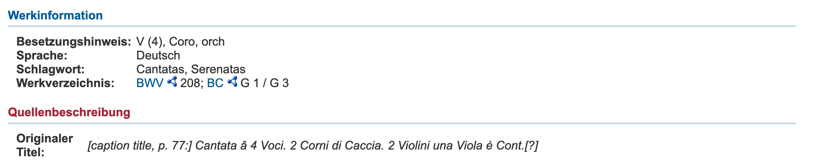
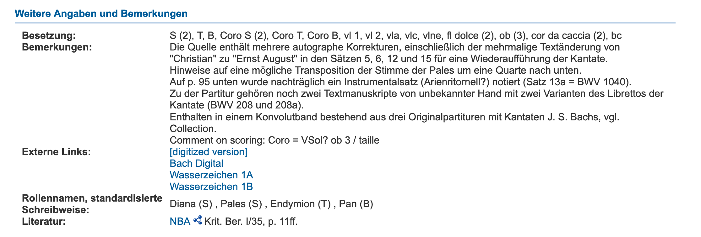

**in krit. Bericht bwv208 gucken, ob da etwas zur Instrumentationsproblematik steht**

# Erschließungspraxis bei Instrumentalbesetzungen

 *RISM* (*Répertoire International des Sources Musicales*) ist "[...] ein länderübergreifendes, gemeinnützig orientiertes Unternehmen mit dem Ziel, die weltweit überlieferten Quellen zur Musik umfassend zu dokumentieren."[^m1] Für die Musikwissenschaft stellt es das wichtigste Nachweissystem von historischem musikalischem Quellenmaterial (insb. bis etwa 1850) dar.

Im folgenden Kapitel soll, ausgehend von einem Datensatz von RISM exemplarisch die derzeitige Situation bei der Erschließung von Quellen mit musikinstrumentenbezogenen Metadaten untersucht und anhand dieser Untersuchung zu einer Problemstellung gefunden werden. Die Kenntnis dieser Problemstellung bildet wiederum die Grundlage für das Entwickeln denkbarer Lösungsansätze. 

Es finden sich im Datensatz[^mb23b1] an drei Stellen Informationen zur Besetzung: Zum einen unter "Quellenbeschreibung / Originaler Titel" (MARC-Feld #245\$a (Title))[^mb9a22] der String "Cantata â 4 Voci. 2 Corni di Caccia. 2 Violini una Viola è Cont.[?]". Hinzu kommt ein sehr allgemeiner Besetzungshinweis, der hier aber ausgeklammert werden kann.

Zum anderen unter "Weitere Angaben und Bemerkungen" im Unterfeld "Besetzung" (MARC-Feld #594$a (freies Feld))[^mb1d26]. 

Dabei handelt es sich um ein kontrolliertes Vokabular.[^mb8647] Mehreres fällt an dieser Stelle auf:

1. Die Bezeichnungen der Instrumente in Originaltitel und im Feld "Besetzung" weichen voneinander ab (etwa "Corn[o] da Caccia" vs. "cor da caccia").
2. Die Besetzungsangaben in den MARC/XML- bzw. RDF/XML-Dateien ist als String nicht "maschinenverstehbar".[^mbeaa6]
3. Auch auf der Benutzeroberfläche sind die (teils kryptischen) Abkürzungen nicht mit einem Vokabular oder einer disambiguierenden Seite verlinkt.
4. Die Bezeichnung *cor da caccia*[^mb1807] ist ungebräuchlich und somit als normierter Term – zumal ohne Disambiguierung – wenig geeignet.

Die Vieldeutigkeit des Terms *cor da caccia* lässt sich dabei auch durch eine Internetrecherche nicht einfach lösen: Die Google-Suche[^mb43a9] ergibt neben Treffer zum *Corno da caccia* vor allem Treffer zu Oboen-Instrumenten wie der *Oboe da Caccia*, dem *Englischhorn* oder zu einem modernen trompetenartigen *Corno da Caccia* mit Ventilen.[^mb714c]

Tatsächlich handelt es sich bei der Frage um die Verwendung von Blechblasinstrumenten in der Musik Bachs um auch in der Musikwissenschaft umstrittene Fragestellungen.[^mb8646] Doch lassen sich durch Konsultation des autographen Quellenmaterials[^mbcbf9] durchaus gewisse verbindliche Aussagen treffen:

 entspricht, dies wird im Bezug zum Basso Continuo deutlich, dem klingenden "kleinen f" (f).
* Es handelt sich aufgrund der stereotypen Stimmführung zwischen den Instrumenten keineswegs um oboenartige Instrumente, sondern um Blechblasinstrumente.
* Angesichts der Lage und der Stellung der Naturtöne lässt sich eine Aussage zu Länge des Instuments und spielbarem Ambitus treffen – der trompetenartige Typ des *Corno da caccia* scheidet aus.
* Eingedenk der raumzeitlichen Dimension in der das Stück entstanden ist, ließen sich Verbindungen zu änhlichen erhaltenen Instrumenten herstellen.

Gleichwohl eine solche Erschließungstiefe nicht notwendigerweise bei der bibliothekarischen Katalogisierung vorausgesetzt werden kann, [aber die könnten bspw. von der Erschließung im Rahmen Edition oder dgl. profitieren – Datenübernahme] handelt es sich bei diesen Schlüssen doch um wesentliche Informationen, die eine Disambiguierung – eigentlich Sinn und Zweck eines kontrollierten Vokabulars – in diesem Fall überhaupt erst ermöglichen. Doch auch eine alternative Benennung als "Corno da Caccia"[^mb008d] würde wenig zur eigentlichen Begriffsbestimmung beitragen können. Es wird deutlich, dass die semantische Eindeutigkeit der hier untersuchten Entität – wie auch immer sie benannt sein mag – sich letztlich vor allem durch ihre Eigenschaften (Stimmung, Lage etc.) und ihrer Beziehungen zu anderen Entitäten (etwa dem historischen Instrumententyp, der sich in einem Objekt manifestieren könnte) ergibt.[^mbaafd] Erst mit diesen versehen, hat der Term *cor da caccia* – und das trotz der Uneindeutigkeit seiner Bezeichnung – eine aussagekräftige Bedeutung.

# Desiderat

Mit Blick auf die am Beispiel des RISM-Datensatzes identifizierten Mängel und Chancen lassen sich mehrere Schlüsse ziehen:

1. Es liegt auf der Hand, dass das verwendete Vokabular nicht ideal ist. Abgesehen von der offenbarten Unschärfe ist das Vokabular nicht öffentlich einsehbar – terminologische Kontrolle somit nicht nachvollziehbar. Um ein alternatives Vokabular zu verwenden, wäre eine philologische Auswertung verfügbarer Klassifikationen und Taxonomien bzw. entsprechender Crosskonkordanzen hinsichtlich ihrer Präzision und Anwendbarkeit erfolgsversprechend.[^mb8648]
2. Es sind noch eine Vielzahl weiterer – wie gezeigt wurde: durchaus signifikanter – Aussagen zum verwendeten Instrumentarium sinnvoll.
3. Leider mangelt es an etabliertem, geschweige denn maschinenlesbarem Vokabular, solcherlei Aussagen in eindeutiger Weise treffen zu können.

Wie bereits dargestellt ist eine ausführliche Auseinandersetzung mit musikinstrumentalen Klassifikationen und Taxonomien im Umfang dieser Arbeit nicht sinnvoll. Das augenscheinliche Fehlen von Ausdrucksfähigkeit in Bezug auf bestimmende Eigenschaften von Musikinstrumenten hingegen birgt enormes Potential und bildet mangels entsprechender Vorarbeiten ein wichtiges Desiderat.

Für den Fortgang dieser Arbeit erscheint dabei die Klärung der folgenden Fragestellungen als insbesondere relevant:

1. Welche Eigenschaften fehlen in den einschlägigen Vokabularen?
2. Existieren bereits Vokabulare, womöglich auch aus dem nicht-musikalischen Bereich, die prinzipiell imstande wären, gewünschte Sachverhalte abzubilden?
3. Welche Aussagen können vermöge dieser Vokabulare nicht getroffen werden?
4. Welche Mittel können ergriffen werden, um diese Aussagen doch zu ermöglichen?

Zu 1.: Es existieren zahllose Musikinstrumente. Diese wiederum besitzen unzählige charakteristische Eigenschaften. Es erscheint daher unumgänglich, sich in dieser Arbeit auf ein Instrument oder auf eine Instrumentengruppe zu beschränken. Dieser Schritt ist auch insofern legitimiert, indem die Demonstration grundsätzlicher ontologischer Zusammenhänge eine heuristische Übertragbarkeit des in der Arbeit entwickelten Modells zulässt. Dieser Legitimierung eingedenk bedient sich diese Arbeit deshalb auch in ihrem weiteren Fortgang exemplarisch vornehmlich des bereits eingeführten Beispiels.

Bereits im vorhergehenden Kapitel waren einige Eigenschaften benannt worden, die als bestimmende Eigenschaften des *cor da caccia* (und zwar jenes Typs, der in BWV 208 Verwendung finden sollte) identifiziert wurden. Dies waren etwa[^m2]:

* Stimmung[^mb4ee1]
  * sowohl Pedalton[^mbd355]
  * als auch Stimmhöhe[^mb3141]
  * als auch Temperatur[^mbfd29]
* Instrumententyp (also etwa als Mapping zu einer Hornbostel und Sachs-Klassifikation: **xxxxx**[^mb17ba])
* Ambitus[^mb1389]
* historische Äquivalente, oder, falls bekannt, Objekt

Darüber hinaus wären – je nach Verwendungskontext – weitere Eigenschaften denkbar, wie:

* Verwendung in BWV 208
* Interpret
* etc.

Die kontrollierte, maschinenlesbare Darstellbarkeit dieser Eigenschaften in Bezug zu einer ohne sie allzu undifferenzierten und unspezifischen Entität *cor da caccia* wird es sein, die als Indikator für ein Gelingen des Ziels dieser Arbeit auf praktischer Ebene fungiert. Zugleich trägt die gemeinsame Anwendung von Aspekten aus unterschiedlichen Domänen, wie sie oben abgebildet sind[^mb429c], eine implizite vorläufige Aussage zur Vernetzbarkeit und den Chancen, die diese birgt, in sich.

## Anwendungsbeispiel

**hier  eigene Naturtonreihe einfügen!

**Leute + Aufnahme + 

**aus der Perspektive von RISM – allerdings auch aus jeder anderen Perpektive (Sucheinstieg) mögl.
**
**a'=440 Hz**

Als einfaches "Domänenmodell"[^mb8659] am Beispiel des RISM-Datensatzes exemplifiziert (wobei auch jede andere Datenbank gleichermaßen gut herhalten könnte) wäre etwa das folgende Szenario denkbar: Entweder innerhalb des Datensatzes eingeblendet, oder als Verlinkung aus dem String *cor da caccia* (mit oder ohne den beschriebenen zusätzlichen Informationen) heraus ließe sich die Kombination geeigneter Eigenschaften aufrufen. Möglich wären weitere Verlinkungen etwa zu ähnlichen Sammlungsobjekten, zu disambiguierenden Normdaten oder zu weiteren nützlichen Informationen. Umgekehrt erzielte eine Suche mit einer entsprechenden Kombination indizierter Terme – etwa über die RISM SPARQL-Schnittstelle – zumindest den erwähnten Datensatz als Treffer. Eine wesentlich differenziertere und vielfältigere Suche über Spartengrenzen hinweg wäre somit ermöglicht.

![Sucheinstieg über RISM – Bildrechte blabla Naturtonreihe: [@ahrens_horner_2016]](medien_Kap2/20200320_Anwendungsbeispiel.001.png)

---

[^mb9a22]: [@noauthor_marc_nodate-2]

[^mb1d26]: [@noauthor_marc_nodate-3]

[^mb1807]: Es scheint sich hier um einen multilingualen synthetischen Neologismus aus den französischen und italienischen Begriffen *cor de chasse* und *corno da caccia* zu handeln.

[^mbeaa6]: Sie sind daher selbstverständlich auch nicht über den RISM SPARQL Endpoint suchbar.

[^mb43a9]: Durchgeführt am 31.01.2020 LINK

[^mb8646]: [@TN_libero_mab2197075]

[^mb714c]: Wie bereits erwähnt, ist es nicht Ziel dieser Arbeit, klassifikatorische Fragestellungen zu Musikinstrumenten zu untersuchen.

[^mbcbf9]: Johann Sebastian Bach, "Was mir behagt ist nur die muntre Jagd", in: *3 Kantaten, 1 Instrumentalstück*, D-B Mus.ms. Bach P 42, Bl. [81].

[^mb008d]: Vgl. [@noauthor_vizskos_nodate]

[^mbaafd]: x **das muss näher erklärt werden, durch Literatur abgesichert werden.**

[^mb4ee1]: [@auhagen_stimmung_1998-1] 07.02.2020.

[^mb17ba]:

[^mb1389]: s. o.

[^mb23b1]: [@noauthor_20200131_was_nodate]. BWV 208 (http://d-nb.info/gnd/300009178) **<- Fußnote bearbeiten!!**

[^mb429c]: Stimmung, Werk aus dem bibliographischen Bereich; Objekt, Material, Instrumententyp aus dem organologischen, musealen Bereich; Fragen zu Werk, Interpretation aus dem Bereich der historischen Musikwissenschaft bzw. dem Editionswesen.

[^mbd355]: Wie sie etwa in der Bezeichnung "in F" (der Grundton *f* also nicht anhand seiner Frequenz fest definiert) gemeint ist.

[^mb3141]: Etwa *a* = 440 Hz.

[^mbfd29]: Etwa die mitteltönige Stimmung einer Orgel.

[^mb8647]: RISM hält im Netz eine Liste der verwendeten Abkürzungen und Bezeichnungen vor: [@noauthor_rism-opac_nodate]). Allerdings ist dort der Term *cor da caccia* nicht verzeichnet. Auf Nachfrage in der RISM-Zentralredaktion stellte sich heraus, dass noch ein zweites, dort gepflegter interner Thesaurus existiert, in dem jedoch der Term ebenfalls fehlte. Mittlerweile ist er jedoch eingepflegt.

[^mb8648]: Tatsächlich existieren bereits dank des DOREMUS-Projekts **Link** Mappings etwa zwischen dem IAML Medium of Performance-Vokabular **Link** und MIMO **Link**. Laut Korrespondenz mit RISM ist zudem die Erstellung eines neuen RISM-Thesaurus' mit entsprechenden Mappings für 2022 vorgesehen (mündl. Auskunft d. RISM-Zentralredaktion vom 21.02.2020).

[^m1]: [@noauthor_unternehmen_nodate]
[^m2]: Für eine Disambiguierung der folgenden Begriffe s. #Kapitel.