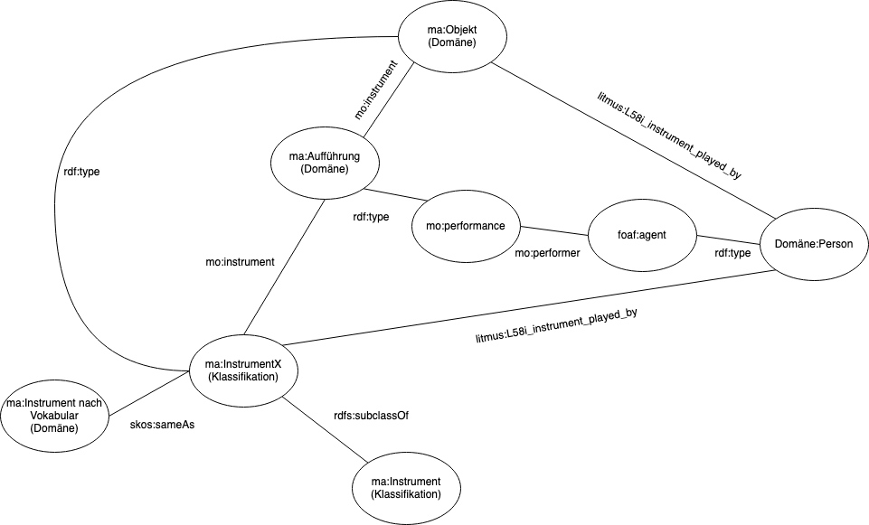

1 Mal (NUR) exemplarisch durchgespielt

### Interpret und Aufführung

#### Interpret und Aufführung

* CIDOC CRM verfügt über das Property `P14`: "This property describes the active participation of an instance of E39 Actor in an instance of E7 Activity."[^d1] Diese Definition erscheint für den vorliegenden Anwendungsfall allzu allgemein gefasst und daher unpassend.

* Ähnlich verhält es sich mit den Properties des *Europeana Data Models*, die in Verbindung mit der Klasse `edm:agent` Verwendung finden.[^d2]

* *Wikidata* verfügt über das Property `wd:P175` ("performer")[^d3]. Während Wikidata aufgrund der potnenitellen Instabilität seiner Terme zwar in der Regel keine Verwendung im Rahmen dieser Arbeit, verweist Wikidata in seiner Eigenschaft als Data Hub unter anderem auf den folgenden Datensatz:

* Auf *schema.org* findet sich das Property `schema:byArtist`.[^d4] mit möglichen Objekten `schema:musicGroup` und `schema:person`. Als Subjekte kommen `schema:musicAlbum`oder `schema:musicRecording` infrage. Während die Objekte geeignet erscheinen, anwendungsrelevante Sachverhalte wiederzugeben, sind die Subjekte offenbar auf Audioaufnahmen beschränkt: Somit können sämtliche Aufführung, die nicht in Form einer Aufnahme vorliegen, nicht repräsentiert werden.

* In der *DOREMUS Ontology*[^d7] finden sich die Properties `mus:U54`[^d5] ("is performed expression of") und `mus:U81`[^d6] ("had performer status"). Jedoch scheint ersteres durch die implizit starke Konzentration auf FRBR für eine generische Anwendung überkomplex und nicht sachgemäß. Letzteres ist offenbar auf eine Verwendung bei der Erfassung von Konzertprogrammen semantisch ausgerichtet und  somit für das vorliegende Anwendungsszenario ebenfalls unsachgemäß.

* In der *GND Ontology* findet sich das Property `gnd:instrumentalist`[^d8] mit Domain `gnd:work` und Range `gnd:differentiatedPerson`. Während diese Verwendungsspezifikationen dem globalen Zweck einer Verbindung von Instrumenten und Werken gerecht wird, würde eine Verwendung die Darstellung einiger möglicher angrenzender Sachverhalte erschweren. So sind mit diesem Property etwa vokale Äußerungen jeder Form ausgeschlossen. Dies wirft gerade im Bereich der Musik des letzten Jahrhunderts etliche Probleme auf – was ist etwa mit gesampleten Stimmen mit anschließender Verzerrung, oder was ist mit instrumentell-imitatorischen Äußerungen des Vokaltrakts, etwa dem sog. *Vocal Percussion*?

* Im Rahmen des *Body&Soul*-Projekts[^d9] findet das Property `mo:performer` der *Music Ontology* Verwendung. Seine Domain ist mit `mo:performance`[^d10] und dem Range `foaf:agent`[^d11] sehr allgemein gehalten, sodass hohe Anschlussfähigkeit gewährleistet wird. 

Allerdings entspricht die Klasse `foaf:agent` nicht der vorgesehenen Klasse `ma:Person`, welche besser durch die Klasse `foaf:person`[^d12] dargestellt würde. Diese Inkonsistenz ist jedoch keineswegs als Defizit aufzufassen, eröffnet doch die Klasse `foaf:agent` das Modell für weitere Szenarien: So lässt sich das Darstellungsspektrum um Instanzen in Form von Personen, wie auch Körperschaften, die dieser Klasse subsumiert werden, erweitern: So werden Aussagen der Form
\
"\<Das Werk Soundso> \<wird gespielt von> \<dem Blockflötenensemble "Schlingenfittich">"

ermöglicht. Diese Darstellungstiefe ist dabei nicht nur im "Werk-Ereignisbereich", sondern auch im Bereich der Musikinstrumente wichtig. So werden auch Aussagen der folgenden Form ermöglicht:
\
"\<Klavierduo Soundso> \<spielt auf> \<dem Klavier "Objekt Schlagmichtot">"

Soll `foaf:agent` Verwendung finden, muss das Datenmodell dergestalt ummodelliert werden, dass `foaf:person` zur Unterklasse von `foaf:agent` wird. Dies geschieht mit dem bereits bekannten Property `rdfs:subclassOf`. Zugleich tritt anstelle des Propertys `ma:Interpret` das Property `mo:performer`. Dessen Range wiederum muss auf `foaf:agent` bezogen werden. Da das Property `rdfs:subclassOf` transitiv ist[^d13], wird die Range-Beschränkung auch auf mögliche Unterklassen von `foaf:agent` vererbt und gilt somit auch für `foaf:person`. [ist das wirklich so???]\

#### Personennormdaten

Die Instanz `ma:Person_a` stellt eine Variable dar, die je nach Bedarf mit entsprechenden Normdaten aus beliebigen externen Vokabularen befüllt werden kann (GND, LCNAF[^d14], VIAF[^d15], Wikidata etc.).

Da die Entitäten `ma:hat_Name` und `ma:hat_Lebensdaten`, ursprünglich ja als Attribute im ERM eingeführt, in der Regel Bestandteil von Personennormdatensätzen sind, können erstere als obsolet betrachtet werden und aus dem Vokabular entfernt werden.

#### Modellierung von Zusammenhängen zwischen Musikinstrumenten, Interpreten und Aufführungen

Während Aussagen gemäß dem Schema
\
"\<das Klavier "Objekt Schlagmichtot"> \<wird bespielt von> \<Klavierduo Soundso>"

nun in Bezug auf auf das Objekt dank `foaf:agent` ermöglicht worden sind, ist aufgrund der Beschränkungen von `mo:performer` mit diesem Property eine Verbindung mit einem Subjekt in Form eines Musikinstruments – immerhin eines der zentralen Anliegen dieser Arbeit – nicht möglich.

Während die Modellierung im ERM kraft der einfachen Eigenschaft "Interpret" erfolgte, wird spätestens zu diesem Zeitpunkt deutlich, dass dieses an äußere Vorgaben ungebundene, monodimensionale Modell der vorgefundenen Realität des Semantic Web nicht mehr gerecht werden kann. Es gilt daher, Um- und Neumodellierungen vorzunehmen.\

1)\ Zentraler Verbindungsknoten bei der Modellierung von Instrument und Interpret ist das Ereignis in Form einer Aufführung, durch die nun einzuführende Klasse `mo:performance`[^d16] vertreten, unter die domänenspezifische Ereignisse (also Instanzen von `ma:Aufführung_Domäne)` fallen. Durch die Einführung dieser Oberklasse wird die Klasse `ma:Aufführung_Domäne` typisiert und in das Semantic Web eingebettet.  Eine Verbindung zwischen Instrumenten und Aufführungen kann dabei mit der Property `mo:instrument` erfolgen: "[The property r]elates a performance to a musical instrument involved [.]"[^d17] Diese Verbindung ist zum einen zum Objektbereich zu knüpfen:\

`mo:performance	mo:instrument	ma:Objekt_Domäne .`
\
Zum anderen muss eine Verknüpfung "werkseitig" erfolgen. Hier bietet es sich an, angesichts der ohnehin angedachten Normierung durch Mapping zu einer Klassifikation, direkt eine Verbindung zwischen entsprechender Klasse und Aufführung zu schaffen:\

`mo:performance	mo:instrument	ma:Instrument_(Klassifikation) .`
\
2)\ Während es nun möglich ist, sowohl die Beteiligung eines Musikinstruments, wie der einer Person an einer Aufführung darzustellen, befinden sich beide Entitäten noch in kontingentem Verhältnis zueinander. Noch besteht kein Konnex zwischen Instrument und Person: die Aussage, jemand spiele ein Instrument, ist noch nicht ermöglicht.

Erstaunlicherweise findet sich in den großen etablierten Vokabularen keine Terminologie, um diesen scheinbar banalen Sachverhalt abzubilden. Fündig wird man jedoch in der *Linked Irish Traditional Music Ontology*.[^d18] Das Property L58[^d20] ("played on instrument") und das inverse Property L58i[^d19] ("instrument played by") geben den hier gewünschten Sachverhalt in geeigneter Weise wieder.

Hierbei ergeben sich auch einige Fragen bezüglich der Verwendung der Entität `ma:Instrument_Domäne`, die im folgenden Kapitel zu diskutieren sein werden.

### Mapping und Klassifikation
#### Medium of Performance
\
Medium of performance
* Thesauri bieten keine Def: IAML / LCMOPThesaurus
* Bibframe?
* DOREMUS <- (willkürliche?) Entscheidung dafür, da Ansatz spartenübergreifend ist.

#### Herausforderungen
\ 
Dieser Option lag das Anliegen zugrunde, "werkseitig" fallspezifisch unsaubere oder unspezifische Vokabulare durch In-Beziehung-Setzen zu Musikinstrumenten – entweder über eine Klassifikation, oder direkt gegenüber einem Objekt – zu disambiguieren. Diese Fallspezifität birgt jedoch auch Probleme: Kehrte man die Perspektive zu einer "objektseitigen" um, so mündete ein Suchvorgang unter Umständen in eine mit ambiguösem Vokabular indexierte Treffermenge und somit in übermäßig viele *False Positives*.
Dieses Problem ist nicht einfach lösbar, und es scheint, dass eine wirklich symmetrische Lösung auf terminologischer Basis nur Ergebnis eines gründlichen Standardisierungsprozesses zu schaffen sein wird. Allerdings exisiteren bereits Ansätze, die aus "umgekehrter Richtung" hin zu einer Verbindung zwischen Objekt und Werk vorstoßen: Im Artikel "A Timeline Metaphor for Analyzing the Relationships between Musical Instruments and Musical Pieces",[^d21] einer Publikation aus dem *MusiXplora*-Umfeld,[^d25] wird beschrieben, wie anhand eines statistischen Abgleichverfahrens zwischen Objekt- und Werkmetadaten (Similarity Measure) eine gute Trefferquote bei der maschinellen Herstellung von Objekt-/Werkbeziehungen zwischen MIMO- und RISM-Einträgen erzielt wird. 
Der Umstand, dass bereits auf Verfahren verwiesen werden kann, die die "objektseitige" Verlinkung abdecken, lässt das eingangs beschriebene Defizit als zunächst verschmerzbar erscheinen. Angesichts dessen jedoch, dass die die Ergebnisse der Verlinkung laut Artikel noch einen intellektuellen Redaktionsprozess erfordern[^d22] bzw. soweit bekannt nicht mit Semantic Web-Technologien erschlossen sind, erschiene vielmehr ein synergetischer hybrider Ansatz, der die hohe intellektuelle Qualität mittels der hier vorgeschlagenen Methodik mit der im Artikel beschriebenen maschinellen Effizienz koppelt, als verfolgenswerter Ansatz.

#### Mapping
\
Zum Mappen hat sich das ebenfalls durch die W3C standardisierte Vokabular SKOS ("Simple Knowledge Organization System")[^d24] etabliert.[^d23] Das Modell sieht zwei Anwendungsszenarien vor:

a) Verbindungen zwischen `ma:Instrument_nach_Vokabular_(Domäne)` und `ma:Objekt_(Domäne)` werden über eine Unterklasse von `ma:Instrument_(Klassifikation)` hergestellt. Dabei ist der jeweilige Vertreter der Klasse `ma:Objekt_(Domäne)` eine Instanz der Klasse `ma:Instrument_(Klassifikation)` dar. Dieser Sachverhalt kann mit `rdf:type`, wie auch bereits in #Kapitel geschehen, wiedergegeben werden:

`ma:Objekt_(Domäne)	rdf:type	ma:Instrument_(Klassifikation)	.`

Die Entität `ma:Instrument_nach_Vokabular_(Domäne)` findet ihre fallspezifische exakte Entsprechung in der Entität `ma:Instrument_(Klassifikation)`, sodass mit `skos:exactMatch` eine Äquivalenzrelation dargestellt werden kann:

`ma:Instrument_nach_Vokabular_(Domäne)	skos:exactMatch	ma:Instrument_(Klassifikation)	.`

Eine Verwendung weiterer, vagerer SKOS-Relationen erscheint – da von einem "werkseitigen" Mappen ausgegangen wird – an dieser Stelle nicht sinnvoll, soll doch das uneindeutige Domänenvokabular durch Mappen dismabiguiert werden.

b) Bei der Herstellung einer direkten Relation zwischen `ma:Instrument_nach_Vokabular_(Domäne)` und `ma:Objekt_(Domäne)` erscheinen verschiedene Szenarien vorstellbar: 

* Zur Exemplifizierung eines Terms wird auf ein beispielhaftes Objekt verwiesen. Dies ist auch im hier behandelten Anwendungsbeispiel der Fall: dem Term `rism:cor_da_caccia` kann aufgrund bestehender Gemeinsamkeiten hinsichtlich Region (Herstellungs-/Kompositionsort: Mitteldeutschland) und Zeit (erste Hälfte 18. Jahrhundert) ein Objekt zugewiesen werden, das als beispielhaft für den Typ des etwa bei der Uraufführung verwendeten Instruments sein könnte.
SKOS bietet dabei das Property `skos:example`[^1], dessen Zweck jedoch nicht im Verlinken mit beispielhaften Instanzen zu bestehen, sondern darin zu liegen scheint, beispielhafte Verwendung von Termen zu illustrieren.[^2] 

Da das Verlinken zu Objekten weniger im bibliographischen Bereich, als im Museumswesen eine Rolle spielt, erscheint es angebracht, in letzterem nach anwendbarer Terminologie zu suchen: Hier erscheint insbesondere das bereits erwähnte CIDOC CRM eine gute Anlaufstelle zu bieten. Dort findet sich das Property `crm:P137`[^3] mit dem Label "exemplifies (is exemplified by)". Die Domain des Propertys ist dabei auf `crm:E1`[^4] (Entity) bezogen – die Range auf `crm:E55` (Type).[^5] Beim Konzept `crm:E55` handelt es sich um "CIDOC CRM’s interface to domain specific ontologies and thesauri",[^6] indem die domänenspezifischen Terme etwa mit der Property  `crm:P127`[^7] "has broader term (has narrower term)" zu Unterklassen von `crm:E55` deklariert werden.[^8] Es erscheint daher sinnvoll:
- das Property `crm:P137` für die Relation "Beispiel" zwischen`ma:Instrument_nach_Vokabular_(Domäne)` und `ma:Objekt_(Domäne)` einzuführen.
- Anstelle der Entität `ma:Instrument_nach_Vokabular_(Domäne)` kann die Entität `crm:E55` (Type) als Schnittstelle zwischen domänenspezifischem Vokabular und dem Metadatenprofil verwendet werden.
- Das Konzept `crm:E19`[^9] ("physical object") kann, als Unterklasse von `crm:E1`, dabei anstelle von `ma:Objekt_(Domäne)` verwendet werden, um den gleichen Effekt zu erzielen.
- Dass es sich bei diesem Objekt um ein Musikinstrument handelt, kann festgelegt werden, indem das Konzept `crm:E19`  anhand einer Aussage der Form

`crm:E19	rdf:type <Musikinstrument>	.`

als solches definiert wird. 
- Dafür kann eine zusätzliche Klasse *Musikinstrument* eingeführt werden. Die Wahl eines geeigneten Terms fällt dabei nicht leicht. Vorhandene wikidata oder mo

- Beispiel
- owl:sameAs
- rdf:type (?)

—

CIDOC CRM
P2 has type (is type of)

P137 exemplifies (is exemplified by)

P138 represents (has representation)

R7 "This property associates a publication with one of its exemplars."
http://www.cidoc-crm.org/Property/r7-is-example-of

Kann man RDF statements überhaupt in MEI embedden? Wie ist das z.B. bei Weber-Gesamtausgabe? Werden die Tripel außerhalb gespeichert und nur aus der MEI Datei referenziert?

—

Erkenntnisse: 
- so allgemein wie möglich

—

[^d1]: [@xrysoula_definition_nodate, S. 52]

[^d2]: [@noauthor_resource_nodate, S. 33–36]

[^d3]: [@noauthor_performer_nodate]

[^d4]: [@noauthor_byartist_nodate]

[^d5]: [@noauthor_doremus_nodate-3]

[^d6]: [@noauthor_doremus_nodate-4]

[^d7]: [@noauthor_doremus-anrdoremus-ontology_nodate]

[^d8]: [@noauthor_gnd_nodate]

[^d9]: [@nurmikko-fuller_building_2018]

[^d10]: [@noauthor_music_nodate-3]

[^d11]: [@noauthor_foaf_nodate]

[^d12]: [@noauthor_foaf_nodate-1]

[^d13]: [@noauthor_rdfcore_nodate]

[^d14]: [@noauthor_library_nodate]

[^d15]: [@noauthor_viaf_nodate]

[^d16]: [@noauthor_music_nodate-4]

[^d17]: [@noauthor_music_nodate-5]

[^d18]: [@archive_irish_2020]

[^d19]: [@archive_irish_2020-1]

[^d20]: [@archive_irish_2020-2]

[^d21]: [@kusnick_timeline_2020]

[^d22]: [@kusnick_timeline_2020, S. 250]

[^d23]: [@noauthor_skos_nodate]

[^d24]: [@noauthor_skos_nodate-1]

[^d25]: [@noauthor_musixplora_nodate]

[^1]: [@noauthor_skos-core_nodate]
[^2]: [@noauthor_skos-core_nodate]
[^3]: [@noauthor_definition_nodate-1]
[^4]: [@noauthor_definition_nodate-2]
[^5]: [@noauthor_definition_nodate-3]
[^6]: [@xrysoula_definition_nodate, S. xxvi]

[^7]: [@noauthor_definition_nodate-4]
[^8]: [@xrysoula_definition_nodate, S. xxvi]

[^9]: [@noauthor_definition_nodate-5]