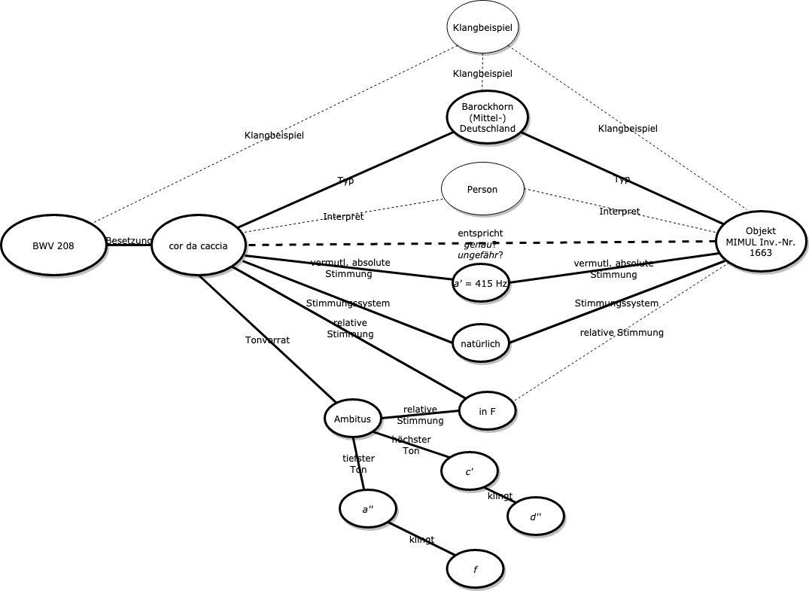
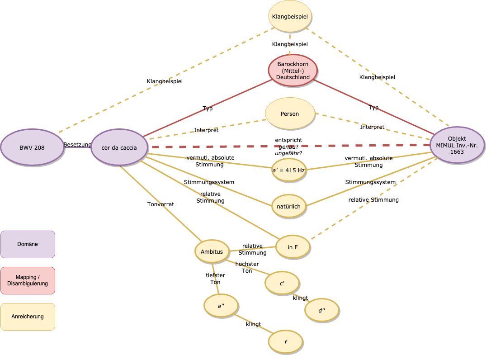
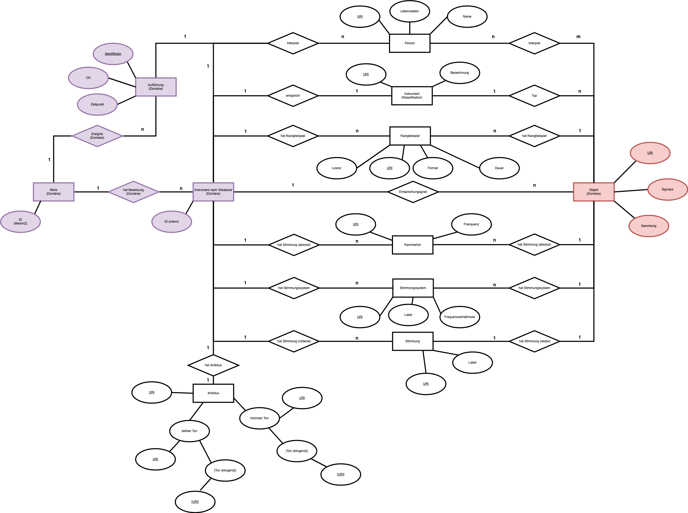

## Datenmodell

### Anwendungsmodellierung

Insgesamt erscheint es als sinnvoll, zuerst die bereits in Kapitel #Desiderat angerissenen Anforderungen nochmals zu schärfen und aus ihnen ein Modell zu generieren, das künftig als diskursive Grundlage für die spätere "dokumentationssprachliche" Ausarbeitung herhalten kann. Dies soll in einem zweistufigen Prozess geschehen, in dem zunächst ein informelles Anwendungsmodell generiert wird, aus dem wiederum ein verbindliches Datenmodell in Form eines *ERM*s (Entity Relationship Model) abgeleitet werden kann, das die Grundlage für die RDF-Modellierung bietet.
Dieses Vorgehen gewährleistet außerdem, dass sich das Anwendungsprofil an den tatsächlichen in der Praxis vorgefundenen Erfordernissen ausrichtet und sich nicht etwa "in vorauseilendem Gehorsam" anhand der bereits etablierten Darstellungsmöglichkeiten selbst zensiert und beschneidet. (In Vorgriff auf die terminologische Ausarbeitung heißt dies etwa: domänenspezifische Vokabulare dahingehend zu untersuchen, ob sie in der Lage sind, das Geforderte abzubilden und andernfalls nach Möglichkeiten zu suchen, diese Darstellungsmöglichkeiten selbst zu schaffen.)
Jedoch darf diese scheinbare Übersimplifizierung, die zunächst also jederlei Eindeutigkeit – etwa in Form von Normdaten – vermeidet, keineswegs als solche missverstanden werden. Vielmehr bildet sie die eigentliche Prämisse für spätere grundsätzliche terminologische Anschlussfähigkeit und Interoperabilität, indem sie sich nicht auf bestimmte gebräuchliche Datenstrukturen oder eine bestimmte Domäne fixiert. 




### Domäne[^8660]

1) Dies wird etwa im Falle der Entität *BWV 208* deutlich: Das "Label" "BWV 208" referenziert hier die Kantate auf Werkebene und fungiert als Platzhalter[^8650] für eine Expression[^8651] (etwa der in RISM beschriebenen Quelle),[^8649] einer Manifestation[^8652] (etwa einer Edition), oder aber auch eines Exemplars[^8653] (etwa einer, freilich illegal, mit Bleistift eingerichteten Ausgabe in einer Bibliothek).

2) Über die Beziehung "Besetzung" mit der Entität Werk verbunden ist die Entität *Corno da caccia*, im Modell mit dem – willkürlichen – Label "cor da caccia", der Terminologie von RISM folgend, versehend. Auch an dieser Stelle ist das Label völlig flexibel – analog also zur Entität *BWV 208*.

Diese beiden Entitäten sind diejenigen, die herkömmlicherweise – wie im RISM-Datensatz exemplarisch demonstriert – die Erschließungstiefe in den allermeisten Datenbanken ausfüllen.
Die Entitäten dieses Bereichs sind institutions-, sparten-, domänenspezifisch sowie bereits etabliert und stehen daher für dieses Metadatenprofil nicht zur Disposition. Das spätere Datenmodell wird daher an dieser Stelle  keinen präskriptiven Charakter für sich beanspruchen können, und auch eine Weiterentwicklung dieses erscheint hier müßig. -> **darauf zurückkommen und sagen, wo was gemacht werden kann** 

### Mapping

Beim Mapping-Anteil steht einerseits die Vernetzung zwischen Objekt und Werk im Vordergrund, zum anderen kann hier die Disambiguierung unklarer Terminologie erfolgen.
Die Anbindung der Besetzungsentität *Corno da caccia* an die Objekt-Entität – in diesem Fall verkörpert durch ein Objekt des Musikinstrumentenmuseums der Universität Leipzig[^8654] – kann in zweierlei Weise erfolgen:

3) durch ein direktes In-Beziehung-Setzen mit der Entität *Corno da Caccia*. Hier sind mehrere Arten der Beziehung denkbar: 
- Einerseits könnte es sich beim Objekt um exakt jenes handeln, das Bach für das Werk besetzt hatte.[^8655].
- In den meisten Fällen jedoch wird eine dermaßen eindeutige Beziehung nicht nachzuvollziehen sein. Vielmehr wird – wie ja auch im Falle von BWV 208 – auf ein ungefähres Äquivalent zu verweisen sein.

4) durch das Mapping über eine zwischengelagerte Klassifikation. Dieses erscheint etwa im hier verwendeten Falle sinnvoll, um den Term "cor da caccia" weiter zu disambiguieren. **für die Zukunft: wenn man mit MIMO verlinkt, kann der Typ inferenziert werden (MIMO-Thesaurus)!!** Unsinnig erscheint dieser Ansatz hingegen, wenn im Bereich der Domäne ein maschinenlesbares und bereits gemapptes Standardvokabular (etwa GND, IAML MoP etc.) Verwendung findet – auch wenn diese mitunter, wie bereits erwähnt, mitunter sehr zu wünschen übrig lassen.

### Anreicherung

Nachdem die Besetzungsentität durch Verknüpfung mit einem Objekt bzw. einer Klassifikation eindeutig bestimmt worden ist, ist es wünschenswert, sie durch weitere Aussagen anzureichern und dadurch noch aussagekräftiger zu machen.

5) Die Hörner sind im Autograph "in F" notiert – der tatsächliche Klang der in F notierten Töne der Hornstimme liegt also eine Quinte tiefer. Dies wird durch die Beziehung der Besetzungsentität zu ihrer relativen Stimmung "in F" ausgedrückt. Auch für das Objekt könnte bekannt sein, dass es in F gestimmt ist (= das Instrument produziert Töne der sog. *Naturtonreihe* über dem Ton *f*), was im hier behandelten Szenario jedoch nicht der Fall ist.[^8656]

> Aus diesem Umstand lassen sich – zumindest für die Zeit bis zur Erfindung des Ventilhorns – sehr facettierte Aussagen zum vorgesehenen Instrument treffen (Länge, Mensur etc.), deren Darstellung jedoch für den begrenzten Rahmen dieser Arbeit keine Rolle spielen kann. Außerdem liefert die Angabe der Stimmung der Hörner – ebenfalls begrenzt auf die Zeit bis zur Erfindung des Ventilhorns – einen Indikator für die Bestimmung der Tonart (wie auch im Fall von BWV 208: Die Kantate steht in F-Dur).

6) Der Besetzungsentität ist in ihrer Eigenschaft als Besetzung für *BWV 208* ein bestimmter Tonvorrat zu eigen, der sich durch die Entität *Ambitus* ausdrückt. Dieser wiederum setzt sich aus einer Tonmenge zusammen, die durch die beiden Entitäten des höchsten und des tiefsten Tons eingegrenzt wird.

>Die Kenntnis des Ambitus' lässt in wissenschaftlicher Hinsicht vielerlei Rückschlüsse zu: etwa auf die Länge des Instruments (Faustregel: kürzer = Tonvorrat liegt höher). Für Musiker (etwa Anfänger) kann diese Information selbstverständlich bei der Suche nach Noten ebenfalls außerordentlich nützlich sein.

7) Im in dieser Arbeit gewählten Szenario ist aus physikalischen Gründen das Stimmungssystem des *Corno da caccia* eindeutig und kann hier berücksichtigt werden.[^8657] Tatsächlich ist das Bestimmen historisch verwendeter Stimmungssysteme in vielen Fällen weit weniger eindeutig.

8) Über die absolute Stimmung der ursprünglich vorgesehenen Instrumente, wie auch für das Objekt *MIMUL 1663* selbst, lässt sich keine eindeutige Aussage treffen. Gleichwohl ist diese Entität grundsätzlich durchaus als aufschlussreich für die Wissenschaft anzusehen.[^8658] Somit handelt es sich bei der Angabe *a* = 415 Hz um einen vermuteten Wert, und es ergibt sich für den Fortgang der Arbeit die Frage, ob es in einem späteren Datenmodell auch möglich sein wird, auch Ambivalenzen und Unsicherheiten dieser Art abzubilden.

9) Über die Beziehung "Klangbeispiel" ist es möglich, die Objektentität oder die Typ-Entität mit einem Klangbeispiel zu verknüpfen. Selbstverständlich wäre dies im gleichen Maße auch für eine Werkentität denkbar.

10) Denkbar ist, dass eine Person – etwa im Rahmen einer Audioaufnahme – auf einem bestimmbarenen Instrument spielt. Hier wäre also eine Verknüpfung zwischen Besetzung (evtl. Werk), Person und Objekt nützlich.

Tatsächlich sind den potentiellen Anwendungsszenarien eines solchen Modells keine Grenzen gesetzt. Angesichts der Komplexität und der vielfältigen spezifischen Anforderungen, die trotz der Beschränkung auf BWV 208 und das *Corno da caccia* erarbeitet wurden, lässt sich bestenfalls erahnen, welches Darstellungspotential eine Erweiterung des Modells für andere Instrumente und Instrumentengruppen bergen könnte: Es ließe sich etwa die Skordatur von Saiten ausdrücken. Oder verschiedene Sing- und Spieltechniken – vom Jodeln bis zum Spiel *con sordino* etc.

Eine zentrale Erkenntnis des vorangehenden Kapitels war die Einteilung der Entitäten und Beziehungen in drei verschiedene Bereiche, die bereits in den Zwischenüberschriften vorweggenommen wurden:

1. Domäne
2. Mapping und Disambiguierung
3. Anreicherung

Während der Bereich der Domäne für diese Arbeit unantastbar bleiben muss, konnte der Fokus der Arbeit und somit die Funktion eines zu entwickelnden Metadatenprofils auf die Punkte

* Mapping und Disambiguierung

sowie

* Anreicherung

gebündelt werden.




### Entity Relationship Model


Ein weiterer Schritt in Richtung einer Modellierung mit RDF ist die Überführung des Anwendungsmodells in ein *Entity Relationship Model* (ERM). Hiebei sollen die obigen anwendungsspezifischen Aussagen auf eine allgemeine Ebene gesetzt werden, auf der übergeordnete Entitätsklassen und ihre Eigenschaften in Beziehung zueinander gesetzt werden.[^8661] Dabei fungieren besondere Schlüsseleigenschaften ("Primärschlüssel") als eindeutige Identifier einer Entität.[^8662] Mengenverhältnisse zwischen Entitäten werden im ERM zudem durch "Kardinalitäten" miteinbezogen und dadurch fixierbar.[^8663]



Einige wesentliche Entwicklungen gegenüber dem Anwendungsmodell sowie weitere Überlegungen sind es wert, nochmals kurz erläutert und erörtert zu werden.

* Neben dem verwendeten Instrument *Instrument nach Vokabular (Domäne)* muss die Entität *Interpret* auch immer an ein Ereignis, in der Regel eine *Aufführung* geknüpft sein (diesem Umstand wurde durch die Zusätze im linken Domänenbereich Rechnung getragen). Dabei sind folgende Szenarien berücksichtigt: ein *Instrument* kann sowohl mehrfach ("n Mal") mit beliebig vielen *Interpreten* besetzt sein (entspricht beispielsweise der Bezeichnung "2 Oboen" oder "Celli" in einer Partitur) als auch gesondert aufgeführt werden (entspricht etwa dem Sachverhalt "Musiker a und Musiker b spielen vierhändig Klavier").

* Ein *Instrument nach Vokabular (Domäne)* kann innerhalb eines Werks beliebig viele notierte *Stimmungen* besitzen.[^8665]. Die Bedeutung der Entität *Stimmung* – etwa mit dem Wert "F" – weicht dabei in der Kombination mit *Instrument* von der der Verwendung in Kombination mit *Objekt (Domäne)* ab: In dieser Kombination bezieht sich die Entität *Stimmung* auf die mögliche "Grundstimmung" eines Objekts (z.B. F-Horn), sofern es eine besitzt.[^8666]

* Mithilfe einer Kombination gegebener Informationen zu *Stimmung* und *notiertem Ambitus* sollte es im Zuge eines späteren Schrittes möglich sein, Informationen zu den *klingenden Tönen* maschinell abzuleiten.

* Im ERM ist definiert, dass ein *Instrument nach Vokabular (Domäne)* nur eine (variable) *absolute Stimmung* besitzen kann. Denkbar wären jedoch auch z.B. Sachverhalte – Konzerte, Aufnahmen etc. – in deren Verlauf mehrmals umgestimmt wird. In diesen Fällen wäre auch eine Verknüpfung mit der Entität *Aufführung* angebracht.[^8664]

* Grundsätzlich ist wünschenswert – wie im Fall des *Interpreten* oder dem Umstimmen von Instrumenten – bestimmte Entitäten mit Ereignissen verknüpfen zu können. Dies gilt insbesondere für die Entitäten *Stimmungssystem* (wird mit historisch akkurater gespielt, oder wohltemperierter Stimmung gespielt?) , *Kammerton* (wird mit den heute üblichen 440 Hz musiziert, oder mit einer historischen Stimmung, z.B. gemäß dem sog. *Cornettton*[^8667]?), *Klangbeispiel* (Das Klangbeispiel stammt aus der und der Aufnahme) und *Instrument (Klassifikation)* (bei der Uraufführung fand Instrument a Verwendung, in der Aufnahme x ein typverschiedenes). 

Für die Zwecke dieser Arbeit reicht es, die zuletzt genannten Anwendungsszenarien im ERM lediglich einmal exemplarisch im Kontext des *Interpreten* anzudeuten. 


---


1. "intellektuelle" Klassenzuordnung
2. Fixierung der klassifizierten Entitäten mithilfe einer Semantic Web-Sprache – Übersetzung in ihr "Weltbild" <- wird so verständlich
    -Auswahl Syntax
    -Auswahl Sprache!!
4. Verfügbarmachen: Einfügen dieser Entitäten in die Architektur des Semantic Webs
        eigentlich erst später – macht aber Sinn jetzt schon
        
        
 Literatur bezieht sich eigentlich fast nie auf das Technische, das man braucht, um selbst Daten zu publizieren.
 darunter: Noy, Allemang, Schneckengruber


# Klassifikatorische Erschließung


Das folgende Kapitel bildet den Ausgangspunkt dafür, den Weg von einem eigenen Datenmodell zu einem Semantic Web-kompatiblen Metadatenprofil zu beschreiten. [vielleicht noch etwas darüber, dass es keine wirkliche Lit. gibt, die einen Leitfaden von Anfang bis Ende bildet] Gemäß Noy und McGuinness[^8] steht dabei ganz zu Beginn dieses Prozesses zunächst eine Klassierung[^9] der benötigten Typen nach folgendem Schema:

> "Define the classes and the class hierarchy"

> "Define the properties of classes [...]"

> "Create instances"[^22]

Dieser Vorgehensweise liegt zugrunde, dass bereits in RDF bestimmte Klassen angelegt sind – in Folgevokabularen[^10] um weitere ergänzt –, die bestimmte Klassen vorgegeben.[^13] Dabei erscheinen angesichts des zuvor ausgearbeiteten Datenmodells die allgemein gebräuchlichsten drei Klassen[^12] für die Zwecke dieser Arbeit ausreichend. Diese sind:

1. Klassen
2. Instanzen[^11]
3. Eigenschaften [Relationen? vg. Stuckschmidt]

Durch die Aufteilung in Entitäten und Beziehungen lassen sich so also bereits RDF-Tripel bilden – zusätzlich gelingt es, dank der qualitativen Unterscheidung in Instanz und Klasse, einfache hierarchische Sachverhalte nachzubilden. In den folgenden Unterkapiteln wird es entsprechend darum gehen, eine entsprechende Klassierung vorzunehmen.

Doch worin besteht an dieser Stelle der tiefere Sinn einer Klassifikation? Direkt assoziativ ist die Funktion des Klassierens – sofern man sie nicht als reinen Selbstzweck betreibt – insbesondere zur Ordnung von Ressourcen und deren Retrieval. Doch neben dieser "pragmatischen Aufgabe"[^23] führt Bertram auch die "erkenntnisvermittelnde Aufgabe" von Klassifikationen ins Feld, die in der "Aufhellung von Zusammenhängen anhand geordneten Wissens" besteht.[^14] Diese hermeneutische Dimension erscheint auch hier ganz zentral: Das Modell, das in seiner gegenwärtigen Form auf einem subjektiv geprägtem Verständnis, Wertesystem und persönlichen Denkstrukturen des Autors beruht, wird in ein objektives, standardisiertes Modell überführt. Gewissermaßen findet so eine Übersetzung statt, die den Erkenntnishorizont zwischen Mensch und Maschine überwindet. Das eigene Denkmodell wird dabei mithilfe der sprachlichen Ausdruckmittel des Semantic Web erfasst und ausgezeichnet, und so in das von RDF-vorgegebene Erkenntnisschema eingepflegt. Die dem Modell inhärente Semantik wird – wie zu sehen sein wird, freilich zunächst auf einer sehr oberflächlichen Ebene – dadurch objektiviert und gemeinhin auslegbar.

Diese Übersetzung geht mithilfe entsprechend standardiserter, sich ergänzender Modellierungssprachen, den sogenannten "Ontologiesprachen", vonstatten.[^16] Wobei sich diese Arbeit insbesondere an der Ontologiesprache OWL[^17], der "inzwischen [...] meistbenutzen Ontologiesprache aller Zeiten"[^19] ausrichtet. Dies geschieht sowohl aus pragmatischen Gründen – der Ontologie-Editor *Protégé*[^18] basiert auf dieser Sprache – als auch aus fachlichen, die es wert sein werden, in einem nachfolgenden Unterkapitel für sich kurz zu skizzieren.

**wichtig, dass kein Informationsverlust durch diese Wahl!** -> im Folgekapitel.

Die formale Interpretierbarkeit der durch die Sprache ausgedrückten semantischen Komponente wird durch eine Syntax, also einer  "Menge von Regeln, um Programme oder Dokumente mit bestimmten Eigenschaften [...] zu erzeugen", ermöglicht. Die Entscheidung für eine bestimmte Syntax ist dabei im Falle nach RDF strukturierter Daten zwar letztlich arbiträr, bilden sie doch im übertragenen Sinne gewissermaßen lediglich "Verpackung und Beipackzettel" für den eigentlichen semantischen Inhalt. Doch fällt aufgrund seiner Einfachheit und Übersichtlichkeit in dieser Arbeit die Wahl auf das sogenannte *Turtle*-Format ("Terse RDF Triple Language")[^20].

So entsteht in Folge dieser Klassifizierung zunächst ein sehr einfaches kontrolliertes Vokabular – etwa im sehr grob gefassten Sinne des *National Information Standards Organization* und des *American National Standards Institute* ausgelegt. Diesemzufolge handelt es sich bei einem kontrollierten Vokabular um ein "[...] list of terms that have been enumerated explicitly. [...] All terms in a controlled vocabulary must have an unambiguous, non-redundant definition."[^21]
Dabei erfolgt die Disambiguierung der Lemmata analog zur Klassifizierung in folgender Form (s. auch Kapitel #klassenundinstanzen):

Typ ist eine Klasse
Typ ist eine Instanz
Typ ist eine Eigenschaft

## OWL

Ich verwende OWL Full! <- informieren… hierzu und zum owl kopf [@TN_libero_mab21631588, S. 130 ff.]


## Klassen und Instanzen

> "Deciding whether a particular concept is a class in an ontology or an individual instance depends on what the potential applications of the ontology are. Deciding where classes end and individual instances begin starts with deciding what is the lowest level of granularity in the representation. The level of granularity is in turn determined by a potential application of the ontology. In other words, what are the most specific items that are going to be represented in the knowledge base?" [@gangler_semantic_nodate, S.18]

Die hier zur Differenzierung zwischen Klasse und Instanz implizit vorgeschlagene Vorgehensweise,[^2] bei der die niedrigste Entität eines aus Klassen bestehenden hierarchischen Strangs als Instanz zu werten ist, erscheint im Falle einer in sich abgeschlossenen Ontologie als durchaus sinnvoll. Doch muss der Blickwinkel im Fall der hier beabsichtigten Anwendung als verbindendes Metadatenprofil auch auf potentielle Anknüpfungspunkte, aber vor allem auf die Anwendungsfälle und Vokabulare, die gewissermaßen "außerhalb" des Profils liegen, erweitert werden. Die Frage also, ob etwas eine Instanz oder eine Klasse ist, muss nicht notwendigerweise anhand des Datenmodells selbst zu beantworten sein. Zugleich bedeutet dies aber auch ganz allgemein, dass bestimmte ontologische Beschaffenheiten den untersuchten Entitäten nicht bereits a priori inhärent sind: Entitäten können grundsätzlich – je nach Kontext – mal als Klassen, mal als Instanzen begriffen werden. Diese Unschärfe gilt es sich auch während der folgenden Modellierungen immer wieder prüfend vor Augen zu halten. 

OWL2 differenziert, anders als etwa RDFS, nicht lediglich zwischen Klassen und Instanzen, sondern zwischen Klassen und Individuen,[^3] wobei letztere nochmals in *owl:namedIndividual* und *owl:anonymousIndividual* unterschieden werden. Über letztere heißt es: "Named individuals are given an explicit name that can be used in any ontology to refer to the same object. _Anonymous individuals_ do not have a global name and are thus local to the ontology they are contained in."[^4]

Auf den ersten Blick finden sich im Modellentwurf vor allem Instanzen, wobei zu beachten ist, dass aufgrund des uneinheitlichen Datenmodells viele der Instanzen mit einem Überbegriff als Klassen definiert worden sind (dies betrifft die Klassenbezeichner *ma:klangbeispiel* und *ma:Person*):[^1]

* *mimul:1663*
* *ma:klangbeispiel* manifestiert sich in Form eines spezifischen Audiofiles.
* *ma:Person* manifestiert sich in Form einer spezifischen Person (etwa in Gestalt seiner Repräsentation als GND Tp-Datensatz).
* *ma:a'=415Hz* erscheint als Klasse nicht sinnvoll (auch wenn sich Frequenzen weiter subsumieren ließen).
* *ma:natuerlichesStimmungssystem* kann ebenfalls nicht als Klasse verwendet werden. Obwohl es denkbar wäre, die Grundstimmung *ma:inF*als Instanz einer Klasse *ma:natuerlichesStimmungssystem* zu betrachten, ist ein Instrument in F nicht zugleich notwendigerweise in natürlich gestimmt (vgl. etwa das *Englischhorn*).
* Sowohl *ma:ambitus* wie auch die ihn definierenden Töne lassen sich nicht weiter differenzieren.

Über die Sinnhaftigkeit weitere übergeordnete Klassen für die Instanzen zu kreieren, wird an späterer Stelle nochmals zu sprechen sein. [Stichwort einerseits – dadurch Semantic Web-Anbindung, andererseits aber Scope soll laut Lit schön kleingehalten werden.]


* *ma:inF* läßt sich hingegen als Klasse definieren: Ein Anwendungsfall, in dem etwa die Tonhöhe des ersten Naturtons Aussagen zu Intervallverteilung und Tonhöhen zuließen – die Entität weiter teilbar ist –, lässt sich durchaus vorstellen. Instanzen dieser Klassen wären dann die jeweiligen Grundtöne.
* *rism:corDaCaccia* ist – insbesondere in seinem Verhältnis zu seiner Instanz *mimul:1663* als Klasse zu bewerten.
* Dies trifft auch für die Entität *taxonomie:barockhorn* zu.

Mit RDF in OWL2 ausgedrückt und in der *Turtle*-Syntax serialisiert[^24] ergibt sich der folgende Zusammenhang:


```
#################################################################
#    Classes
#################################################################

###  ma#inF
<ma#inF> rdf:type owl:Class .

###  rism#corDaCaccia
<rism#corDaCaccia> rdf:type owl:Class .

###  taxonomie#barockhorn
<taxonomie#barockhorn> rdf:type owl:Class .

#################################################################
#    Individuals
#################################################################

###  ma#ambitus
<ma#ambitus> rdf:type owl:NamedIndividual .

###  ma#f
<ma#f> rdf:type owl:NamedIndividual .

###  ma#klangbeispiel
<ma#klangbeispiel> rdf:type owl:NamedIndividual .

###  ma#natuerlichesStimmungssystem
<ma#natuerlichesStimmungssystem> rdf:type owl:NamedIndividual .

###  ma#person
<ma#person> rdf:type owl:NamedIndividual .

###  ma#a''
<ma#a''> rdf:type owl:NamedIndividual .

###  ma#a'=115Hz
<ma#a'=115Hz> rdf:type owl:NamedIndividual .

###  ma#c'
<ma#c'> rdf:type owl:NamedIndividual .

###  ma#d''
<ma#d''> rdf:type owl:NamedIndividual .

###  mimul#1663
<mimul#1663> rdf:type owl:NamedIndividual .
```


## Properties

Analog zu den Entitäten müssen auch die Properties schematisch in das Wissensrepräsentationskonzept des Semantic Webs eingebettet werden. Auch hier geschieht dies, indem sie in der Sprache des Semantic Webs erfasst und als Properties definiert werden. Im Gegensatz zu den Entitäten müssen diese (zumindest im hier behandelten Beispiel) jedoch zunächst nicht klassifiziert werden.[^5] 

```
#################################################################
#    Object Properties
#################################################################

###  ma#entsprichtGenau
<ma#entsprichtGenau> rdf:type owl:ObjectProperty .

###  ma#entsprichtUngefähr
<ma#entsprichtUngefähr> rdf:type owl:ObjectProperty .

###  ma#grundstimmung
<ma#grundstimmung> rdf:type owl:ObjectProperty .

###  ma#hoechsterTon
<ma#hoechsterTon> rdf:type owl:ObjectProperty .

###  ma#interpret
<ma#interpret> rdf:type owl:ObjectProperty .

###  ma#klangbeispiel
<ma#klangbeispiel> rdf:type owl:ObjectProperty .

###  ma#klingt
<ma#klingt> rdf:type owl:ObjectProperty .

###  ma#stimmungssystem
<ma#stimmungssystem> rdf:type owl:ObjectProperty .

###  ma#tiefsterTon
<ma#tiefsterTon> rdf:type owl:ObjectProperty .

###  ma#tonvorrat
<ma#tonvorrat> rdf:type owl:ObjectProperty .

###  ma#typ
<ma#typ> rdf:type owl:ObjectProperty .

###  ma#vermutlAbsoluteStimmung
<ma#vermutlAbsoluteStimmung> rdf:type owl:ObjectProperty .
```

#  Relationen definieren / Anpassung des Datenmodells

Nachdem kontrollierte Vokabulare erstellt worden sind, liegt es nahe, Relationen, die bislang höchstens im Vorhandensein kontingenter Klassen bestanden, zu erstellen. Auch dies geschieht laut Stuckenschmidt idealerweise zunächst auf einer Metaebene, indem die Properties gemäß ihrer Abhängigkeit zu den Entitäten näher beschrieben werden.[^33] Dies kann geschehen, indem zwei neue Properties eingeführt werden: *rdfs:range*[^31] und *rdfs:domain*[^32].[^27]        

Diese fungieren als "semantische[s] Bindeglied zwischen Klassen und Propertys".[^30] indem sie definieren, welche Properties sich auf welche Klassen in welcher Weise beziehen können. 

So besitzt z.B. das Prädikat in der folgenden Aussage[^28]
```
rism:corDaCaccia ma:typ taxonomie:barockhorn
```
die Domäne rism:corDaCaccia – das Subjekt der Aussage.[^29]  Zugleich besitzt das Property *ma:typ* das *rdfs:range* Barockhorn. Es lassen sich daher die Aussagen treffen, dass das Property bedeutet, dass jede Entität, die als Subjekt oder Objekt mit dem Property *ma:typ* verbunden ist, ein Barockhorn oder ein 


die Aussage ist schon richtig, aber nur für das spezielle Modell. -> man sollte schon noch übergeordnete Klassen vergeben.


**WICHTIG:** Nächster Schritt bei der Modellierung: [<- ja, erst jetzt wird Kontext konstruiert]

>"Nachdem auf diese Art eine Grundmenge von Relationen identifiziert wurde, muss diese na ̈her beschrieben werden. Hier- bei ist zuna ̈chst die Beziehung der gefundenen Relationen zu den im Vorfeld identifizierten Klassen zu bestimmen. Dies erfolgt in der Regel durch die in den Kapiteln 4.1.1 und 4.2.1 beschriebe- nen Domain- und Range Einschra ̈nkungen. Fu ̈r jede Relation ist also festzulegen, welche Art von Objekten diese potenziell ver- binden kann. Hierbei ist stets die allgemeinste Klasse zu wa ̈hlen, um nicht unno ̈tigerweise Mo ̈glichkeiten auszuschließen. Kom- men mehrere Klassen als Doma ̈ne oder Range einer Relation in Betracht, so sind die jeweilige Semantik der verwendeten Spra- che und leider zum Teil auch die Eigenschaften des verwende- ten Tools zu beru ̈cksichtigen, da diese zu unerwu ̈nschten Effek- ten fu ̈hren ko ̈nnen." [@alma9913393902586, S. 169]

Dabei stellt sich heraus, dass das Datenmodell noch weiter spezifiziert werden muss, indem weitere Klassen vergeben werden. z.B. "natürliche Stimmung" rdfs:domain "Stimmung" (dabei mittelbar ja auch Anbindung an weitere Vokabulare möglich.)

**"Dieser Schrittist notwendig, da die Kenntnis der zur Verf ̈ugung stehendenRelationen Voraussetzung f ̈ur die Formalisierung der Klassen durch notwendige und hinreichende Bedingungen im n ̈achstenSchritt ist."**[^15] <- Mist – warum mache ich es anders? und warum ist das auch ok? Wohl weil keine ganze Domäne modelliere, sondern nur einen ganz bestimmten Ausschnitt, der auch nicht die Funktion hat, vollständig zu sein, sondern nur spezifische Infos anzureichern bzw. zu Mappen.

Nachdem auf diese Art eine Grundmenge von Relationen identifiziert wurde, muss diese na ̈her beschrieben werden. Hier- bei ist zuna ̈chst die Beziehung der gefundenen Relationen zu den im Vorfeld identifizierten Klassen zu bestimmen. Dies erfolgt in der Regel durch die in den Kapiteln 4.1.1 und 4.2.1 beschriebe- nen Domain- und Range Einschra ̈nkungen. Fu ̈r jede Relation ist also festzulegen, welche Art von Objekten diese potenziell ver- binden kann.[^25]

"Ahnlich verha ̈lt es sich mit der Beschreibung charakteristi-

scher Eigenschaften von Objekten, die zu einer bestimmten Ka- tegorie geho ̈ren. Diese werden ja, wie oben beschrieben, in der Philosophie als ,,differentiae“ bezeichnet. In den anderen rele- vanten Disziplinen wird ha ̈ufig von Eigenschaften und Attri- buten gesprochen. Diese wiederum werden oft durch ,,Relatio- nen“ dargestellt. Zusa ̈tzlich werden in bestimmten Gebieten spe- zielle Bezeichnungen verwendet. So wird vor Allem im Kon- text von Beschreibungslogiken und semantischen Netzen oft von ,,Slots“ gesprochen."[^26]

# Semantic Web-Anbindung
**terminolomuss evtl. anders aufgezogen werden – mehr Ablauf-orientiert im Kontext mit dem Zeug oben. Eventuell erst viel später?**

Es liegt nahe, die zuletzt mit den Ontologiesprachen OWL und RDF beschriebenen und somit in das schematisch-ontologische Gefüge von RDF für das Semantic Web handhabbar gemachten Terme in Form kontrollierter Vokabulare zu speichern. Dabei beschränkt sich die "terminologische Kontrolle" hier zunächst auf Maßnahmen, "die direkt oder indirekt der Definition und Abgrenzung von Begriffen"[^7] im allerweitesten Sinne dienen. In diesem Sinne reicht es zu diesem Zeitpunkt – zunächst! – aus, eine einfache Liste der Terme und der – freilich außerordentlich vagen – eben erfolgten Spezifikation ihrer Natur als potentielle "Dinge" im Semantic Web zu erstellen.

Die Funktion terminologischer Kontrolle erfüllen in der Informatik sogenannte *Namespaces*. 

—

# Notizen

Nachdem bereits vorläufige "Domains" in Form von Präfixen (*ma:*, *rism:*, *taxonomie:*, *mimul*) definiert worden waren, scheint es denkbar, die nun mit RDF ausgezeichneten Terme im Internet zu verankern und somit in das Semantic Web einzubetten. 

deutlich machen, dass die Vorgehensweise hier nicht sauber, aber für die Belange der Arbeit ausreichend ist.


wichtig ist auch range zu definieren. kann nur verwendet werden mit ma – wie??? mit rdfs:domain? als rdfs:container definieren (= Liste) und dann sagen, dass sich nur auf die Listen bezieht?

aus gründen der lesbarkeit .rdf und nicht rdf/xml (<- könnte man aber geschwind umwandeln?)

Many namespaces have been created in the context of Semantic Web projects to distinguish the names of classes, properties and individuals defined and/or described by that project from all others. One common approach is to use a namespace URI ending with a hash (`#`) to identify the namespace, in which case the URI _without_ the hash is available to identify the information resource which describes the namespace, that is, the namespace document.

"An URIs kann, abgetrennt durch #, auch ein weiteres Fragment angehängt werden. Die Kombination aus URI und Fragment wird URI-Referenz genannt. URI- Referenzen werden in RDF häufig zur eindeutigen Referenzierung von Ressourcen verwendet und stellen somit eine wichtige Komponente der Semantic-Web-Schichten dar."[^6]

"Wie schon in XML versteht man un- ter einem Vokabular meist eine Zusammenstellung von Bezeichnern mit klar definierter Bedeutung." [@TN_libero_mab21631588, S. 48]

"Oft muss man aber auch vo ̈llig neue URIs bilden. In einem solchen Fall muss man sicherstellen, dass die gewa ̈hlte URI nicht versehentlich anderswo mit anderer Bedeutung zum Einsatz kommt. Eine gute Methode dazu ist es, eine URI zu wa ̈hlen, die sich aus einer Webadresse ableitet, deren Inhalte man selbst kontrolliert. Eine URI, die mit http://springer.com/... beginnt, soll- te demnach nur vom Springer-Verlag eingefu ̈hrt werden. Außerdem ist es in einem solchen Fall mo ̈glich, an der entsprechenden Adresse ein Dokument ab- zulegen, welches die Bedeutung der URI fu ̈r Menschen beschreibt." [@TN_libero_mab21631588, S. 48–49]

"Eine Mo ̈glichkeit ist die Verwendung von URI-Referenzen. Schreibt man z.B. http://de.wikipedia.org/wiki/Othello#URI, dann zeigt dies nicht direkt auf ein existierendes Dokument (da es den Abschnitt ”URI“ auf dieser Seite nicht gibt). Wenn man diese URI-Referenz als URL aufruft, dann erha ̈lt man dennoch die beschreibende Seite fu ̈r diese URI." [@TN_libero_mab21631588, S. 49]

"Eine andere Mo ̈glichkeit ist die Verwendung von Weiterleitungen: auch bei Aufruf einer nicht existierenden URL kann ein Server den Nutzer auf eine alternative Seite weiterleiten. Da das Programm des Nutzers diese Weiterlei- tung wahrnimmt, ist dennoch die Unterscheidung der URIs gewa ̈hrleistet. Die automatische Weiterleitung hat außerdem den Vorteil, dass man entweder eine menschenlesbare HTML-Datei oder eine maschinenlesbare RDF-Datei auslie- fern kann – abha ̈ngig von Informationen in der Anfrage. Dieses Verfahren ist auch als Content Negotiation bekannt." [@TN_libero_mab21631588, S. 49]

"The names in a namespace form a collection [...] There's no requirement that the names in a namespace only identify items of a single type; elements and attributes can both come from the same namespace as could functions and concepts or any other homogeneous or heterogeneous collection you can imagine. The names in a namespace can, in theory at least, be defined to identify any thing or any number of things. [...] A user encountering a namespace might want to find any or all of these related resources. In the absence of any other information, a logical place to look for these resources, or information about them, is at the location of the namespace URI itself. The details of exactly what this means may be subtlely different in different cases, but the general point is clear, as [\[WebArch Vol 1\]](file:///Users/alanriedel/Zotero/storage/VEIFTJE6/nsDocuments.html#webarch) says: It is [Good Practice](http://www.w3.org/TR/webarch/#pr-namespace-documents) for the owner of a namespace to make available at the namespace URI “material intended for people to read and material optimized for software agents in order to meet the needs of those who will use the namespace”."


---


**heute noch ändern: klingend/notiert ist falsch / Grundstimmung / obertonreine Stimmung / relative Stimmung bleibt?**

---

[^1]: Zur Schreibweise: 

[^2]: Vgl. auch die folgende Aussage "Individual instances are the most specific concepts represented in a knowledge base." (vgl. [@gangler_semantic_nodate, S.18]).

[^3]: [@noauthor_owl_nodate-1]

[^4]: [@noauthor_owl_nodate]

[^5]: OWL2 differenziert zwischen *Object Properties* und *Datatype Properties* (vgl.: [noauthor_owl_nodate-2]). Obwohl etwa *ma:a'=415Hz* prinzipiell auch mit *Datatype Properties* modelliert werden könnte, erscheint diese Detailtiefe für den hier exemplarisch durchgeprobten Anwendungsfall nicht notwendig.

[^6]: [@TN_libero_mab21631588, S. 27–28.]

[^7]: [@TN_libero_mab213864266, S. 128]

[^8]: [@noy_ontology_nodate]
Auch Stuckenschmidt legt diese Vorgehensweise nahe (vgl.: [@alma9913393902586]).

[^9]: Zum Begriff siehe [@ TN_libero_mab213864266, S. 150]

[^10]: Für diese Arbeit spielen insbesondere RDFS ([@ noauthor_rdfs_nodate]) und OWL ([@ noauthor_owl_nodate-3]) eine Rolle.

[^11]: "Individualbegriffe"  [@ stock_wissensreprasentation_2008, S. 84].

[^12]: In "Semantic Web-Sprache" augedrückt, wären das die Klassen *rdfs:class*, *rdfs:instanceOf* und *rdf:property*.

[^13]: Auf eine Übersicht der gängigen übergeordneten Klassen – etwa "Literals", "Datatypes", "Blank nodes" etc. – muss an dieser Stelle verzichtet werden.

[^14]: [@TN_libero_mab213864266, S. 151]

[^15]: [@alma9913393902586, S. 166]

[^16]: S. hierzu etwa: [@alma9913393902586, S. 95–99]

[^17]: [@noauthor_owl_nodate-3]

[^18]: 

[^19]:  [@alma9913393902586, S. 146]

[^20]: Vgl.: [@noauthor_rdf_nodate-2]

[^21]: [@national_information_standards_organization_u.s._guidelines_2005, S. 3]

[^22]: Die relative Einfachheit des Datenmodells gestattet es hier, Schritte 1 und 3 zusammenzufassen und gleich zu Beginn vorzunehmen.

[^23]: [@TN_libero_mab213864266, S. 151]

[^24]: Die Serialisierung erfolgt am einfachsten, indem etwa der Ontologieeditor *Protégé* zu Hilfe genommen wird. Er ermöglicht den Export von Ontologien in vielfältigen Formaten.

[^25]:  [@alma9913393902586, S. 169]

[^26]: [@alma9913393902586, S. 24]

[^27]: Auch in OWL verfügt über entsprechende (noch mächtigere) Möglichkeiten, diese Beziehungen auszudrücken (vgl. hierzu etwa: [@allemang_semantic_2011, S. 238-239.]) Allerdings erscheint für die Belange dieser Arbeit die Terminologie von RDFS als genügend.

[^28]: Wörtlich also: "Das Objekt mit der Signatur 1663 hat den Typ eines Barockhorns".

[^29]: [@alma9913393902586, S. 106]

[^30]: [@TN_libero_mab21631588, S. 77]

[^31]: [@noauthor_rdf_nodate-3]

[^32]: [@noauthor_rdf_nodate-4]

[^33]: [@alma9913393902586, S. 169]

[^8649]: Zur spezifischen Problematik des an dieser Stelle verwendeten  FRBR/FRAD-Modells bei Werken der Musik s.  [@bicher_normdaten_2018, S. 225].

[^8650]: In den sogenannten *Functional Requirements for Bibliographic Data*, deren Entitätenmodell an dieser Stelle verwendet wird, heißt es: "Ein Werk ist eine abstrakte Entität; es gibt keinen entsprechenden materiellen Gegenstand." ([@arbeitsstelle_fur_standardisierung_funktionelle_2006, S. 16]).

[^8651]: [@arbeitsstelle_fur_standardisierung_funktionelle_2006, S. 18–20.]

[^8652]: [@arbeitsstelle_fur_standardisierung_funktionelle_2006, S. 20–22.]

[^8653]: [@arbeitsstelle_fur_standardisierung_funktionelle_2006, S. 22–23.]

[^8654]: Und somit strenggenommen ebenfalls eine domänenspezifische Entität. **in MIMO verlinken**

[^8655]: Ein gleichermaßen illustratives wie auch charmantes Beispiel für eine solche Beziehung wären etwa Leopold Mozarts und Johann Ernst Eberlins Komposition "Der Morgen und der Abend" ([@mozart_eberlin_morgen_nodate]) für das "Hornwerk" der Festung Hohensalzburg aus dem 16. Jahrhundert, dem sog. *Salzburger Stier* ([@hocker_mechanische_2016]). (Ein lohnenswerter klanglicher Eindruck lässt sich hier gewinnen: [@noauthor_salzburger_nodate]).

[^8656]: Daher die gestrichelte Verbindungslinie zwischen Objekt und der Entität der relativen Stimmung.

[^8657]: Anders verhielte es sich freilich, würde mit dem hier definierten Schema beispielsweise eine Audioaufnahme einer Aufführung mit modernen Instrumenten erschlossen.

[^8658]: Etwa lassen die Stimmungen von unstimmbaren Instrumenten (Blockflöten, Zinken etc.) sehr präzise Rückschlüsse auf die historische Musikpraxis zu (vgl.: [@haynes_stimmton_2016]).

[^8659]: Nach Martin Fowler, dem Begründer des Modells: "An object model of the domain that incorporates both behavior and data." (vgl.:[@N_libero_mab2, S. 116]).

[^8660]: Da diese Arbeit angesichts ihres Fallbeispiels sehr stark RISM als primäre Domäne hervorhebt, kann gar nicht oft genug betont werden, dass jede andere relevante Domäne gleichermaßen im Vordergrund stehen könnte. So ist letztlich auch die Objektentität innerhalb einer Domäne, in diesem Fall dem Musikinstrumentenmuseum der Universität Leipzig, angesiedelt, das seinerseits sein Objekt mit dem RISM-Datensatz verlinken könnte, und dasselbe gilt selbstverständlich auch für Editionen, Bibliotheken, Archive, Wirtschaftsunternehmen etc.


[^8661]: Siehe hierzu etwa: [@alma9958916302586, S. 338–343]

[^8662]: [@alma9958916302586, S. 342–343]

[^8663]: [@alma9958916302586, S. 343]

[^8664]: Um den Umfang dieser Arbeit in Grenzen zu halten, kann nicht jedem denkbaren Szenario in ihr Rechnung getragen werden. Vielmehr würden sich solche tiefergehenden Überlegungen im Rahmen einer Weiterentwicklung des Anwendungsprofils empfehlen.

[^8665]: Sowohl "simultan" (vgl. etwa den Hornsatz in C. M. v. Webers Ouvertüre zur Oper "Der Freischütz": "Corni in F" sowie "Corni in C"), als auch "sukszessive" ab der Klassik zwischen Sätzen und mit der zunehmenden Erweiterung des harmonischen Raums im Laufe des 19. Jahrhunderts immer mehr auch in kontingenter Abfolge. 

[^8666]: Tatsächlich kann diese Entität in Zusammenhang mit Objekten lediglich in Verbindung mit Instrumenten Verwendung finden, die etwa aus baulichen, physikalischen Gründen eine solche "Grundstimmung" vorweisen.

[^8667]: Vgl. [@haynes_stimmton_2016]