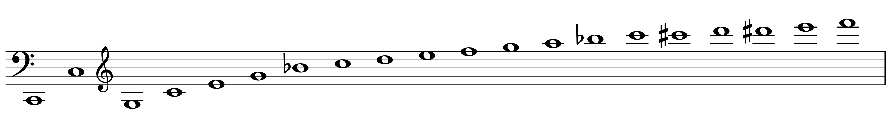
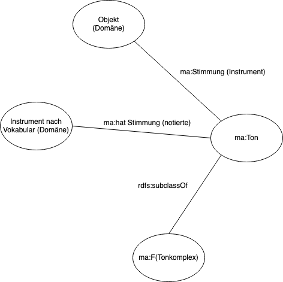
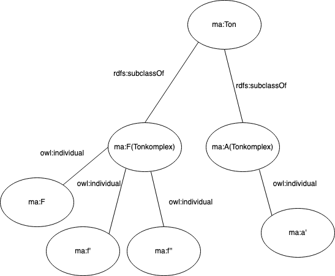

# Anreicherung "Stimmungen" <- das muss anders heißen

Nachdem es zuletzt möglich gewesen war, bei der Modellierung ontologischer Sachverhalte auf nachnutzbare, bereits im Semantic Web verankerte Vokabulare zurückzugreifen, ergibt sich für diese Arbeit nun die Situation, dass eine solche Datengrundlage nicht mehr zur Verfügung steht. Dies ist gleichermaßen Herausforderung wie Chance: So entfällt zwar die aufwendige Suche nach- und Auswertung von Vokabularen im Netz, doch ergeben sich nun zwangsläufig Fragen in Bezug auf die konzeptuelle Anlage und technische Bereitstellung eigener Datensätze. Dabei wird es abermals nicht anders möglich sein, als technische Aspekte weitestgehend auszuklammern und sich auf die konzeptuelle Arbeit zu fokussieren. Angesichts der Komplexität im Bereich der musikalischen Stimmungen, die im Spannungsfeld von Musikästhetik, Musiktheorie, Organologie aber auch etwa der Physik angesiedelt ist, wird es fortan notwendig sein, vermehrt musikwissenschaftlichen Fragestellungen im weitesten Sinne bei der terminologischen Arbeit Platz einzuräumen. 

## Problemstellung

Eine zentrale Herausforderung stellt die Vieldeutigkeit der mit dem Komplex "Stimmung" assoziierten Begriffe dar. Da eine umfassende Disambiguierung an dieser Stelle nicht möglich ist,[^1] wird hier vor allem auf einen wichtigen Umstand hingewiesen, der das Verständnis für die folgenden Ausführungen erleichtern soll.

Prinzipiell unterschieden werden muss nämlich zwischen einer streng physikalisch basierten und messbaren Definition von Stimmung und Klang und einem ideellen Konzept, der sich insbesondere etwa in Formen ihrer (scheinbaren) Repräsentierungen äußert. Diese beiden Kategorien stehen durchaus in Beziehung zueinander, dürfen jedoch keineswegs pauschal gleichgesetzt werden. So mag etwa die Aussage, ein Instrument sei in A gestimmt, dazu verleiten, Rückschlüsse auf verschiedene klangliche Verhältnisse gemäß heute selbstverständlicher Konventionen (*a'* = 440 Hz) zu ziehen. Es ist wichtig, sich immer wieder vor Augen zu führen, dass diese Festlegung keine naturgegebene, sondern eine willkürliche ist:

Die Frequenz 440 Hz ist keineswegs dasselbe wie "der Ton *a*'", sondern ein in der Natur vorkommendes Phänomen, das anhand einer normalisierten Einheit, *Hertz*, gemessen wird. Und umgekehrt handelt es sich beim Ton *a* nicht um einen Klang mit der Frequenz 440 Hz, sondern um ein lediglich ideell existierendes Konzept, das innerhalb eines Ordnungsgefüges in (ebenfalls theoretischer) Relation zu anderen theoretischen Konzepten (also anderen "Tönen") steht. Dieses Konzept erfährt seine reale Manifestation dabei zunächst lediglich in semiotischer Form als graphischer (Note) oder sprachlicher Darstellung als "Label" "der Ton *a*'". Ein klangliches Potential existiert für dieses Konzepts höchstens implizit (dank dessen ist etwa eine Partitur als Medium dazu imstande, dieses inhärente Potential auch ohne klangliche Äußerung in abstrahierter Repräsentation zu transportieren). 
Kurz gesagt also: Signifikant und Signifikat sind nicht a priori gekoppelt. Ihr Verhältnis muss zuerst festgelegt werden: – etwa durch die Definiton "*a'* = 440 Hz". Es wird bei der Modellierung darauf zu achten sein, dass diese beiden konzeptuellen Ebenen nicht vermischt werden, und es erscheint sinnvoll, die benötigten Entitäten und Properties nochmals semantisch zu schärfen und gegeneinander abzugrenzen.

## Stimmton

Die Entität `ma:Stimmhöhe` definiert, wie eben bereits skizziert, den Bezug zwischen Tonkonzept und Klang in der Form "Stimmton hat Festlegung Klangfrequenz" (etwa: "*a'* = 440 Hz)".[^2] Dabei liegt die Relevanz keineswegs in der Kenntnis des Stimmtons in seiner eigentlichen Funktion als Ton für das gemeinsame Stimmen von Instrumente, sondern darin, dass in ihm ein Referenzpunkt festgelegt ist, an dem weitere Töne intervallisch ausgerichtet sind (s. Stimmungssystem).

## Stimmungssystem

Die Entität `ma:Stimmungssystem`  definiert das Gefüge, das festlegt, in welchem Verhältnis Töne zueinander stehen. Anhand eines absolut definierten Stimmtons als Referenzton und in Kenntnis eines zugrundeliegenden Stimmungssystems ließen sich Frequenzen und somit absolute Tonhöhen für beliebige weitere Töne – etwa die des Ambitus – ableiten. Hier bietet die GND mit der Entität `gnd:4122368-8` ("Stimmung <Musik\>")[^22i] einen halbwegs aussagekräftigen Datensatz, der behelfsmäßig genutzt werden kann. Um die scheinbare Redundanz dieser Entität und der Entität `ma:Stimmung` aufzulösen, wird das Label für den Gebrauch in diesem Metadatenprofil durch das Property `rdfs:label`[^23] wieder zu "Stimmungssystem" verändert (sich aber auf die GND hinterlegte Bedeutung bezieht).

## Stimmung

Bei dieser Entität handelt es sich um das komplexeste der hier zu fokussierenden, da in ihm jene eingangs beschriebenen Ebenen Gefahr laufen, übermäßig zu verschwimmen. Zu differenzieren sind vor allem zwei Konzepte:

1) Ein "werk-" oder "quellenseitiges" Konzept von Stimmung, das vor allem die Notation betrifft und somit abstrakt und ideell bleibt (jedoch in gewisser Weise mit 2) in Beziehung steht).
2) Ein Konzept von Stimmung, das aus instrumentenbaulichen Zusammenhängen zustandekommt und sowohl (wiederum nicht notwendigerweise gekoppelte) abstrakte als auch physikalische Aspekte beinhaltet.

Diese beiden Punkte sollen nun anhand des Anwendungsbeispiels näher ausgeführt werden.

Zu 1): Bereits zu Beginn dieser Arbeit wurde erwähnt, dass die Hörner im Autograph der Kantate BWV 208 in F notiert sind, wobei alle weiteren Stimmen in C notiert sind. Dies bedeutet, dass die Töne der Hornstimmen eine Quinte tiefer "klingen",[^3] als sie notiert sind.
Dieses Konzept von Stimmung hat dabei eine lediglich auf die Erschließung von Notenmaterial begrenzte Relevanz, da etwa bereits im Falle von Audioaufnahmen Notation keine Rolle spielt.
Wichtig ist hierbei festzuhalten, dass das hier gemeinte Stimmungskonzept in keinem notwendigen Zusammenhang zum Instrumententyp stehen muss: eine in F notierte Stimme ist auf einem (mit Ventilen versehenen) Horn gleich welcher Stimmung (siehe 2) ) spielbar.[^4]

Zu 2): Blasinstrumente verfügen kraft ihrer baulichen Charakteristika sowie der Methode der Tonerzeugung[^5] über eine Art "Grundton", dem sog. "Pedalton". Über diesem baut sich durch Veränderung des in Schwingung versetzten Luftstroms – das sog. "Überblasen" – eine Folge von Tönen mit einer festen Intervallstruktur auf – die sog. "Naturtonreihe".

Dies bedeutet also, dass Blasinstrumente bereits qua Konstruktion über eine festgelegte Stimmung verfügen. Diese wird anhand jenes Pedaltons, dem "ersten Naturton" benannt: so bedeutet etwa die Bezeichnung "F-Horn" oder "Horn in F" bezogen auf ein Instrument (und also nicht einen Notentext), dass es sich beim ersten Naturton um ein *f* handelt, und dass sich die Naturtonreihe mit ihrer festgelegten Intervallik über diesem Ton aufbaut. Doch auch hier ist die Aussage "in F" keineswegs auf einen absoluten Ton mit definierter Frequenz bezogen und bleibt somit wenig aussagekräftig, sondern kann nur in Bezug zu einem Frequenz-mäßig definierten Stimmton identifiziert werden.
Jedenfalls ergibt sich bei der Modellierung die Schwierigkeit, dass der Bezeichnung "Horn in F" je nach Bezugspunkt – Objekt oder Quelle – eine unterschiedliche Bedeutung zukommen kann, jedoch nicht muss. Tatsächlich kann diese Bezeichnung im Fall der Modellierung von Autograph und *Großwindigem Naturwaldhorn* als synonym gelten – eine Differenzierung zwischen Notation und Horn ist nicht nötig: Ein F-Horn muss in diesem Kontext allein schon deshalb gemeint sein, da nur dessen Naturtonreihe im Barock das notwendige Tonmaterial bereithalten konnte – die Notation ist also bloß eine logische Folge dieser Festlegung. Anders sieht es bei neueren Sachverhalten aus. Dort ist Notation keineswegs an den Instrumententyp gekoppelt: Für ein diatonisch spielbares Horn kann auch ein "virtuell-gestimmtes" Horn notiert werden.[^6]

Ein Umgang mit dieser Herausforderung könnte sein, zwei neue Stimmungsentitäten zu schaffen – eine, die sich auf die Notation bezieht und eine, die sich auf die "Grundstimmung" eines Instruments bezieht. Allerdings würde dies eine recht eigentlich artifizielle Trennung des eben skizzierten Sachverhalts bewirken. Um einiges sinnvoller erscheint es, das Konzept der `ma:Stimmung` in seiner bisherigen Form beizubehalten und – wie dies auch vorgesehen war – durch Properties Relationen zu einem jeweiligen Bezugspunkt, Quelle oder Objekt, auszudrücken. 

##  Töne

Töne spielten im vorhergehenden Kapitel bereits eine Rolle:

1) als eine Art Schlüssel zum Verständnis eines Notentexts ("'in F' bedeutet, man muss alles eine Quinte tiefer denken")
2) als ein Bezeichner, der Rückschlüsse auf den physikalisch prädisponierten intervallischen Aufbau der Naturtonreihe bei Blechblasinstrumenten erlaubt
3) als Klangfrequenz (440 Hz)
4) als "Zeichen" ("*f'*" oder "graphische Note")
5) Bislang nicht thematisiert worden ist die Idee einer Oktavidentität der "F-Töne", die alle Oktav-verwandten, also im Schwingungsverhältnis 1:2, 2:4 etc. stehenden Töne, in sich vereint.[^7]

Abermals wird deutlich, dass die Beschaffenheit des Konzepts "Ton" eine sehr ambige ist, die durchaus hohe Herausforderungen an die kontextuelle Modellierung stellt, ergeben sich doch zugleich konzeptuelle Überschneidungen sowie Differenzen zwischen den zu modellierenden Konzepten. 

Es erscheint sinnvoll, zunächst eine Klassifikation der relevanten Konzepte vorzunehmen:

### Ton als Abstraktum

\1) und 2) beziehen sich auf ein Tonkonzept, das große Ähnlichkeit mit dem 5) inhärenten aufweist: Es liegt ihm eine sehr allgemeine und zugleich sehr abstrakte Vorstellung einer Tonentität "F" zugrunde. Um nicht zu sehr ins Philosophisch-Musiktheoretische abzuschweifen (dies könnte Thema einer Anschlussuntersuchung sein), reicht es, diese Entität zunächst rein hierarchisch als allgemeinste Oberklasse von "F-Tönen" – im denkbar weitesten Sinne – zu verstehen. Leider findet sich keine adäquate Terminologie im Netz, die übernommen werden könnten – es erscheint offensichtlich, dass die Repräsentation musiktheoretischer Zusammenhänge noch ein großes Desiderat darstellt. So ist – beispielhaft betrachtet – eine Nutzung der Wikidata-Entität `wdt:Q775617`("F"[^8]) durch Koppelung an die gleichstufige Stimmung in ihrer Nutzbarkeit dergestalt beschränkt, dass sie etwa im hier bearbeiteten Anwendungsszenario nicht verwendet werden kann. Es muss daher eine neue Entität `ma:F (Tonkomplex)` als Unterklasse von `ma:Ton` angelegt werden. Diese erhält – wie im letzten Kapitel geschildert – durch Verbindung mit einer Property `ma:hat Stimmung (notierte)` oder `ma:Stimmung (Instrument)` eine semantische Spezifikation. So können denn auch die bisherigen Entitäten `ma:Stimmung` sowie `ma:in_F` entfernt werden und die beiden Properties durch `rdfs:range` auf `ma:Ton` und seine Unterklassen bezogen werden.

### Ton als normativ fixiertes Zeichen

#### Taxonomie

Eine Eskalationsstufe weiter in der Konkretisierung des Konzepts "Ton" liegt seine Manifestation als Zeichen jeglicher Form, jedoch stets nur innerhalb eines Musikalischen Bezugs- und Ordnungssystems verständlich, in dessen Kontext er als Bedeutungsträger auftritt. Doch auch hier bleibt er ein abstraktes Phänomen, dessen akustische Äußerung ihm lediglich als Potential innewohnt.

Dieses Konzept von Ton begegnet selbstverständlich insbesondere in Hinsicht auf den Notentext, wie er etwa im Umfeld der Entität `ma:Ambitus` auftritt. Seine Notation erfolgt dabei in dieser Arbeit gemäß der sog. Helmholtz-Notationsweise.[^9]

Es ergeben sich die folgenden taxonomischen Beziehungen:

Dabei ist jedoch weiter zwischen Notation und "Klang" – etwa bei transponierenden Instrumenten zu differenzieren. Dieser Faden wird an späterer Stelle wieder aufzunehmen sein.

#### Stimmton

Zugleich aber findet sich dieses Tonkonzept im Zusammenhang mit der bisherigen Entität `ma:Stimmhoehe`, indem jene "symbolische", tonsystemisch-relative Tonhöhe durch die Zuweisung einer Frequenz definiert wird und als Referenzton Verwendung finden kann.

Angesichts der zuletzt vorgenommenen Anpassung im Bereich der Töne gilt es, das bestehende Modell nochmals zu überdenken: Es liegt dabei auf der Hand, dass die bisherige Entität `ma:a' = 415 Hz` sehr viel aussagekräftiger, multidimensionaler und semantisch anschlussfähiger würde, wenn man jeden Bestandteil des Tripels als einzelnes Konzept auffassen würde.

Dabei existiert bereits eine Entität `ma:a'`, durch deren Nachnutzung in diesem Kontext die Kohärenz des gesamten Datenmodells weiter gestärkt wird.

### Ton als physikalisches Phänomen

Wie bereits mehrfach erwähnt, geschieht die Etablierung eines Referenztons, eines Stimmtons, durch "das Mappen" eines relativen Tonkonkonzepts mit der realen Naturerscheinung akustischer Schwingungsfrequenzen. Soll nun also diese "Konkordanz" ebenfalls in eine Tripelstruktur gebracht werden, muss eine Property sowie ein Objekt definiert werden. Dies kann an dieser Stelle nur prophylaktisch erfolgen, erfordert doch die Modellierung mit etablierten Semantic Web-Sprachen solide(re) Kenntnisse im Bereich der Akustik. Daher soll zunächst mit der Wikidata-Entität "pitch" (`wdt:Q118819`) vorliebgenommen werden, die als Klasse eingeführt werden kann. Ihr als Instanz zugeordnet, ist die zu erstellende Frequenz-Entität `ma:415Hz`. Eine weitere Ausdifferenzierung der Bestandteile in Datentypen (etwa "natürliche Zahlen") und Einheitswerte (Hz) wäre ebenfalls ein Anschlusspunkt für künftige Bestrebungen.[^11]

#### Modellierung Stimmhöhe / Referenzton
\
1)\ Es ergibt sich also der folgende Zusammenhang:

**Bild: **

Die Entität `ma:Stimmhoehe` integriert in sich die allgemeine, freilich durch Instanzen dieser Klassen weiter zu spezifizierende Aussage:

``ma:Ton	rdf:value	wdt:Q118819``

Dabei wurde `wdt:Q118819` durch das neue Property `rdf:value`[^10] in Relation zu `ma:Ton`, etwa `ma:a'`, gesetzt.

2)\ Durch die so erfolgte Modellierung der Entität `ma:Stimmhoehe` als RDF-Tripel ergibt sich eine Schwierigkeit, die bislang keine Rolle gespielt hat: Das Objekt (`die Stimmung`) der Aussage

``<ein Musikinstrument>	<hat Stimmung>	<die Stimmung>	.``\

beinhaltet selbst ein Tripel, nämlich:

``<a'>	<ist gleich>	<415 Hertz>	.``\

Die Lösung dieses Problems liegt im sogenannten *reification*,[^12] indem "eine Aussage über eine Aussage" gemäß dem folgenden Schema gemacht wird:

``<ein Musikinstrument>	<hat Stimmung>	<die Stimmung>	.``\

``<die Stimmung>	<hat Subjekt>	<a'>	.``\

``<die Stimmung>	<hat Prädikat>	<ist gleich>	.``\

``<die Stimmung>	<hat Objekt>	<415 Hertz>	.``\

Zudem könnte definiert werden:

``<die Stimmung>	<ist eine>	<Tripel-Aussage>	.``\

Dies kann mithilfe der Properties `rdf:subject`,[^14] `rdf:predicate`[^15] und `rdf:object`[^16] geschehen. Zudem kann das Objekt durch Klassifizierung als Aussage durch die Verbindung über das Property `rdf:type` zur Entiät `rdf:statement`[^17] definiert werden:[^13][^18]
 
 Es ergibt sich somit der folgende analoge Zusammenhang:
 
 ``<wdt:musical_instrument>	<ma:hat_Stimmhoehe>	<ma:Stimmhoehe>	.``\
 
 ``<ma:Stimmhoehe>	<rdf:subject>	<ma:Ton>	.``\
 
``<ma:Stimmhoehe>	<rdf:predicate>	<rdf:value>	.``\

``<ma:Stimmhoehe>	<rdf:object>	<wdt:pitch>	.``\

sowie

``<ma:Stimmhoehe>	<rdf:type>	<rdf:statement>	.``

### Tonraum (Ambitus)

Ein weiteres Anliegen der Arbeit war es, eine Darstellungsmöglichkeit für den Ambitus (bislang `ma:Ambitus`) von Stimmen zu schaffen. Auch hier halten die auffindbaren Vokabulare keine Patentrezepte bereit. So bietet zwar DOREMUS das Property `mus:has_Ambitus`[^18] scheinbar einen Ansatzpunkt, allerdings wird durch die Erklärung "this property allows for describing the tessitura of a character, as can be drawn from the score[...]" die Benutzung letztlich auf Vokalpartien beschränkt.
Wikidata hält das Property `wdt:ambitus`(`P2279`)[^19] bereit, das aufgrund seiner Beschreibung "étendue d'une mélodie, d'une voix ou d'un instrument, entre sa note la plus grave et sa note la plus élevée" vielversprechend erscheint. Jedoch ist er semantisch auf eine Entiät bezogen, deren Beschreibung unsinnig ist,[^20] und zugleich scheint jener Ambitus als Intervall und nicht als definierter Tonraum darstellbar. So fällt die Entscheidung leicht, die eigens definierten Konzepte auch weiterhin beizubehalten.\

``<ma:Instrument_nach_Vokabular_(Domäne)>	<ma:hatAmbitus>	<ma:Ambitus>	.``\

Dabei gilt für `ma:Ambitus`:\

``<ma:Ambitus>	<ma:hat_höchsten_Ton>	<ma:Ton>	.``\

``<ma:Ambitus>	<ma:hat_tiefsten_Ton>	<ma:Ton>	.``\

### Inferenzmöglichkeiten

Weiteres Potential des Metadatenprofils liegt in der automatischen Deduktion von Schlussfolgerungen dank formallogischer Zusammenhänge.[^21] Beispielsweise die folgenden Sachverhalte könnten künftig durch entsprechende weitaus komplexere Modellierung inferiert werden:\

1) anhand der Information über die notierte Stimmung könnten die dermaßen notierte Töne – etwa die des Ambitus – automatisch zu "klingenden" Tönen automatisch werden. (Die Möglichkeit, diese Transposition künftig maschinell zu implementieren macht die ursprünglich im ERM vorgesehene Modellierung der "klingenden" Äquivalente zu notierten Tönen hinfällig.)
2) mit dem Kammerton als Referenzton und in Kenntnis des zugrundeliegenden Stimmungssystems wären einzelne Frequenzen von Tönen exakt bestimmbar.\

Diese Modellierung würde ein fundierteres Verständnis mathematischer Logik und ihrer Modellierung etwa mit OWL erfordern. 

## "Wrapping things up"

* label @eng – rdfs:literal
* domain: owl:deprecated
* trennung von domain und ma:vokabular
* in diesem Kontext: Anpassen des namespaces / der Benennung des Vokabualrs

1 Erkenntnis: das ganze mit den Stimmungen und so sollte mal als komplette Ontologie modelliert werden!!!

Dies wird umso deutlicher, wendet man sich den innerhalb des Komplexes `ma:Ambitus` relevanten Entitäten zu.

deswegen kann man sie auch nicht einfach alle gleichsetzen bei modellierung

Töne: zwei verschiedene Sorten: 
in F: Klasse aller Oktavverwandten F-Töne <- nein: entweder betrifft dies die Notation oder die Prädisposition der Stimmung
f': Ton, der in einer bestimmten Art notiert wird und in jenem Gefüge sich bewegt.

im weiteren: ausdifferenzieren – Töne zueinander in Beziehung setzen. <- Reasoning!

also die Properties definieren – kann also sein, dass Stimmung andere Werte hat (nicht so wie im ERM)

man muss Definitionen in das Vokabular reinmachen.

Pedalton ist an das Instrument gekoppelt: der tiefste Ton ist F

"hat Stimmung (absolute Tonhöhe)": "a' = 440 Hz" – absolute Tonhöhe bedeutet, dass ein Ton mit seinen inhärenten Eigenschaften (Name, notierte Darstellung) auf eine Frequenz festgelegt ist
-> erstmal nicht so relevant für Anwendungsfall, oder?

Dann ist aber der Pedalton noch etwas zusätzliches...

Pedalton ebenfalls: man muss differenzieren zwischen der Bezeichnung "in F" und der tatsächlihcne absoluten Tonhöhe

hat Stimmungssystem – natürlich (heißt das so bei Blechinstrumenten?)

Grundstimmung / obertonreine Stimmung / relative Stimmung

Ein *Instrument nach Vokabular (Domäne)* kann innerhalb eines Werks beliebig viele notierte *Stimmungen* besitzen.[^c8665]. Die Bedeutung der Entität *Stimmung* – etwa mit dem Wert "F" – weicht dabei in der Kombination mit *Instrument* von der der Verwendung in Kombination mit *Objekt (Domäne)* ab: In dieser Kombination bezieht sich die Entität *Stimmung* auf die mögliche "Grundstimmung" eines Objekts (z.B. F-Horn), sofern es eine besitzt.[^c8666]

!!!! Das muss vermutlich alles auch mit dem Werk verknüpft sein!!! <- das muss man fragen!

Das gilt übrigens auch für den ganzen anderen Kram… :(

http://data.doremus.org/ontology/#U28_has_ambitus

"scope note: this property allows for describing the tessitura of a character, as can be drawn from the score."

https://www.wikidata.org/wiki/Property:P2279

musical interval/range of a melody

étendue d'une mélodie, d'une voix ou d'un instrument, entre sa note la plus grave et sa note la plus élevée

“directed graphs are the more suitable data structure for encoding (music) texts than tree structures (and thus XML)” J. Kepper. 2009. “XML-basierte Codierung musikwissenschaftlicher Daten – Zu den Voraussetzungen einer digitalen Musikedition”. it – Information Technology. Methoden und innovative Anwendungen der Informatik und Informationstechnik 51 (4): 216–221, here 220.

[^1]: Einen umfassenden Überblick bietet:

[^2]: Sinnvoll wäre es etwa für maschinelle Auswertungen, die Festlegung des Stimmtons ebenfalls als Tripel mit unterschiedlichen Datentypen zu modellieren und mit etablierten Vokabularen – v.a. aus dem Bereich der Physik/Akustik – zu verknüpfen. 

[^3]: Wobei dies freilich zunächst ebenfalls ein theoretisches "Klingen" ist.

[^4]: Eine sehr verständliche Einführung zur Transposition in Hornstimmen findet sich in: [@TN_libero_mab21137748, S. 67–72.]

[^5]: S. hierzu insb. [@wogram_beitrag_nodate]

[^6]: Vgl.: [@TN_libero_mab21137748, S. 69.]

[^8]: [@noauthor_f_nodate]

[^9]: 

[^10]: [noauthor_rdf_nodate-11], [@TN_libero_mab21631588, S. 55–56.]

[^11]: [@TN_libero_mab21631588, S. 51–52.]

[^12]: [@noauthor_rdf_nodate-12], [@allemang_semantic_2011, S. 42–44.]

[^13]: [@TN_libero_mab21631588, S. 80.]

[^14]: [@noauthor_rdf_nodate-13]

[^15]: [@noauthor_rdf_nodate-14]

[^16]: [@noauthor_rdf_nodate-15]

[^17]: [@noauthor_rdf_nodate-16]

[^18s]: Dabei ist die Domain der Properties auf die Klasse `rdfs:statement` festgelegt, die Range auf `ma:Stimmhoehe`.

[^18]: [@noauthor_doremus_nodate-6]

[^19]: [@noauthor_ambitus_nodate]

[^20]: Beschreibung: "range of musical scale degrees attributed to a given mode", vgl.: [@noauthor_ambitus_nodate-1]

[^21]: Vgl. etwa: [@szeredi_lukácsy_benkő_nagy_2014, S. 175–183.]
[^22]: 

[^22i]: [@noauthor_katalog_nodate]
[^23]: [@noauthor_rdf_nodate-17]