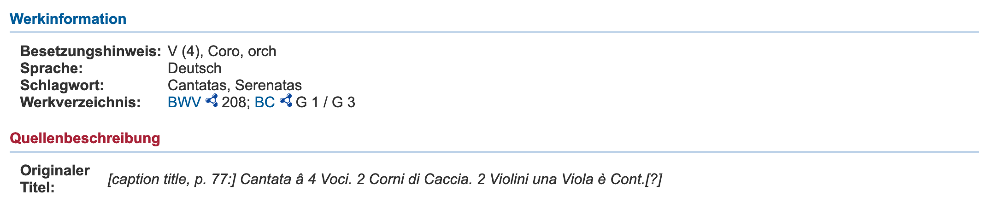

Einleitung
==========

Ziel dieser Arbeit ist es, einen Ansatz für ein semantisches Framework
zu entwickeln, das seine Anwender in die Lage versetzt,
musikinstrumentenbezogene Ressourcen aus Einrichtungen unterschiedlicher
Sparten des Kulturerbes zueinander in Beziehung zu setzen, zu verbinden
und dabei zugleich -- mittelbar -- bereits vorhandenes Vokabular um
wichtige Aspekte anzureichern.

Musikinstrumente sind schwer zu fassende Phänomene, deren "Wesen"
situativ und je nach Blickwinkel[^1] sehr unterschiedlich -- etwa
materiell, immateriell, medial oder performativ -- sich ergeben
kann.[^2] Hinzu kommt, dass sie mit ihrem Bezugspunkt "Musik" (zumeist
primär) in Abhängigkeit zu einem gleichermaßen immateriellen, hochgradig
ambivalenten und damit für Kulturerbeinstitutionen ohnehin
außerordentlich schwierig fassbaren Gegenstand stehen.[^3] Trotzdem
spielen Musikinstrumente in verschiedenen solcher Einrichtungen eine
Rolle -- sei es als Museumsobjekt, als Besetzungsangabe einer Quelle,
als Instrument in einer Aufnahme oder als Term in einem Vokabular etc.

Es liegt dabei auf der Hand, dass sich das Konzept "Musikinstrument"
eingedenk seines eingangs beschriebenen, sparten- oder gar
institutionsspezifischen Blickwinkels unterscheiden muss: Eine
"Objekt-zentrierte Herangehensweise" wird womöglich ganz andere Aspekte
jenes Konzepts hervorheben -- etwa physische oder ereignisbezogene --
als eine bibliographische.[^4] Und so mag es denn auch nicht verwundern,
wenn konzeptuelle Modelle und Vokabulare verschiedener Kulturerbesparten
-- etwa Museen, Archive, Bibliotheken etc. -- mitunter nicht unmittelbar
miteinander kompatibel sind.

Dabei bärge vor dem Hintergrund eines digitalisierten
*GLAM*-Bereichs[^5] eine Vernetzung von Beständen, dessen Prämisse jene
Kompatibilität bildet, bekanntlich einiges an Potential: So könnten etwa
Bestandsmetadaten durch Kontextualisierung nach außen zusätzlich in Wert
gesetzt werden, die Übernahme von Fremddaten zur Anreicherung eigener
Datensätze erleichtert werden,[^6] neue -- womöglich
bestandsübergreifende -- Suchmöglichkeiten und -Einstiege für den Nutzer
geschaffen[^7] und Bestände virtuell zusammengeführt und sichtbarer
werden.[^8] Für Forscher, etwa Editionswissenschaftler oder Digital
Humanists, ergibt sich neben der Nutzung und Auswertung von hochwertigen
Metadaten die Möglichkeit, eigene Forschungsdaten in diesem Austausch
beizutragen. Die Aktualität und Relevanz dieses Anliegens im
geisteswissenschaftlichen Bereich zeigt sich dabei etwa darin, dass mit
den Projekten GND4C[^9] sowie im NFDI4Culture-Konsortium (insb. "Task
Area 2")[^10] gleich zwei Projekte von nationaler Größenordnung die
Vernetzung und Standardisierung im Kulturerbebereich angehen.

Ein weiteres zentrales Problem im Zusammenhang mit musikalischen Quellen
besteht zudem darin, dass vorhandene, meist generische Vokabulare im
Bereich der Musikinstrumente mithin starke Defizite (Konsistenz,
Detailtiefe, Präzision) aufweisen. Eine Möglichkeit, diese -- möglichst
einfach -- um wichtige Konzepte zu ergänzen, erscheint daher ebenfalls
außerordentlich fruchtbar. Der praktische Nutzen einer solchen
Möglichkeit wurde im Vorfeld dieser Arbeit in zahlreichen persönlichen
Gesprächen mit Vertretern verschiedener Sparten sowie Forschenden
verifiziert. Dabei findet sich so manche kleinere Institution und
Forschung oftmals vor die Herausforderung gestellt, dass sie, oftmals
durchaus spezielle, Bedürfnisse bei Erschließung oder Publikation ihrer
Forschung haben, die Teilhabe an der Entwicklung von Standardvokabular
ihnen jedoch verwehrt ist. Für diese ist es wichtig, Möglichkeiten zu
finden, diese Teilhabe dennoch niederschwellig zu ermöglichen.

So ergeben sich drei Hauptanliegen für diese Arbeit:

1)  die Möglichkeit einer Vernetzung von musikinstrumentenbezogenen
    Daten verschiedener Sparten zu erproben.

2)  auszuloten, in welcher Weise eine Anreicherung der vorhandenen
    Vokabulare möglich ist.

3)  ein Gelingen wäre ein Indikator für die Möglichkeit, fehlendes
    kontrolliertes Vokabular niederschwellig selbst -- also von
    kleineren Einrichtungen und Forschern -- anlegen zu können.

Technisch kann dies durch die sog. "Semantic Web-Technologien"[^11]
ermöglicht werden. Dank des ihnen zugrundeliegenden *RDF*-Modells
(*Research Description Framework*) ist es bei Nutzung verschiedener
etablierter Technologien des Internets möglich, im Netz gespeicherte
Daten in semantische Beziehungen zueinander zu setzen und dabei
interoperabel und maschinenlesbar zu machen. Aus der Gesamtheit der an
dieses semantische Netz angeschlossenen Daten, dem *Linked Data Cloud*,
lässt sich so ein eigenes anwendungsbezogenes Schema, ein sog.
*Metadatenprofil*[^12] erzeugen, das imstande ist, als Schema für
Vernetzung und Anreicherung musikinstrumentenbezogener Metadaten
herzuhalten. Es könnte dabei als gedankliche Vorarbeit für eine
anschließende Weiterentwicklung und Ausarbeitung durch eine
Fachcommunity fungieren. Dank der semantischen und technischen Offenheit
des sog. *Semantic Web* ist dabei terminologische Anschlussfähigkeit und
die Darstellung sehr spezifischer Sachverhale möglich.

In methodischer Hinsicht ist die Entwicklung eines solchen Profils
jedoch mit einigen Herausforderungen verbunden:

Nach dem RDF strukturierte Vokabulare liegen gewöhnlich "als Endprodukt"
vor -- Rückschlüsse auf die Modalitäten ihrer Genese (und somit
methodische Ansätze für die Entwicklung eigener) bleiben dem Betrachter
in der Regel somit verwehrt. Zudem ist der Vorgang der Modellierung
stark prozessual und mitunter zirkulär geprägt, was das Gießen dieses
Prozesses in die chronologische Form wissenschaftlicher Stringenz in
Form einer schriftlichen wissenschaftlichen Fixierung sehr erschwert.
(Da nicht jede Iteration dieser Genese umfassend im Rahmen der
verschriftlichten Variante dieser Arbeit nachgezeichnet werden kann,
wurde im *GitHub*-Repositorium dieser Arbeit[^13] jeder Schritt
dokumentiert und offen nachvollziehbar gemacht.)

Eine zusätzliche Herausforderung liegt in den auszuwertenden Quellen
selbst begründet: Die Quellen, aus deren Termen sich das Metadatenprofil
zusammensetzen könnte, umfasst potentiell die Gesamtheit der im Semantic
Web enthaltenen. Eine philologische Auswertung ist daher schlichtweg
unmöglich, und es werden im Laufe der Arbeit alternative heuristische
Lösungen gefunden werden müssen. Umso schwerer wiegt es da, dass es an
einführender Literatur, die imstande wäre -- insbesondere
Nicht-Informatikern --, einen Kompass im Prozess des Modellierens und
Publizierens von Linked Data an die Hand zu geben, mangelt.[^14]

Diese besonderen Rahmenbedingungen machen es erforderlich, dass sich die
Arbeit in großen Teilen deduktiv vorantastet, wobei die Methodik
anlassbezogen anhand der in der Praxis vorgefundenen jeweiligen
Problemstellung zu entwickeln sein wird, so dass der methodische Faden
im Laufe der Arbeit immer wieder aufzunehmen zu sein wird.

\[es ist ja theoretisch unbegrenzt anschlussfähig -- das endgültige
Modell hat Situationen, die ins Leere laufen (z.B. Instrument nicht mit
Ereignis verknüpft etc.)\]

Eine weitere methodische Besonderheit, die gewissermaßen bereits im
Wesen des Semantic Webs begründet liegt, ergibt sich aus der ihm eigenen
sonderbaren Verschmolzenheit von Konzepten intellektueller
Wissensrepräsentation und der technischen Umstände ihrer digitalen
Manifestation, was eine losgelöste Betrachtung eines einzelnen dieser
beiden Bestandteile nachgerade unmöglich macht. Dennoch erscheint es
angesichts des hier behandelten konkreten Anwendungsfalls sinnvoll, im
Folgenden einen gewissen inhaltlichen Schwerpunkt auf die intellektuelle
Modellierung zu legen und technische Belange, wo immer möglich,
auszuklammern.

Metadatenstandards werden nicht im Rahmen von studentischen
Qualifikationsarbeiten verfasst, sondern entstehen etwa als wandelbare
Ergebnisse langwieriger diskursiver, Community-getriebener
Prozesse.[^15] Das Ergebnis dieser Arbeit besteht daher keineswegs im
Fertigstellen einer umfassenden Ontologie der Musikinstrumente, ihrer
Eigenschaften und ihrer ontologischen Beziehungen in der Welt. Vielmehr
liegt ihr Sinn insbesondere darin, einige Vorüberlegungen für eine
potentielle anschließende Entwicklung eines ausdrucksstärkeren
Vokabulars vorwegzunehmen, dabei gangbare methodische Wege zu kartieren
und zuletzt einige -- wenige -- konkrete inhaltliche
musikwissenschaftliche Vorarbeiten vorauszuschicken -- welche
insbesondere aber zur Illustration und zu Verifikationszwecken für die
Stimmigkeit des Arbeitsansatzes bestimmt sind.

Vorbemerkungen
--------------

### Semantic Web: Konzept

Eine erschöpfende Einführung in die paradoxerweise teils nachgerade
banalen wie zugleich hermetisch komplexen Konzepte und Technologien des
*Semantic Web* kann an dieser Stelle nicht erfolgen, sondern sie darf
sich vielmehr auf einige für das Verständnis der folgenden Arbeit
wesentliche Punkte beschränken.

Das *W3C* erklärt die Grundidee des *Semantic Webs* folgendermaßen: "The
Semantic Web provides a common framework that allows data to be shared
and reused across application, enterprise, and community
boundaries."[^16] Dabei wird das Grundprinzip des Internet --
verschiedene mittels *HTML*-Links miteinander *vernetzter* Seiten --,
dem *Web of Documents*[^17], auf den Inhalt dieser Seiten übertragen und
erweitert. Leider ist das *Web of Documents* lediglich ein "\[...\] set
of interlinked documents with heterogeneous syntax and semantics and
uncontrolled content\[...\]":[^18] dessen Inhalt ist also leider nicht
einheitlich und somit nicht interoperabel.[^19] Im *Web of Data*[^20]
hingegen können auch die Inhalte einer Seite (also "Data" innerhalb
eines "Documents") dank einer standardiserten "Syntax", dem in \#kapitel
bereits erwähnten sog. *Ressource Description Framework* (RDF),[^21] in
vielfältige Beziehung zum Inhalt anderer Seiten gesetzt und mit
passenden Informationen wiederum innerhalb dieser verlinkt werden. Durch
die Charakterisierung der Beziehungen dieser Daten zueinander ergeben
sich so mithilfe von RDF Aussagen, sog. "Tripel", mit semantischem
Gehalt in der Form

*Subjekt* - *Prädikat* - *Objekt*.[^22]

Die vormals auf die recht banale Beziehung

*Seite A* - *verlinkt auf* - *Seite B*

beschränkte Aussagekraft von HTML wird um komplexe Aussagemöglichkeiten
erweitert, die kreuz und quer durch das Netz Aussagen jeder Art über
"Dinge" jeder Art zu treffen imstande sind. Dabei können die
Bestandteile dieser Aussagen sowohl Subjekt oder Objekt neuer Aussagen
werden. Dank der Verwendung von RDF und bereits etablierter
Webinfrastruktur und -Standards sind Semantic Web-konform strukturierte
und publizierte Daten als *Linked Data* maschinenlesbar und
interoperabel und können in beliebige Beziehungen gesetzt werden.

### Terminologie

Im Kontext des Semantic Web begegnet eine Vielzahl sehr ambiger
Begriffe, die zugleich außerordentlich inkonsistent Verwendung finden.
Wenngleich an dieser Stelle für einige ausführlicheren terminologischen
Untersuchungen auf Heiner Stuckenschmidt[^23] verwiesen werden kann, ist
es an dieser Stelle dennoch sinnvoll, nochmals kurz auf einige der in
dieser Arbeit verwendeten Begriffe einzugehen.

-   Der syntaktische Kontext der Elemente *Subjekt*, *Prädikat*,
    *Objekt* ergibt einen gerichteten Graphen. Der Oberbegriff für die
    einzelnen, nun kontextuell losgelöst gedachten Elemente lautet in
    dieser Arbeit gemäß Stuckenschmidt *Konzepte*.[^24]

-   Die "Kanten" des Graphen, die also je nach Kontext *Subjekt* oder
    *Objekt* sein können, heißen im Folgenden *Entitäten*, wobei diese
    *Entitäten* sowohl "Dinge", als auch "Mengen von Dingen" sein
    können.[^25]

-   Etwas weniger einheitlich wird mit dem Element *Prädikat* verfahren:
    er wird, je nach Kontext, als *Property* oder *Relation* bezeichnet.

-   Kaum ein anderer Begriff ist in derartige Ambivalenz gehüllt, wie
    der Begriff "Ontologie", sodass eine Definition für diese Arbeit
    höchstens näherungsweise -- übrigens auch in der Fachliteratur
    gelebte Praxis --[^26] erfolgen kann. Dies gilt nicht lediglich für
    den Umstand, dass er als "Lehnwort" aus der Philosophie in
    verschiedenen Disziplinen unterschiedliche Verwendung findet,[^27]
    vielmehr herrscht auch in der Informatik selbst kein eigentlicher
    Konsens über seinen Bedeutungsinhalt.[^28] Über das Begriffspaar
    *Ontologie* und *Vokabular* schreibt das *W3C* (*World Wide Web
    Consortium*): "\[...\] ontologies and vocabularies within the
    Semantic Web can be regarded as synonymous, although ontologies may
    denote more complex conceptualisations (W3C, 2015)."[^29] Diese
    Arbeit verfährt wiederum etwas anders, indem sie diese prinzipielle
    Synonymität aufhebt und die Begriffe anhand Funktion und Struktur
    qualitativ unterscheidet: Demnach handelt es sich beim Begriff
    *Vokabular* um "\[...\]die Verzeichnung aller (allgemeinen oder
    fachspezifischen) Benennungen zur Nutzung als Wissensordnung
    \[...\]."[^30] Ihre Funktion besteht im Augenblick ihrer Nutzung
    darin, kontrolliertes Vokabular vorzuhalten. Für diese spezielle
    Nutzung kann nach Auffassung dieser Arbeit eine Ontologie mitunter
    ebenfalls verwendet werden. Charakteristika von Ontologien gegenüber
    anderen Systemen der Wissensorganisation sind in dieser Arbeit aber
    viel eher die folgenden Aspekte: Zumeist wird -- sofern es um
    Ontologien im Semantic Web-Kontext geht -- die formalisierte
    Sprachlichkeit und Maschinenlesbarkeit[^31] bzw. die Möglichkeit
    automatisches Schlussfolgern ("Reasoning") zu vollziehen,
    erwähnt.[^32] Bertram unterstreicht zudem ihre Vieldimensionalität
    und inhärente größtmögliche Flexibilität als Ordnungssystem in Bezug
    auf Beziehungsmöglichkeiten[^33] und zuletzt impliziert die Existenz
    einer "light"-Variante, der sog. *lightweight ontology*[^34] (s.
    \#kapitel) ein hohes Maß an Komplexität.

-   Die Bezeichnung *Metadatenprofil* (auch "Anwendungsprofil",
    "Applikationsprofil") impliziert -- ähnlich wie im Falle von
    "Vokabular" -- insbesondere eine funktionale Qualität für eine
    bestimmte Anwendung. Es handelt sich beim *Metadatenprofil* um ein
    Metadatenschema,[^35] in dem typischerweise Elemente von bereits
    exisitierenden Modellen und Standards kombiniert und so ein für
    einen bestimmten Anwendungsfall optimiertes Metadatenschema
    geschaffen wird.[^36] Eher untypisch erscheint hingegen, dass ein
    Metadatenprofil auch eigene Terme definiert.[^37] Da dies jedoch in
    dieser Arbeit der Fall sein wird, weist das hier entwickelte
    Metadatenprofil auch Eigenschaften eines Vokabulars auf. Bei dieser
    Definition ist noch nichts über die Struktur gesagt -- so nimmt etwa
    das in dieser Arbeit zu erarbeitende Metadatenprofil die Form eines
    *lightweight ontology* (s. \#kapitel).

**in krit. Bericht bwv208 gucken, ob da etwas zur
Instrumentationsproblematik steht**

Erschließungspraxis bei Instrumentalbesetzungen
===============================================

*RISM* (*Répertoire International des Sources Musicales*) ist "\[...\]
ein länderübergreifendes, gemeinnützig orientiertes Unternehmen mit dem
Ziel, die weltweit überlieferten Quellen zur Musik umfassend zu
dokumentieren."[^38] Für die Musikwissenschaft stellt es das wichtigste
Nachweissystem von historischem musikalischem Quellenmaterial (insb. bis
etwa 1850) dar.

Im folgenden Kapitel soll, ausgehend von einem Datensatz von RISM
exemplarisch die derzeitige Situation bei der Erschließung von Quellen
mit musikinstrumentenbezogenen Metadaten untersucht und anhand dieser
Untersuchung zu einer Problemstellung gefunden werden. Die Kenntnis
dieser Problemstellung bildet wiederum die Grundlage für das Entwickeln
denkbarer Lösungsansätze.

Es finden sich im Datensatz[^39] an drei Stellen Informationen zur
Besetzung: Zum einen unter "Quellenbeschreibung / Originaler Titel"
(MARC-Feld \#245\$a (Title))[^40] der String "Cantata â 4 Voci. 2 Corni
di Caccia. 2 Violini una Viola è Cont.\[?\]". Hinzu kommt ein sehr
allgemeiner Besetzungshinweis, der hier aber ausgeklammert werden kann.

{width="5.833333333333333in"
height="1.1505369641294838in"}

Besetzung1

Zum anderen unter "Weitere Angaben und Bemerkungen" im Unterfeld
"Besetzung" (MARC-Feld \#594\$a (freies Feld))[^41].

{width="5.833333333333333in"
height="1.975805993000875in"}

Besetzung2

Dabei handelt es sich um ein kontrolliertes Vokabular.[^42] Mehreres
fällt an dieser Stelle auf:

4)  Die Bezeichnungen der Instrumente in Originaltitel und im Feld
    "Besetzung" weichen voneinander ab (etwa "Corn\[o\] da Caccia"
    vs. "cor da caccia").

5)  Die Besetzungsangaben in den MARC/XML- bzw. RDF/XML-Dateien ist als
    String nicht "maschinenverstehbar".[^43]

6)  Auch auf der Benutzeroberfläche sind die (teils kryptischen)
    Abkürzungen nicht mit einem Vokabular oder einer disambiguierenden
    Seite verlinkt.

7)  Die Bezeichnung *cor da caccia*[^44] ist ungebräuchlich und somit
    als normierter Term -- zumal ohne Disambiguierung -- wenig geeignet.

Die Vieldeutigkeit des Terms *cor da caccia* lässt sich dabei auch durch
eine Internetrecherche nicht einfach lösen: Die Google-Suche[^45] ergibt
neben Treffer zum *Corno da caccia* vor allem Treffer zu
Oboen-Instrumenten wie der *Oboe da Caccia*, dem *Englischhorn* oder zu
einem modernen trompetenartigen *Corno da Caccia* mit Ventilen.[^46]

Tatsächlich handelt es sich bei der Frage um die Verwendung von
Blechblasinstrumenten in der Musik Bachs um auch in der
Musikwissenschaft umstrittene Fragestellungen.[^47] Doch lassen sich
durch Konsultation des autographen Quellenmaterials[^48] durchaus
gewisse verbindliche Aussagen treffen:

\[PD1.0\](medien\_Kap2/20200731\_autograph.png **fehlt!!!!!!!**

-   Die Instrumente sind in F gestimmt -- das in F-notierte
    "eingestrichene c" (c') entspricht, dies wird im Bezug zum Basso
    Continuo deutlich, dem klingenden "kleinen f" (f).

-   Es handelt sich aufgrund der stereotypen Stimmführung zwischen den
    Instrumenten keineswegs um oboenartige Instrumente, sondern um
    Blechblasinstrumente.

-   Angesichts der Lage und der Stellung der Naturtöne lässt sich eine
    Aussage zu Länge des Instuments und spielbarem Ambitus treffen --
    der trompetenartige Typ des *Corno da caccia* scheidet aus.

-   Eingedenk der raumzeitlichen Dimension in der das Stück entstanden
    ist, ließen sich Verbindungen zu änhlichen erhaltenen Instrumenten
    herstellen.

Gleichwohl eine solche Erschließungstiefe nicht notwendigerweise bei der
bibliothekarischen Katalogisierung vorausgesetzt werden kann, \[aber die
könnten bspw. von der Erschließung im Rahmen Edition oder dgl.
profitieren -- Datenübernahme\] handelt es sich bei diesen Schlüssen
doch um wesentliche Informationen, die eine Disambiguierung --
eigentlich Sinn und Zweck eines kontrollierten Vokabulars -- in diesem
Fall überhaupt erst ermöglichen. Doch auch eine alternative Benennung
als "Corno da Caccia"[^49] würde wenig zur eigentlichen
Begriffsbestimmung beitragen können. Es wird deutlich, dass die
semantische Eindeutigkeit der hier untersuchten Entität -- wie auch
immer sie benannt sein mag -- sich letztlich vor allem durch ihre
Eigenschaften (Stimmung, Lage etc.) und ihrer Beziehungen zu anderen
Entitäten (etwa dem historischen Instrumententyp, der sich in einem
Objekt manifestieren könnte) ergibt.[^50] Erst mit diesen versehen, hat
der Term *cor da caccia* -- und das trotz der Uneindeutigkeit seiner
Bezeichnung -- eine aussagekräftige Bedeutung.

Desiderat
=========

Mit Blick auf die am Beispiel des RISM-Datensatzes identifizierten
Mängel und Chancen lassen sich mehrere Schlüsse ziehen:

1)  Es liegt auf der Hand, dass das verwendete Vokabular nicht ideal
    ist. Abgesehen von der offenbarten Unschärfe ist das Vokabular nicht
    öffentlich einsehbar -- terminologische Kontrolle somit nicht
    nachvollziehbar. Um ein alternatives Vokabular zu verwenden, wäre
    eine philologische Auswertung verfügbarer Klassifikationen und
    Taxonomien bzw. entsprechender Crosskonkordanzen hinsichtlich ihrer
    Präzision und Anwendbarkeit erfolgsversprechend.[^51]

2)  Es sind noch eine Vielzahl weiterer -- wie gezeigt wurde: durchaus
    signifikanter -- Aussagen zum verwendeten Instrumentarium sinnvoll.

3)  Leider mangelt es an etabliertem, geschweige denn maschinenlesbarem
    Vokabular, solcherlei Aussagen in eindeutiger Weise treffen zu
    können.

Wie bereits dargestellt ist eine ausführliche Auseinandersetzung mit
musikinstrumentalen Klassifikationen und Taxonomien im Umfang dieser
Arbeit nicht sinnvoll. Das augenscheinliche Fehlen von
Ausdrucksfähigkeit in Bezug auf bestimmende Eigenschaften von
Musikinstrumenten hingegen birgt enormes Potential und bildet mangels
entsprechender Vorarbeiten ein wichtiges Desiderat.

Für den Fortgang dieser Arbeit erscheint dabei die Klärung der folgenden
Fragestellungen als insbesondere relevant:

1)  Welche Eigenschaften fehlen in den einschlägigen Vokabularen?

2)  Existieren bereits Vokabulare, womöglich auch aus dem
    nicht-musikalischen Bereich, die prinzipiell imstande wären,
    gewünschte Sachverhalte abzubilden?

3)  Welche Aussagen können vermöge dieser Vokabulare nicht getroffen
    werden?

4)  Welche Mittel können ergriffen werden, um diese Aussagen doch zu
    ermöglichen?

Zu 1.: Es existieren zahllose Musikinstrumente. Diese wiederum besitzen
unzählige charakteristische Eigenschaften. Es erscheint daher
unumgänglich, sich in dieser Arbeit auf ein Instrument oder auf eine
Instrumentengruppe zu beschränken. Dieser Schritt ist auch insofern
legitimiert, indem die Demonstration grundsätzlicher ontologischer
Zusammenhänge eine heuristische Übertragbarkeit des in der Arbeit
entwickelten Modells zulässt. Dieser Legitimierung eingedenk bedient
sich diese Arbeit deshalb auch in ihrem weiteren Fortgang exemplarisch
vornehmlich des bereits eingeführten Beispiels.

Bereits im vorhergehenden Kapitel waren einige Eigenschaften benannt
worden, die als bestimmende Eigenschaften des *cor da caccia* (und zwar
jenes Typs, der in BWV 208 Verwendung finden sollte) identifiziert
wurden. Dies waren etwa[^52]:

-   Stimmung[^53]

    -   sowohl Pedalton[^54]

    -   als auch Stimmhöhe[^55]

    -   als auch Temperatur[^56]

-   Instrumententyp (also etwa als Mapping zu einer Hornbostel und
    Sachs-Klassifikation: **xxxxx**[^57])

-   Ambitus[^58]

-   historische Äquivalente, oder, falls bekannt, Objekt

Darüber hinaus wären -- je nach Verwendungskontext -- weitere
Eigenschaften denkbar, wie:

-   Verwendung in BWV 208

-   Interpret

-   etc.

Die kontrollierte, maschinenlesbare Darstellbarkeit dieser Eigenschaften
in Bezug zu einer ohne sie allzu undifferenzierten und unspezifischen
Entität *cor da caccia* wird es sein, die als Indikator für ein Gelingen
des Ziels dieser Arbeit auf praktischer Ebene fungiert. Zugleich trägt
die gemeinsame Anwendung von Aspekten aus unterschiedlichen Domänen, wie
sie oben abgebildet sind[^59], eine implizite vorläufige Aussage zur
Vernetzbarkeit und den Chancen, die diese birgt, in sich.

Anwendungsbeispiel
------------------

\*\*hier eigene Naturtonreihe einfügen!

\*\*Leute + Aufnahme +

**aus der Perspektive von RISM -- allerdings auch aus jeder anderen
Perpektive (Sucheinstieg) mögl.** **a'=440 Hz**

Als einfaches "Domänenmodell"\[\^mb8659\] am Beispiel des
RISM-Datensatzes exemplifiziert (wobei auch jede andere Datenbank
gleichermaßen gut herhalten könnte) wäre etwa das folgende Szenario
denkbar: Entweder innerhalb des Datensatzes eingeblendet, oder als
Verlinkung aus dem String *cor da caccia* (mit oder ohne den
beschriebenen zusätzlichen Informationen) heraus ließe sich die
Kombination geeigneter Eigenschaften aufrufen. Möglich wären weitere
Verlinkungen etwa zu ähnlichen Sammlungsobjekten, zu disambiguierenden
Normdaten oder zu weiteren nützlichen Informationen. Umgekehrt erzielte
eine Suche mit einer entsprechenden Kombination indizierter Terme --
etwa über die RISM SPARQL-Schnittstelle -- zumindest den erwähnten
Datensatz als Treffer. Eine wesentlich differenziertere und
vielfältigere Suche über Spartengrenzen hinweg wäre somit ermöglicht.

{width="5.833333333333333in"
height="4.375in"}

Sucheinstieg über RISM -- Bildrechte blabla Naturtonreihe:[^60]

Modellierung und Klassifizierung mit RDF {#modellierung-und-klassifizierung-mit-rdf-1}
========================================

Anwendungsmodellierung
----------------------

Insgesamt erscheint es als sinnvoll, zuerst die bereits in Kapitel
\#Desiderat angerissenen Anforderungen nochmals zu schärfen und aus
ihnen ein Modell zu generieren, das künftig als diskursive Grundlage für
die spätere Ausarbeitung herhalten kann. Dies soll in einem zweistufigen
Prozess geschehen, während dessen zunächst ein informelles
Anwendungsmodell generiert wird, aus dem wiederum ein formalisiertes
Datenmodell in Form eines *ERM*s (Entity Relationship Model) abgeleitet
werden kann. Dieses wiederum wird die Grundlage für die RDF-Modellierung
bieten. Dieses Vorgehen gewährleistet, dass sich das Anwendungsprofil an
den tatsächlichen in der Praxis vorgefundenen Erfordernissen ausrichtet
und sich nicht etwa "in vorauseilendem Gehorsam" anhand im Semantic Web
bereits vorhandener Darstellungsmöglichkeiten ausrichtet und selbst
zensiert. (In Vorgriff auf die terminologische Ausarbeitung heißt dies
etwa: domänenspezifische Vokabulare dahingehend zu untersuchen, ob sie
in der Lage sind, das Geforderte abzubilden und andernfalls nach
Möglichkeiten zu suchen, diese Darstellungsmöglichkeiten selbst zu
schaffen.) Jedoch darf diese scheinbare Übersimplifizierung, die
zunächst also jederlei Eindeutigkeit -- etwa in Form von Normdaten --
vermeidet, keineswegs als solche missverstanden werden. Vielmehr bildet
sie die eigentliche Prämisse für spätere grundsätzliche terminologische
Anschlussfähigkeit und Interoperabilität, indem sie sich nicht auf
bestimmte gebräuchliche Datenstrukturen oder eine bestimmte Domäne
fixiert.

{width="5.833333333333333in"
height="5.652629046369204in"}

Datenmodell -- Beziehungen ausgedrückt als Verbindungslinien zwischen
den umkreisten Entitäten

### "Domäne"[^61]

8)  Dies wird etwa im Falle der Entität *BWV 208* deutlich: Das "Label"
    "BWV 208" referenziert hier die Kantate auf Werkebene und fungiert
    als Platzhalter[^62] für eine Expression[^63] (etwa der in RISM
    beschriebenen Quelle),[^64] eine Manifestation[^65] (etwa eine
    Edition), oder aber auch eines Exemplars[^66] (etwa einer, freilich
    verdammenswerterweise, mit Bleistift eingerichteten Ausgabe in einer
    Bibliothek).

9)  Über die Beziehung "Besetzung" mit der Entität Werk verbunden ist
    die Entität *Corno da caccia*, im Modell mit dem -- willkürlichen --
    Label "cor da caccia", der Terminologie von RISM folgend, versehend.
    Auch an dieser Stelle ist das Label völlig flexibel -- analog also
    zur Entität *BWV 208*.

10) Bei der Entität *MIMUL Inv.-Nr. 1663*[^67] handelt es sich um ein
    Objekt, das in dieser Arbeit exemplarisch als materielles Gegenpart
    zum Term "cor da caccia" geführt wird.[^68]

Die Entitäten dieses Bereichs sind institutions-, sparten-,
domänenspezifisch sowie bereits etabliert und stehen daher für dieses
Metadatenprofil nicht zur Disposition. Das spätere Datenmodell wird
daher an dieser Stelle keinen präskriptiven Charakter für sich
beanspruchen können. Jedoch werden entsprechende Beispielentitäten aus
der Kulturerbe-Domäne im Folgenden angelegt, um Anschlussfähigkeit des
Metadatenprofils in diese Domäne simulieren und prüfen zu können.

### Mapping

Beim Mapping-Anteil steht einerseits die Vernetzung zwischen Objekt und
Werk im Vordergrund, zum anderen kann hier die Disambiguierung unklarer
Terminologie erfolgen. Die Anbindung der Besetzungsentität *Corno da
caccia* an die Objekt-Entität kann in zweierlei Weise erfolgen:

-   durch ein direktes In-Beziehung-Setzen zwischen Term und Objekt.
    Hier sind mehrere Arten der Beziehung denkbar:

```{=html}
<!-- -->
```
-   Einerseits könnte es sich beim Objekt um exakt jenes handeln, das
    Bach für das Werk besetzt hatte.[^69].

-   In den meisten Fällen jedoch wird eine dermaßen eindeutige Beziehung
    nicht nachzuvollziehen sein. Vielmehr wird -- wie ja auch im Falle
    von BWV 208 -- auf ein ungefähres Äquivalent zu verweisen sein.

4)  durch das Mapping über eine zwischengelagerte Klassifikation. Dieses
    erscheint etwa im hier verwendeten Falle sinnvoll, um den Term "cor
    da caccia" weiter zu disambiguieren. Unsinnig erscheint dieser
    Ansatz hingegen, wenn im Bereich der Domäne ein maschinenlesbares
    und bereits gemapptes Standardvokabular (etwa GND, IAML MoP etc.)
    Verwendung findet -- auch wenn diese, wie bereits erwähnt, mitunter
    sehr zu wünschen übrig lassen.

### Anreicherung

Nachdem die Besetzungsentität durch Verknüpfung mit einem Objekt bzw.
einer Klassifikation eindeutig bestimmt worden ist, ist es
wünschenswert, sie durch weitere Aussagen anzureichern und dadurch noch
aussagekräftiger zu machen.

5)  Die Hörner sind im Autograph "in F" notiert -- der tatsächliche
    Klang der in F notierten Töne der Hornstimme liegt also eine Quinte
    tiefer. Dies wird durch die Beziehung der Besetzungsentität zu ihrer
    relativen Stimmung "in F" ausgedrückt. Auch für das Objekt könnte
    bekannt sein, dass es in F gestimmt ist (= das Instrument produziert
    Töne der sog. *Naturtonreihe* über dem Ton *f*).

> Aus diesem Umstand lassen sich -- zumindest für die Zeit bis zur
> Erfindung des Ventilhorns -- sehr facettierte Aussagen zum
> vorgesehenen Instrument treffen (Länge, Mensur etc.), deren
> Darstellung jedoch für den begrenzten Rahmen dieser Arbeit keine Rolle
> spielen kann. Außerdem liefert die Angabe der Stimmung der Hörner --
> ebenfalls begrenzt auf die Zeit bis zur Erfindung des Ventilhorns --
> einen Indikator für die Bestimmung der Tonart (wie auch im Fall von
> BWV 208: Die Kantate steht in F-Dur).

6)  Der Besetzungsentität ist in ihrer Eigenschaft als Besetzung für
    *BWV 208* ein bestimmter Tonvorrat zu eigen, der sich durch die
    Entität *Ambitus* ausdrückt. Dieser wiederum setzt sich aus einer
    Tonmenge zusammen, die durch die beiden Entitäten des höchsten und
    des tiefsten Tons eingegrenzt wird.

> Die Kenntnis des Ambitus' lässt in wissenschaftlicher Hinsicht
> vielerlei Rückschlüsse zu: etwa auf die Länge des Instruments
> (Faustregel: kürzer = Tonvorrat liegt höher). Für Musiker (etwa
> Anfänger) könnte diese Information selbstverständlich bei der Suche
> nach Noten ebenfalls außerordentlich nützlich sein.

7)  Im in dieser Arbeit gewählten Szenario ist aus physikalischen
    Gründen das Stimmungssystem des *Corno da caccia* eindeutig und kann
    hier berücksichtigt werden.[^70] Tatsächlich ist das Bestimmen
    historisch verwendeter Stimmungssysteme in vielen Fällen weit
    weniger eindeutig.

8)  Über die Stimmhöhe der ursprünglich vorgesehenen Instrumente, wie
    auch für das Objekt *MIMUL 1663* selbst, lässt sich keine eindeutige
    Aussage treffen. Gleichwohl ist diese Entität grundsätzlich durchaus
    als aufschlussreich für die Wissenschaft anzusehen.[^71] Somit
    handelt es sich bei der Angabe *a'* = 415 Hz um einen vermuteten
    Wert, und es ergibt sich für den Fortgang der Arbeit die Frage, ob
    es in einem späteren Datenmodell möglich sein wird, auch
    Ambivalenzen und Unsicherheiten dieser Art abzubilden.

9)  Über die Beziehung "Klangbeispiel" ist es möglich, die Objektentität
    oder die Typ-Entität mit einem Klangbeispiel zu verknüpfen.
    Selbstverständlich wäre dies im gleichen Maße auch für eine
    Werkentität denkbar.

10) Denkbar ist, dass eine Person -- etwa im Rahmen einer Audioaufnahme
    -- auf einem bestimmbarenen Instrument spielt. Hier wäre also eine
    Verknüpfung zwischen Besetzung (evtl. Werk), Person und Objekt
    wünschenswert.

Tatsächlich sind den potentiellen Anwendungsszenarien eines solchen
Modells keine Grenzen gesetzt. Angesichts der Komplexität und der
vielfältigen spezifischen Anforderungen, die trotz der Beschränkung auf
BWV 208 und das *Corno da caccia* erarbeitet wurden, lässt sich
bestenfalls erahnen, welches Darstellungspotential eine Erweiterung des
Modells für andere Instrumente und Instrumentengruppen bergen könnte: Es
ließe sich etwa die Skordatur von Saiten ausdrücken. Oder verschiedene
Sing- und Spieltechniken -- vom Jodeln bis zum Spiel *con sordino* etc.

Klassifikatorische Erschließung \[umbenennen?\]
-----------------------------------------------

Das folgende Kapitel bildet den Ausgangspunkt dafür, den Weg von einem
auf dem Reißbrett entworfenen, Anwendungsszenario zu einem
formalisierten, Semantic Web-kompatiblen Metadatenprofil zu beschreiten.
Gemäß Noy und McGuinness[^72] steht dabei ganz zu Beginn des Prozesses
hin zur Ontologie zunächst eine Klassierung[^73] der benötigten Typen
nach folgendem Schema:

> "Define the classes and the class hierarchy"
>
> "Define the properties of classes \[...\]"
>
> "Create instances"

Tatsächlich hat sich im Verlauf dieser Arbeit ganz organisch eine andere
Reihenfolge ergeben: Nach dem exemplarischen Auffinden eines Defizits
wurde ein spezifisches Szenario entworfen, um dieses zu beheben: Einige
wichtige Instanzen[^74] wurden bereits im vorhergehenden Kapitel
identifiziert und aufgeführt.

Das Produkt dieses Kapitels bildet eine zunächst auf den
Anwendungsbereich beschränkte "Ontologie", die auf sehr elementarer
Ebene imstande ist, das Anwendungsszenario mit formalisierten Sprachen
wiederzugeben.

### Entity Relationship Model

Ein erster möglicher Schritt in Richtung einer Modellierung mit RDF ist
die Überführung des Anwendungsmodells in ein Modell in Form eines
*Entity Relationship Models* (ERM). Wichtig ist gleich eingangs darauf
hinzuweisen, dass auch das ERM zunächst ebenfalls lediglich eine
Eskalationsstufe auf dem Weg zur RDF-"Ontologie" darstellt, das wohl,
wie auch das "Anwendungsszenario" Gegenstand vielfacher Veränderungen
wird sein müssen. Hierbei sollen die anwendungsspezifischen Szenarien
strukturiert und auf eine allgemeine Ebene gesetzt werden, auf der
übergeordnete Entitätsklassen und ihre Eigenschaften in Beziehung
zueinander stehen.[^75] So werden Klassen definiert und erste einfache
hierarchische Relationen zwischen Klassen und untergeordneten,
"beschreibenden" Klassen (Eigenschaften) hergestellt.

Beziehungen wiederum können in diesem ERM ebenfalls zunächst als
potentielle zukünftige "Eigenschaftsklassen" verstanden werden, die
zukünftig Container für weitere "Untereigenschaften" darstellen
können.[^76] Im ERM fungieren besondere Schlüsseleigenschaften
("Primärschlüssel") als eindeutige Identifier einer Entität. Es ist zu
erwarten, dass diese in einer RDF-Modellierung keine Rolle spielen
werden, da dort eindeutige Referenzierbarkeit bereits dank URIs gegeben
ist.[^77] Mengenverhältnisse zwischen Entitäten werden im ERM zudem
durch "Kardinalitäten" miteinbezogen und dadurch fixierbar.[^78]

{width="6.527777777777778in"
height="7.291666666666667in"}

Entity Relationship Modell: farbige Markierung externer Entitäten.
Entitäten sind in Rechtecken, Eigenschaften in Ovalen, Beziehungen in
Rauten eingefasst. Schlüsseleigenschaften sind durch Unterstreichung
gekennzeichnet.

Einige wesentlichen Entwicklungen gegenüber dem Anwendungsmodell sowie
weitere Überlegungen sind es wert, nochmals kurz erläutert und erörtert
zu werden.

-   Wie bereits erwähnt sind den Entitäten des ERM gegenüber denen der
    Anwendungsmodellierung weitere sie beschreibende Eigenschaften
    hinzugefügt worden (etwa *Name* zu *Person*)

-   Neben dem verwendeten Instrument *Instrument nach Vokabular* muss
    die Entität *Interpret* auch immer an ein Ereignis, in der Regel
    eine *Aufführung* geknüpft sein (diesem Umstand wurde durch die
    Zusätze im linken Domänenbereich Rechnung getragen). Dabei sind
    folgende Szenarien berücksichtigt: ein Instrument kann sowohl
    mehrfach ("n Mal") mit beliebig vielen *Interpreten* besetzt sein
    (entspricht beispielsweise der Bezeichnung "2 Oboen" oder "Celli" in
    einer Partitur) als auch gesondert aufgeführt werden (entspricht
    etwa dem Sachverhalt "Musiker a und Musiker b spielen vierhändig
    Klavier").

-   Die Verknüpfung zwischen Ereignis und Werk kann in gleichem Maße
    auch für Ereignis und Objekt gelten -- etwa wenn ein bestimmtes
    Objekt in einer Aufführung verwendet wird. Dieser Sachverhalt ist
    der besseren im ERM **nicht** dargestellt! Es wird an späterer
    Stelle gelten, dies umzusetzen.

-   Ein *Instrument nach Vokabular* kann innerhalb eines Werks beliebig
    viele notierte *Stimmungen* besitzen.[^79]. Die Bedeutung der
    Entität *Stimmung* -- etwa mit dem Wert "F" -- weicht dabei in der
    Kombination mit *Instrument* von der der Verwendung in Kombination
    mit *Objekt (Domäne)* ab: In dieser Kombination bezieht sich die
    Entität *Stimmung* auf die mögliche "Grundstimmung" eines Objekts
    (z.B. F-Horn), sofern es eine besitzt (s. auch \#kapitel).[^80]

-   Mithilfe einer Kombination gegebener Informationen zu *Stimmung* und
    notiertem *Ambitus* sollte es im Zuge eines späteren Schrittes
    möglich sein, Informationen zu den *klingenden Tönen* maschinell
    abzuleiten (s. \#kapitel).

-   Im ERM ist definiert, dass ein *Instrument nach Vokabular (Domäne)*
    nur eine (variable) *Stimmhöhe* besitzen kann. Denkbar wären jedoch
    auch z.B. Sachverhalte -- Konzerte, Aufnahmen etc. -- in deren
    Verlauf mehrmals umgestimmt wird. In diesen Fällen wäre auch eine
    Verknüpfung mit der Entität *Aufführung* angebracht. Um den Umfang
    dieser Arbeit jedoch in Grenzen zu halten, kann nicht jedem
    denkbaren Szenario in ihr Rechnung getragen werden. Vielmehr würden
    sich solche tiefergehenden Überlegungen im Rahmen einer
    Weiterentwicklung des Metadatenprofils empfehlen.

-   Grundsätzlich ist wünschenswert -- wie im Fall des *Interpreten*
    oder dem Umstimmen von Instrumenten -- bestimmte Entitäten mit
    Ereignissen verknüpfen zu können. Dies gilt insbesondere für die
    Entitäten *Stimmungssystem* (wird mit historisch akkurater gespielt,
    oder wohltemperierter Stimmung gespielt?) , *Stimmhöhe* (wird mit
    den heute üblichen 440 Hz musiziert, oder mit einer historischen
    Stimmung, z.B. gemäß dem sog. *Cornettton*[^81]?), *Klangbeispiel*
    (Das Klangbeispiel stammt aus der und der Aufnahme) und *Instrument
    (Klassifikation)* (bei der Uraufführung fand Instrument a
    Verwendung, in der Aufnahme x ein typ-verschiedenes).

Für die Zwecke dieser Arbeit ist es ausreichend, die zuletzt genannten
Anwendungsszenarien im ERM lediglich einmal exemplarisch im Kontext des
*Interpreten* anzudeuten.

### Klassifikation und Transformation mit RDF, RDFS und OWL

Das zuletzt ausgearbeitete Modell befindet sich gewissermaßen noch
außerhalb des Erkenntnishorizonts des Semantic Web. Diesen
Erkenntnishorizont zu überwinden und eine minimale semantische -- wenn
auch zunächst nicht primär eine technische -- Anschlussfähigkeit zu
erreichen, ist Anliegen dieses Kapitels. Dazu wird es gelten, die
Konzepte des ERM nochmals zu hinterfragen.

Der Vorgehensweise im weiteren Verlauf liegt zugrunde, dass in RDF
bereits bestimmte Klassen angelegt sind -- in Folgevokabularen[^82] um
weitere ergänzt --, die verwendet werden können, um Konzepte zu
klassifizieren.[^83] Dabei erscheinen angesichts der zuvor
ausgearbeiteten Anwendungsmodellierung die allgemein gebräuchlichsten
drei Klassen[^84] für die Zwecke dieser Arbeit ausreichend. Diese sind:

1.  Klassen

2.  Instanzen

3.  Relationen (im Folgenden auch "Properties")

Es mag an dieser Auflistung auffallen, dass in RDF das Konzept von
Attributen gegenüber dem ERM keine ausgezeichnete eigene Entitätsklasse
mehr bildet. Dies ist unmittelbar einleuchtend, kann doch jede
RDF-Entität auch als Subjekt eines Tripels agieren (somit erscheint das
von seiner Bezugsentität abhängige und auf ihn verweisende Attribut mit
RDF inkompatibel). Durch die Aufteilung in (theoretisch also
gleichgestellte) Entitäten und Beziehungen lassen sich bereits
vollwertige RDF-Tripel bilden -- zusätzlich gelingt es, dank der
qualitativen Unterscheidung in Instanz und Klasse, einfache
hierarchische Sachverhalte nachzubilden. In den folgenden Unterkapiteln
wird es nun darum gehen, eine entsprechende Klassierung am Gegenstand
der erarbeiteten Konzepte vorzunehmen.

Doch worin besteht an dieser Stelle der tiefere Sinn einer
Klassifikation? Direkt assoziativ ist die Funktion des Klassierens --
sofern man sie nicht als reinen Selbstzweck betreibt -- insbesondere mit
der Ordnung von Ressourcen und deren Retrieval. Doch neben dieser
"pragmatischen Aufgabe"[^85] führt Bertram auch die
"erkenntnisvermittelnde Aufgabe" von Klassifikationen ins Feld, die in
der "Aufhellung von Zusammenhängen anhand geordneten Wissens"
besteht.[^86] Diese so angedeutete hermeneutische Dimension erscheint
auch bei der RDF-Klassifizierung ganz zentral: Das Modell, das in seiner
gegenwärtigen Form auf einem subjektiv geprägtem Verständnis,
Wertesystem und persönlichen Denkstrukturen des Autors beruht, wird in
ein objektives, standardisiertes System überführt. Gewissermaßen findet
so eine Übersetzung statt, die den Erkenntnishorizont zwischen Mensch
und Maschine überwindet. Das eigene Denkmodell wird dabei mithilfe der
formalsprachlichen Ausdruckmittel des Semantic Web erfasst und
ausgezeichnet, und so in das von RDF-vorgegebene "Erkenntnisschema"
einsortiert. Die dem Modell inhärente Semantik wird -- wie zu sehen sein
wird, freilich zunächst auf einer sehr oberflächlichen Ebene -- dadurch
objektiviert und gemeinhin auslegbar.

#### Vorgehensweise

Diese Übersetzung geht mithilfe entsprechend standardiserter, sich
ergänzender Modellierungssprachen, den sogenannten "Ontologiesprachen",
vonstatten.[^87] Die durch den W3C standardisierten "Grundpfeiler" des
Semantic Web bilden dabei insbesondere die Sprachen RDF (Ressource
Description Framework),[^88] RDFS (RDF Schema)[^89] und OWL (Web
Ontology Language[^90], der "inzwischen \[...\] meistbenutzen
Ontologiesprache aller Zeiten"[^91].

Die formale Interpretierbarkeit der durch die Sprache ausgedrückten
semantischen Komponente wird durch eine Syntax, also einer "Menge von
Regeln, um Programme oder Dokumente mit bestimmten Eigenschaften \[...\]
zu erzeugen",[^92] ermöglicht. Die Entscheidung für eine bestimmte
Syntax ist dabei im Falle nach RDF strukturierter Daten zwar letztlich
arbiträr, bilden sie doch im übertragenen Sinne gewissermaßen lediglich
"Verpackung und Beipackzettel" für den eigentlichen semantischen Inhalt.
Doch fällt aufgrund seiner Einfachheit und Übersichtlichkeit in dieser
Arbeit die Wahl auf das sogenannte *Turtle*-Format ("Terse RDF Triple
Language")[^93].

Dabei erfolgt die Disambiguierung der Konzepte analog zur
Klassifizierung in folgender Form (s. auch \#Kapitel (klassen und
instanzen??)):

-   "Typ ist eine Klasse"

-   "Typ ist eine Instanz"

-   "Typ ist eine Eigenschaft"[^94]

Durch die klassifikatorische Erfassung der Instanzen, Entitäten und
Beziehungen aus der Anwendungsmodellierung bzw. der Klassen,
Eigenschaften und Beziehungen des ERM ergibt sich ein sehr einfaches
kontrolliertes Vokabular -- etwa im sehr grob gefassten Sinne des
*National Information Standards Organization* und des *American National
Standards Institute*.[^95] Durch die Zuordnung von Instanzen zu Klassen
ergeben sich zudem erste taxonomische Beziehungen.[^96] Vermöge der
Klassifizierung mithilfe der Eigenschaft

    rdf:type

werden zudem ontologische Aussagen zu den Einzelkonzepten getroffen. So
werden alle konzeptuell-kategorialen Verhältnisse innerhalb des
Erkenntnishorizonts des Semantic Web formalsprachlich übersetzt und
verstehbar.

### Vokabular

Das gemäß den eben beschriebenen Maßgaben strukturierte und
ausgezeichnete Vokabular ist durch Publikation im Online-Repositorium
dieser Arbeit[^97] im Netz referenzierbar und kann dort abgerufen
werden.

#### Bemerkungen zum Vokabular

##### Namensraum und Benennung

Auch wenn keine abschließenden Definitionen der hier geschaffenen Terme
erstellt worden sind, lässt sich bereits jetzt die sehr allgemeine
Aussage treffen, dass ihr semantischer Gehalt sich darin ausdrückt, wie
sie in dieser Arbeit Verwendung finden. Es ist möglich, diese freilich
bislang nicht im Einzelnen aussagekräftige, doch trotzdem in so fern
definierte und abgrenzbare semantische Reichweite von Vokabular im Bezug
zu sogenannten *Namensräumen*[^98] -- referenzierbare kontrollierte
Vokabulare -- festzulegen. Die Namensraumzugehörigkeit der Terme dieser
Arbeit wird im Folgenden zunächst durch das Präfix *ma:* gekennzeichnet.
Der Namensraum ist am folgenden Ort,

https://raw.githubusercontent.com/SPARQLCRMSUPPE/VocsForInstruments/master/namespaces/ma,

hinterlegt.

Eine menschenlesbare Definition der einzelnen Terme, wie sie als gute
Praxis gemäß dem W3C (*World Wide Web Consortium*) nahegelegt wird,[^99]
wäre aufgrund der voraussichtlichen terminologischen Unbeständigkeit zum
gegenwärtigen Zeitpunkt noch verfrüht.

##### Instanzen (owl:namedIndividuals) und Klassen (owl:class, rdfs:subClassOf)

Die bei der Differenzierung zwischen Klasse und Instanz
(owl:namedIndividual)[^100] oftmals vorgeschlagene Vorgehensweise,[^101]
bei der die niedrigste Entität eines aus Klassen bestehenden
hierarchischen Strangs als Instanz zu werten ist, mag im Falle einer in
sich abgeschlossenen Ontologie als sinnvoll erscheinen. Doch muss der
Blickwinkel im Fall der hier beabsichtigten Anwendung als verbindendes
Metadatenprofil auch auf potentielle Anknüpfungspunkte, aber vor allem
auf die Anwendungsfälle und Vokabulare, die gewissermaßen "außerhalb"
des Profils liegen, erweitert werden. Die Frage also, ob etwas eine als
Instanz oder eine Klasse zu verstehen ist, liegt nicht notwendigerweise
in der hierarchischen Ebene begründet. Im Falle des *Barockhorns* wird
dies insbesondere deutlich:

    ma:Barockhorn_(Mitteldeutschland)	rdf:type	owl:Class ;
                                 rdfs:subClassOf ma:Instrument_(Klassifikation) .

Es ist einleuchtend, dass die Bestimmung einer Klasse (Barockhorn) als
Instanz, auch wenn sie sich auf der untersten hierarchischen Ebene
befindet, unsinnig ist.

> Zur obigen Schreibweise: Es handelt sich um zwei "Tripel". Das Subjekt
> des Tripels in Zeile 1 wird dank des`;` (im Gegensatz zum `.`) auf die
> Aussage ("Statement") in Zeile 2 übertragen. Gleichbedeutend wäre die
> Schreibweise:

`ma:Barockhorn``_(Mitteldeutschland)``	``rdf:type``	``owl:Class`` .    ``ma:Barockhorn``_(Mitteldeutschland)``	``rdfs:subClassOf``	``ma:Instrument``_(Klassifikation) .`

##### Identifier

Während in einer relationalen Datenbank das Schlüsselattribut einer
Entität variabel sein kann, erfolgt die eindeutige Referenzierung von
Konzepten -- darunter auch Entitäten -- im Semantic Web grundsätzlich
anhand von URIs (Uniform Ressource Identifier).[^102] Eine konzeptuelle
Trennung zwischen Entität und seinem eindeutigen Identifier, wie im ERM,
ist im Semantic Web nicht denkbar: Die URI selbst erscheint vielmehr
gewissermaßen als digitale Manifestation des durch sie repräsentierten
nichtdigital existierenden Konzepts. URIs sind also im Gegensatz zur
Repräsentation im ERM keine eigenständigen Konzepte mehr, sondern sie
"sind" die Konzepte:

Bei den syntaktischen Elementen der Aussage

    ma:Klangbeispiel rdf:type owl:Class .

etwa sind die Konzepte mit ihrem jeweiligen Namensraum präfigiert und
über den Header der Datei zu vollständigen URIs auflösbar:[^103]

Header:

    @\prefix ma: <https://github.com/SPARQLCRMSUPPE/VocsForInstruments/blob/master/namespaces/ma#> .
    @\prefix owl: <http://www.w3.org/2002/07/owl#> .
    @\prefix rdf: <http://www.w3.org/1999/02/22-rdf-syntax-ns#&gt .

löst auf zu:

    https://github.com/SPARQLCRMSUPPE/VocsForInstruments/blob/master/namespaces/ma#klangbeispiel
    http://www.w3.org/2002/07/owl#class
    http://www.w3.org/1999/02/22-rdf-syntax-ns#type

##### Attribute und Properties

-   Ein Nebeneffekt der Transformation des ERM nach RDF ist, dass
    Attribute von Entitäten von diesen als nunmehr eigenständige
    Entitäten entkoppelt sind, und somit dem ERM entsprechende
    Tripelbeziehungen nicht möglich sind. Dieses Problem lässt sich in
    der Regel einfach lösen, indem entsprechende Entitäten und
    Properties erschaffen werden.

##### Weitere Anmerkungen

-   Analog zur Defintion von Klassen (owl:Class) und Unterklassen
    (rdfs:subclassOf) ist es mit *rdfs* möglich, Untereigenschaften
    (rdfs:subPropertyOf) zu Eigenschaften zu bilden.[^104] Dies ist im
    Falle der Eigenschaften *genaue Entsprechung* und *ungefähre
    Entsprechung* nützlich, indem sie der Eigenschaft
    *Entsprechungsgrad* subsumiert werden.

-   Aus Gründen der Kohärenz und der klassifikatorischen Konsolidierung
    wurde eine Oberklasse `ma:Ton` eingeführt.

Spezifizierung von Relationen mit *rdfs:range* und *rdfs:domain*
----------------------------------------------------------------

Eines der zentralen Konzepte des Semantic Webs ist die sog. *open world
assumption*.[^105] Gemäß dem vielzitierten Leitsatz "Anyone can say
anything about anything"[^106] besagt sie, dass eine Aussage, die in
einem Modell nicht explizit verankert ist, nicht notwendigerweise falsch
sein muss, sondern dass lediglich keine Aussage über ihre Richtigkeit
getroffen werden kann.[^107] Es muss somit im Interesse eines
RDF-Vokabulars liegen, sein semantisches Ausdruckspotential fort von der
Summe alles Möglichen (und somit Willkürlichen) hin zum eigentlich
Aussagekräftigen fokussieren zu können, indem es Hinweise zur sinnhaften
Verwendung seiner Terme bereithält. Die Möglichkeit einer solchen
Fokussierung bieten Ontologiesprachen wie RDFS und OWL, indem sie in RDF
formalisierte und somit direkt integrierbare "Anwendungsregeln" zu
Properties anbieten.[^108] Es liegt dabei auf der Hand, dass für ein
Applikationsprofil, dessen Sinn darin besteht, schematische
Rahmenbedingungen zu schaffen, entlang derer sich Anwender ausrichten
und orientieren können, ein hohes Maß an semantischer Fixiertheit
insbesondere unabdingbar ist.

Doch werden kraft dieser Schemata keineswegs lediglich die Wirkungsweite
von Relationen abgesteckt. Vielmehr entsteht durch sie eine weitere
Bedeutungsdimension, die die Grundlage dafür bietet, auch maschinell
inhärente logische Schlussfolgerungen (Inferenzen) ziehen zu können
(Reasoning).[^109]

Während im Vokabular Properties in Form kontingenter, semantisch
ungerichteter Bestandteile einer Liste aufgezählt waren, kann im
Folgenden ihre Anwendung in Abhängigkeit zu den durch sie in Relation
gesetzten Entitäten näher beschrieben werden.[^110] Diesen Schritt zu
vollziehen, ermöglichen die Properties *rdfs:range*[^111] und
*rdfs:domain*[^112].[^113]

11) Die Wirkung dieser begrenzenden Properties wird im folgenden
    Beispiel verdeutlicht:

Obwohl die Aussage

    ma:Person_a	ma:hat_Frequenz	ma:Lizenz .

angesichts der *open world assumption* legitim ist, ist es sinnvoll die
Anwendung von `ma:hat``_Frequenz` gemäß Anwendungsmodell nur auf
bestimmte Subjekte und Objekte auszurichten. Im Szenario

    ma:a'	ma:hat_Frequenz	ma:415Hz .

bezieht sich `ma:hat``_Frequenz` auf ein Subjekt aus der Klasse `ma:Ton`
(es ist zudem bekannt, dass auch andere Töne Frequenzen besitzen). Zum
anderen auf ein Objekt der Klasse Frequenz (mit weiteren möglichen
Instanzen, wie 415 Hz etc.). Somit lässt sich mit der Zuweisung

    ma:hat_Frequenz 		rdfs:domain 	ma:Ton .
    ma:hat_Frequenz 		rdfs:range 		ma:Frequenz .

bestimmen, dass im Profil das Property mit einem Subjekt aus der Klasse
`ma:Ton` und einem Objekt aus der Klasse `ma:Frequenz` verwendet werden
sollte.

Diese Beschränkungen werden dabei, wie bereits kurz angedeutet, in
folgender Form direkt in das Vokabular integriert (dabei wird das
Property `ma:hat``_Frequenz` zum Subjekt folgender dreier Tripel):

    ma:hat_Frequenz	rdf:type		owl:ObjectProperty ;
    rdfs:domain		ma:Ton ;

>     rdfs:range 		ma:Frequenz .

2)  Durch die Bestimmung der Wirkunsweise von `ma:hat``_Freuquenz` ist
    es im Folgenden möglich aus einer Aussage mehrere weitere Aussagen
    zu inferieren: Aus dem Tripel

```{=html}
<!-- -->
```
    example:x ma:hat_Frequenz example:y

wäre es für eine Reasoning-Applikation nun möglich zu inferieren, dass
es sich bei `example:x` um eine Entität der Klasse `ma:Ton` und bei der
Entität `example:y` um eine Entität der Klasse `ma:Frequenz` handeln
muss.

-   Eine direkte Überführung des ERM mit `rdfs:domain` und `rdfs:range`
    ist nur im Falle bestimmter Properties -- nämlich derjenigen, die in
    Bezug zu nur einem einzigen Subjekt und Objekt stehen (etwa
    `ma:hat_Ambitus`) -- möglich. Das Property `ma:Interpret` etwa
    bezieht sich auf mehrere Subjekte. Eine Aussage in der folgenden
    Form ist jedoch problematisch:

```{=html}
<!-- -->
```
    ma:Interpret	rdf:type		owl:ObjectProperty ;
    rdfs:domain		ma:Instrument_nach_Vokabular_(Domäne

>     rdfs:domain		ma:ma:Objekt_(Domäne) ;
>
>     rdfs:domain		ma:Aufführung_(Domäne) ;
>
>     rdfs:range		ma:Person      .

Aus diesem Sachverhalt scheint sich inferieren zu lassen, dass jede
Instanz der Klasse `ma:Person` immer auch einer Instanz von `ma:Objekt`,
`ma:Instrument_nach_Vokabular` sowie `ma:Aufführung` zugleich zugeordnet
ist.[^114] Eine Aussage, wie

"Person a ist an dem Ereignis 'Uraufführung' beteiligt (spielt jedoch
nicht auf dem Museumsobjekt b)"

wäre demnach nicht möglich.

Einen Ausweg scheint in die Möglichkeit zu bieten, eine übergeordnete
Klasse für die Entitäten `ma:Instrument_nach_Vokabular` sowie
`ma:Objekt` zu erschaffen und die Verwendung von `ma:Interpret` mit
`rdfs:domain` auf diese Oberklasse (`ma:Instrument`) zu
beschränken.[^115] Die Koppelung von Person und Ereignis scheint
hingegen eine allgemein gültige. Somit lautet die neue Definition von
`ma:Interpret`:

    ma:Interpret rdf:type owl:ObjectProperty ;
        rdfs:domain     ma:Instrument ;
        rdfs:domain     ma:Aufführung ;
        rdfs:range       ma:Person      .

Bezugnahme auf die neue Superklasse `ma:Instrument` kann nun auch auf
analoge Sachverhalte im Falle von `ma:hat_Stimmung``_(absolut)`,
`ma:hat_Stimmungssystem` sowie `ma:hat_Klangbeispiel` angewendet werden.

### Vom Vokabular zur "Lightweight Ontology"

Die *open world assumption* bringt es mit sich, dass eine Validierung
von in RDF strukturierten Daten naturgemäß eigentlich nicht vorgesehen
sein kann.[^116] Hieran ändert auch -- trotz des Namens -- RDFS kaum
etwas: "Unlike XML Schema, RDF Schema is generally interpreted as
supplementing rather than validating RDF data."[^117] Dennoch sind die
Möglichkeiten von RDFS -- etwa gegenüber dem sehr viel mächtigeren,
dafür aber umso komplexeren OWL DL --[^118] für die Belange dieses
Metadatenprofils als angemessen zu betrachten,[^119] nicht zuletzt da es
gilt, Überkomplexität aufgrund seiner Anwendungs- und
Anwenderorientiertheit insbesondere zu vermeiden.[^120] Man spricht in
solchen Fällen von sogenannten "lightweight ontologies", die "in der
Regel nur aus einer Konzepthierarchie sowie Relationen, für die jeweils
Domain und Range Einschränkungen \[sic!\] angegeben werden\[,
bestehen\]."[^121]

Anbindung an- / Integration in das Semantic Web
===============================================

Vorüberlegungen
---------------

### Hintergrund

In den vorangegangenen Kapiteln wurde ein Modell in eine strukturell auf
RDF basierende Ontologie "übersetzt". Deren "Grammatik" orientierte sich
zwar an der im Semantic Web standardisierten (RDF, RDFS, OWL), deren
Semantik und Etabliertheit das Potential für eine anschließende
Integration im Semantic Web birgt. Doch bleiben die in dieser Ontologie
verwahrten Konzepte durch die Brille des "Semantic Web-Subjekts"
betrachtet diffus: es handelt sich lediglich um eine Menge arbiträrer
Entitäten, die in bestimmten, jedoch außerordentlich allgemeinen
Beziehungen stehen. Es gilt insofern an dieser Stelle abermals einen
hermeneutischen Prozess zu durchlaufen, in dessen Zuge die
nicht-explizierten Konzepte im Namespace `ma``:` dermaßen erschlossen
werden, dass sie für ein Wahrnehmungssubjekt interpretierbar werden.
Abermals stellt sich, wie in \#Kapitel die Frage, in welcher Weise der
hier begegnende Verständnishorizont zu überwinden ist. Dies ist für ein
menschliches Subjekt relativ einfach zu beantworten, etwa indem Konzepte
mit sinnvollen Namen und Erklärungen versehen werden. Doch wie verhält
es sich mit einem Wahrnehmungssubjekt, das nur die Sprache des Semantic
Webs beherrscht ("things not strings")?[^122]

Hier erscheint eine kurze Digression in die philosophische Ontologie
hilfreich: Eine zentrale Idee der Heidegger'schen Philosophie ist, dass
das "eigentliche Wesen" von "Zeug"[^123] (im Gegensatz etwa zu Platons
Ideenlehre) keineswegs diesem a priori inhärent ist, sondern sich in der
Welt erst in seiner kontextuellen habituellen Funktionalität und
Materialität gegenüber einem Wahrnehmungssubjekt äußert.[^124] Diese
Annahme erscheint auch hier aufschlussreich: Kontext -- sich in
funktionalen Beziehungen zwischen Konzepten ausdrückend -- bildet im
Semantic Web die Prämisse von Semantik. Das "Wesen" der Konzepte liegt
keineswegs in ihrer textuellen Beschreibung ("strings") begründet,
sondern in ihrer Rolle als Sinnträger innerhalb eines Bedeutungsgefüges
und gegenüber einem "besorgenden" Wahrnehmungssubjekt.

So ist etwa das Wesen des Konzepts "Spucknapf" in den folgenden
RDF-Tripeln ein je anderes:

12) "Mann" "spuckt in" "Spucknapf"

13) "Spucknapf" "fällt auf" "Mann (Kopf)"

Neben dem offensichtlichen, hier variablen grammatikalischen "Wesen",
Subjekt und Objekt,\[nicht sicher ob das so geht\] liegt im ersten
Beispiel das Wesen des Spucknapfs darin begründet, dass es "der
Gegenstand" ist, "in das man reinspuckt". Im zweiten ist es jedoch "das
zerbrechliche Ding, das durch Fallen auf den Kopf Schmerzen und Ekel
bereitet. Exakt analog hierzu erscheint das"Wesen\" einer Entität
innerhalb einer formalen Welt dadurch bestimmt, in welchen Relationen
sie zu der sie umgebenden, wechselwirkenden Welt steht. Und umgekehrt:
löst man Konzepte aus diesem Gefüge heraus (wie es bislang in dieser
Arbeit der Fall ist), entbindet man sie ihrer semantischen Kraft, und
sie werden, im schlimmsten Fall, zu nichts weiterem als zu kontingenten
URIs, jedenfalls aber -- zumindest nach Heidegger -- zu einem trivialen
lediglich "Vorhandenen".

### Semantische Verknüpfungsmöglichkeiten mit dem Semantic Web

Es stellt sich nun die Frage, wie diese Kontextualisierung konzeptionell
umzusetzen ist. Boten bislang insbesondere die Arbeiten von
Ontology101[^125] und Stuckenschmidt[^126] einen guten Leitfaden für die
Erstellung von Ontologien im Sinne abstrakter formalisierter
Wissensrepräsentationen, so findet sich in der Literatur kaum irgendwo
ein Hinweis zur Umsetzung semantischer Kontextualisierung eigener
Ontologien im Semantic Web.

Einen Hinweis liefert Hyvönen, indem er drei Bestandteile einer
(Semantic Web)-"Ontologieinfrastruktur" ausmacht:

14) Domain independent vocabularies are needed for facilitating
    > cross-domain interoperability. For example, thesaurus standards
    > and the W3C Semantic Web recommendations RDF(S), SKOS, and OWL
    > fall into this category, as well as generic metadata schemas, such
    > as Dublin Core.

-   Domain specific ontologies \[...\]. For example, the Getty
    > Vocabularies (AAT, TGN, and ULAN), the Library of Congress Subject
    > Headings (LCSH), and other vocabularies used for annotating
    > contents fall in this category.

```{=html}
<!-- -->
```
-   Institution specific ontologies are needed for concepts that may be
    > relevant for a particular organization only or cannot be shared
    > for some reason with a larger community\[...\].[^127]

Anhand dieser Bestandsaufnahme lassen sich mehrere Aussagen
schlussfolgern: Neben der auf technischer Ebene wichtigen Information,
dass eine im Semantic Web integrierte Ontologie sich aus verschiedenen
Vokabularen aus verschiedenen Bereichen zusammensetzt (ja zusammensetzen
sollte),[^128] halten diese Informationen auch Hinweise auf die Frage
nach semantischer Kontextualisierung bereit: Eine Ontologie erhält ihre
Aussagekraft indem sie sich in den Kontext bereits etablierter
Vokabulare stellt. Dabei sind die etabliertesten diejenigen, die das
höchste Maß an Verständlichkeit anbieten -- domänen- und
institutionsspezifische die, die das höchste Maß an semantischer
Spezifität zu erreichen imstande sind.

Freilich ist hierdurch nur wenig über den eigentlichen semantischen
Prozess der Verknüpfung eigener Ontologien im Semantic Web ausgesagt.
Die Empfehlung der Semantic Web-Pioniere Bizer, Heath und
Berners-Lee[^129] hingegen "\[s\]et RDF links to other data sources on
the Web, so that clients can navigate the Web of Data as a whole by
following RDF links\[...\]",[^130] bietet einige konkrete Hinweise für
diese Umsetzung:

#### 1) Mapping

In etwa analog zur Klassifizierung von Konzepten in \#kapitelx können
eigene Konzepte in Relation zu extern, etablierten Konzepten gesetzt
werden, und diese Relationen als Eigenschaft in der RDF-Beschreibung des
Konzepts fixiert werden. Der bisherige Verständnishorizont wäre somit
für eine Anwendung, die das Metadatenprofil parsed, überwunden, und ein
Konnex zwischen Metadatenprofil und Semantic Web geschaffen.\
Ein *vorläufiges* Beispiel:

`ma:Klangbeispiel``  ``rdfs:subclassOf`` <http://d-nb.info/gnd/4052020-1> .`

In Worten: Der Term "Klangbeispiel" im `ma``:`-Namespace wird als
Unterklasse des in der GND definierten Schlagworts "Schallaufzeichnung"
verstanden.

Das Property `rdfs:subclassOf` verlinkt dabei die Entität
`ma:Klangbeispiel` in eine externe, bereits im Semantic Web eingebundene
und semantisch etablierte Ontologie, die Gemeinsame Normdatei, sodass
nun also auch die Entität `ma:Klangbeispiel` (freilich erst nach
Publikation im Netz) in das Semantic Web integriert ist.

Neben Integration durch hierarchische Relation (bspw. `rdfs:subclassOf`)
kommen auch Äquivalenzrelationen für diesen Verlinkungsvorgang infrage.
Insbesondere das Vokabular SKOS ("Simple Knowledge Organization
System")[^131] hat sich etabliert, um etwa Thesauri in RDF zu
überführen,[^132] jedoch insbesondere auch um Vokabulare und Ontologien
aufeinander zu beziehen[^133] (ontology alignment,[^134] Mapping).
Hierfür sind etwa die Properties

`skos:exactMatch`, `skos:narrowMatch`, `skos:broadMatch`,
`skos:closeMatch`

besonders geeignet. Deutlich wird aber zugleich, dass die Ambivalenz
dieser Propeties (ausgenommen `skos:exactMatch`) groß ist und daher
womöglich keine endgültig befriedigende semantische Eindeutigkeit
ermöglichen kann.

#### 2) Integration von bereits etablierten externen Konzepten

Während das Mappen zu äquivalenten Termen im Falle sich bereits in
Verwendung befindlicher und somit unantastbarer Vokabulare im Sinne
einer bestmöglichen Integration ins Semantic Web sinnvoll sein mag,
erscheint es angesichts von Funktionsweise und Architektur des Semantic
Webs im Falle des Metadatenprofils als nicht erstrebenswert. Obwohl die
Produktion von Doubletten (und anschließendem Mapping) im Sinne der
*open world assumption* im Semantic Web nicht "falsch" ist,[^135] so ist
sie doch eingedenk dessen Konzeption als offene, ins Netz ausgelagerte
"Datenbank", in dem jeder Datensatz für jeden zugänglich und
referenzierbar ist, unsinnig, ist doch Kontextualisierung durch den
Rekurs auf semantisch etablierte und somit aussagekräftige Konzepte, wie
bereits mehrfach betont, sogar außerordentlich wünschenswert. Diese
Aussagekraft erhöht sich weiter durch Wiederverwendung etablierter
Konzepte und der Vermeidung von konkurrierenden Redundanzen: "it is
considered good practice to reuse terms from well-known RDF vocabularies
\[...\] wherever possible in order to make it easier for client
applications to process Linked Data. Only if these vocabularies do not
provide the required terms should data publishers define new, data
source-specific terminology \[...\]."[^136] Zu guter Letzt wird so
"\[...\]die Einheitlichkeit und Interoperabilität der Beschreibungen
sicher\[gestellt\]."[^137]

So erfolgte also die semantische Verknüpfung des Konzepts `ma:Ton` mit
dem Semantic Web nicht nach dem in \#Kapitel 1) Mapping erwähnten Schema
`ma:Ton``  ``skos:exactMatch`` ``gnd:Ton`` .,` sondern besser einfach
durch Übernahme des Konzepts `gnd:Ton` anstelle von `ma:Ton`.

### Vorgehensweise

Für den Fortgang dieser Arbeit erscheint die folgende allgemeine
Vorgehensweise sinnvoll:

15) Das verbleibende, institutionsübergreifende Vokabular im Namespace
    `ma``:` ist daraufhin zu untersuchen, ob sich seine Semantizität
    auch adäquat mit externen Konzepten abbildet, und eigene Terme in
    diesem Fall durch sie zu ersetzen. Dabei wird es gelten, eine
    ausgewogene Balance zwischen semantisch festen, jedoch vermutlich
    eher unspezifischen, domänenübergreifend verwendeten Konzepten, und
    spezifischen, jedoch womöglich weniger etablierten Konzepten
    auszutarieren. Dieser Vorgang birgt einige methodische
    Herausforderungen, auf die an entsprechender Stelle eingegangen
    werden wird.

16) Eigene Terme, für die sich keine vorexistierende Entsprechungen
    finden lassen, sind nochmals zu fokussieren und einer
    terminologischen Kontrolle zu unterziehen. Anschließend sind sie
    gemäß 1) im vorhergehenden Kapitel in Beziehung zu externen
    Vokabularen zu setzen und so im Semantic Web durch Verknüpfung
    aussagekräftig referenzierbar zu machen. Sie sind anschließend gemäß
    der guten Praxis bei Namespaces[^138] auch mit menschenlesbaren
    Informationen und Bezeichnungen ("Labels") anzureichern.[^139]

#### Terminologische Kontrolle / Modellierung / Methodik

Mit "terminologischer Kontrolle" sind im Sinne Bertrams "alle Maßnahmen
\[...\], die direkt oder indirekt der Definition und Abgrenzung von
Begriffen und der eindeutigen Zuordnung von Bezeichnungen zu Begriffen
dienen \[...\]"[^140] gemeint. Während dieser Prozess in einem
herkömmlichen Thesaurus insbesondere introspektiv auf die Arbeit mit
internen Termen gerichtet sein dürfte, so umfasst der hier
miteinzubeziehende Thesaurus nichts Geringeres als die Gesamtheit aller
im Semantic Web eingebundenen Daten. Es liegt somit auf der Hand, dass
dieser Prozess sich in vielem von der herkömmlichen Erstellung von
Vokabularen unterscheiden muss. Leider findet sich in der Literatur, wie
bereits eingangs erwähnt, kaum ein Hinweis, wie dieser Vorgang zu
gestalten sein mag. Dieser Umstand kann auch nicht weiter verwundern,
bedenkt man, dass die Heterogenität formalisierter Weltrepräsentationen
in Form von Ontologien, die die Komplexität und Ambivalenz der realen
Welt widerspiegeln muss. Zugleich erscheint der Vorgang der
Formalisierung von Wissen, und somit von Wahrnehmung, ein stark
subjektiver -- einen allgemeingültigen Leitfaden unter diesen Umständen
zu formulieren, ist somit naturgemäß schwierig, erscheint aber als
lohnenswertes Desiderat für künftige Arbeiten.

Für diese Arbeit erscheinen die folgenden Schritte und Abwägungen
sinnvoll:

4)  Eine Grundbeschaffenheit des Semantic Webs liegt in seiner Qualität
    als Hypertext[^141] aller in ihm verwobenen Modellierungen und
    Ontologien. Dieser Umstand macht eine -- eigentlich wünschenswerte
    -- initiale vollständige philologische Auswertung einzelner
    Textteile (Vokabulare), und es muss mit einem heuristischen Ansatz
    vorliebgenommen werden. Dieser besteht darin, unter Zuhilfenahme
    geeigneter Suchwerkzeuge, fallspezifisch nach terminologischen
    Lösungen zu suchen. Wie dies in der Praxis gelingen kann, wird sich
    prozessual im Laufe der folgenden Kapitel entfalten. (Eine
    Ausarbeitung der generierten Erkenntnisse zur Methodik ist nicht
    Gegenstand dieser Arbeit, stellt aber wie erwähnt ein sehr
    vielversprechendes Desiderat dar!)

5)  Bereits mehrfach wurde auf den Wert etablierter Vokabulare
    hingewiesen. Unter diesen findet sich eine Reihe von Vokabularen,
    die als Standards, wenn nicht gar als Grundpfeiler des Semantic Webs
    gelten können. Diese sind insbesondere RDF, RDFS, SKOS, OWL, aber
    auch etwa Dublin Core. Ihre Verwendung ist gut dokumentiert, und es
    existiert eine vergleichbar große Menge einführender Literatur, die
    als Leitfaden zu Rate gezogen werden kann.[^142] Diese Vokabulare
    fanden bereits teilweise Verwendung in den vorangegangenen Kapiteln,
    und es wird aufgrund ihrer hohen Aussagekraft gelten, auch im
    Folgenden sich ihrer wann immer möglich zu bedienen.

Hinsichtlich der Recherche nach domänenspezifischen Vokabularen und
deren Anwendung sind verschiedene Strategien vorstellbar, die in dieser
Arbeit jeweils anzuwenden sein werden:

6)  Es erscheint naheliegend, die Verwendungsweise von Terminologie im
    Rahmen solcher domänenspezifischer Projekte zu untersuchen, die ihre
    Daten als Linked Open Data zur Verfügung stellen. Entsprechend der
    spartenübergreifenden Zielsetzung dieser Arbeit sind dies Akteure
    aus dem gesamten Spektrum des musikbezogenen
    Kulturerbebereichs.[^143]

7)  Einen Sucheinstieg für Vokabulare bietet das *Basel Register of
    Thesauri, Ontologies and Classifikations*[^144], in dem auch
    fachspezifische Suchen möglich sind.

8)  Das Portal *Linked Open Vocabularies*[^145] ist eine
    Metasuchmaschine, mit der eine große Zahl von Triplestores
    durchsucht werden kann. Suchergebnisse können wiederum nach
    unterschiedlichen Kriterien (Disziplin, Konzept etc.) gefiltert
    werden.

9)  Zumindest erwähnenswert ist die technische Möglichkeit, eigene
    referenzierbare und semantisch kontextualisierte Datensätze -- etwa
    in Wikidata -- zu erstellen. Ob dies auch für das hier entwickelte
    Metadatenprofil sinnvoll ist, ist wiederum eine andere Frage.

Gegenüber dem Vokabular, das lediglich eine Bestandsaufnahme der für
diese Arbeit relevanten Konzepte und deren Klassifikation darstellte,
ist kraft der Properties eine weitere ontologische Dimension
hinzugekommen **(vgl. Abbildung)**: phänomenologisch gesprochen wird das
zuvor lediglich Vorhandene kraft seiner Bezogenheit um die Dimension
intentionaler[^146] Bestimmtheit erweitert. Es wird so ein Stück weiter
in Richtung eines sinnhaften "Zuhandenenseins" innerhalb des
Verständnishorizonts eines wie auch immer gearteten wahrnehmenden
Subjekts entwickelt.

Wenn an dieser Stelle der Begriff (lightweight) Ontologie -- auch wenn
diese Arbeit den Begriff im Allgemeinen als zu bedeutungsschwer für sich
scheut -- ausnahmsweise Verwendung findet, so ist mit ihm also genau
diese Qualität gemeint. Das Metadatenprofil ist, gemessen an seinem
Potential Seinsstrukturen einer Welt darstellen zu können, qualitativ
als Ontologie zu betrachten. Gemessen an seiner Funktionalität, die es
als Schema für Mapping und Datenanreicherung auszeichnet, ist es ein
Metadatenprofil.

Erfassung und Modellierung mit externen Vokabularen
---------------------------------------------------

### Interpret und Aufführung

In diesem Bereich spielen drei Konzepte eine Rolle:

17) *Interpret*

18) *Aufführung*

19) Das Verhältnis dieser beiden Entitäten zueinander, welches durch
    eine Property ausgedrückt wird.

Während *Interpret* und *Aufführung* jeweils im Bereich der "Domäne" und
somit in deren Ermessen liegen, muss die Relation zwischen den beiden
Entitäten verbindlich definiert sein und somit einen Bestandteil des
Metadatenprofils bilden.

#### Interpret und Aufführung -- Relation

-   CIDOC CRM verfügt über das Property `P14`: "This property describes
    the active participation of an instance of E39 Actor in an instance
    of E7 Activity."[^147] Diese Definition erscheint für den
    vorliegenden Anwendungsfall allzu allgemein gefasst und daher
    unpassend.

-   Ähnlich verhält es sich mit den Properties des *Europeana Data
    Models*, die in Verbindung mit der Klasse `edm:agent` Verwendung
    finden.[^148]

-   *Wikidata* verfügt über das Property `wd:P``175`
    ("performer")[^149]. Während Wikidata aufgrund der potnenitellen
    Instabilität seiner Terme zwar in der Regel keine Verwendung im
    Rahmen dieser Arbeit, verweist Wikidata in seiner Eigenschaft als
    Data Hub unter anderem auf den folgenden Datensatz:

-   Auf *schema.org* findet sich das Property `schema:byArtist`.[^150]
    mit möglichen Objekten `schema:musicGroup` und `schema:person`. Als
    Subjekte kommen `schema:musicAlbum`oder `schema:musicRecording`
    infrage. Während die Objekte geeignet erscheinen,
    anwendungsrelevante Sachverhalte wiederzugeben, sind die Subjekte
    offenbar auf Audioaufnahmen beschränkt: Somit könnten Aufführungen,
    die nicht in Form einer Aufnahme vorliegen, durch diese Entitäten
    nicht repräsentiert werden.

-   In der *DOREMUS Ontology*[^151] finden sich die Properties
    `mus:U``54`[^152] ("is performed expression of") und `mus:U81`[^153]
    ("had performer status"). Jedoch scheint ersteres durch die implizit
    starke Konzentration auf FRBR für eine generische Anwendung zu
    eingeschränkt und nicht sachgemäß. Letzteres ist offenbar auf eine
    Verwendung bei der Erfassung von Konzertprogrammen semantisch
    ausgerichtet und somit für das vorliegende Anwendungsszenario
    ebenfalls unsachgemäß.

-   Die *GND Ontology* verfügt über das Property
    `gnd:instrumentalist`[^154] mit der Domain `gnd:work` und Range
    `gnd:differentiatedPerson`. Während diese Verwendungsspezifikationen
    dem Zweck einer Verbindung von Instrumenten und Werken in
    prinzipieller Weise gerecht werden könnte, würde die Anwendung des
    Propertys die Darstellung einiger vorstellbarer angrenzender
    Sachverhalte erschweren. So bezöge das Property etwa vokale
    Äußerungen jeder Form nicht mit ein. Diese Einschränkung wirft
    gerade im Bereich der Musik des letzten Jahrhunderts etliche
    Probleme auf -- wie wäre etwa mit gesampleten Stimmen mit
    anschließender Verzerrung, oder instrumentell-imitatorischen
    Äußerungen des Vokaltrakts, etwa dem sog. *Vocal Percussion* zu
    verfahren?[^155]

-   Im Rahmen des *Body&Soul*-Projekts[^156] findet das Property
    `mo:performer` der *Music Ontology* Verwendung. Seine Domain ist mit
    `mo:performance`[^157] und dem Range `foaf:agent`[^158] sehr
    allgemein gehalten, sodass hohe Anschlussfähigkeit zu erwarten ist.

Allerdings entspricht die Klasse `foaf:agent` nicht der vorgesehenen
Klasse `ma:Person`, welche besser durch die Klasse `foaf:person`[^159]
dargestellt würde. Diese Inkonsistenz ist jedoch keineswegs als Defizit
aufzufassen, eröffnet doch die Klasse `foaf:agent` recht eigentlich das
Modell für weitere Szenarien: So lässt sich das Darstellungsspektrum um
Instanzen in Form von Personen, wie auch "Körperschaften", die dieser
Klasse subsumiert werden, erweitern: In Folge werden Aussagen der Form

"\<Das Werk Soundso\> \<wird gespielt von\>
\<Blockflötenensemble"Schlingenfittich"\> ."

ermöglicht. Diese Darstellungstiefe ist dabei nicht nur im
"Werk-Ereignisbereich", sondern auch im Bereich der Musikinstrumente
wichtig. Auch Aussagen der folgenden Form sind entsprechend möglich:

"\<Klavierduo Soundso\> \<spielt auf\> \<dem Klavier"Objekt
Schlagmichtot"\>"

Soll `foaf:agent` Verwendung finden, muss das Datenmodell dergestalt
ummodelliert werden, dass `foaf:person` zur Unterklasse von `foaf:agent`
wird. Dies geschieht mit dem bereits bekannten Property
`rdfs:subclassOf`. Zugleich tritt anstelle des Propertys `ma:Interpret`
das Property `mo:performer`. Dessen Range wiederum muss auf `foaf:agent`
bezogen werden. Da das Property `rdfs:subclassOf` transitiv ist[^160],
wird die Range-Beschränkung auch auf mögliche Unterklassen von
`foaf:agent` "vererbt" und gilt somit auch für `foaf:person`.

#### Personennormdaten

Die Instanz `ma:Person``_a` stellt eine Variable dar, die je nach Bedarf
mit entsprechenden Normdaten aus beliebigen externen Domänenvokabularen
befüllt werden kann (GND, LCNAF[^161], VIAF[^162], Wikidata etc.). So
hat der Verfasser beispielsweise zur Illustration für die Arbeit
Personendatensätze auf Wikidata der angeblich an der Uraufführung der
Kantate BWV 208 beteiligten Hornisten des Weißenfelser Hofs,[^163]
Johann Zedelmayer (`wdt:Q``97621186`)[^164] und Anton Fischer
(`wdt:Q97621343`)[^165] angelegt.

Da die Entitäten `ma:hat``_Name` und `ma:hat_Lebensdaten`, ursprünglich
ja als Attribute im ERM eingeführt, in der Regel Bestandteil von
Personennormdatensätzen sind, können erstere als obsolet betrachtet
werden und aus dem Vokabular `ma``:` entfernt werden.

#### Modellierung von Zusammenhängen zwischen Musikinstrumenten, Interpreten und Aufführungen

Während Aussagen gemäß dem Schema

"\<das Klavier"Objekt Schlagmichtot"\> \<wird bespielt von\>
\<Klavierduo Soundso\> ."

nun in Bezug auf das Objekt dank `foaf:agent` ermöglicht worden sind,
ist aufgrund der Beschränkungen von `mo:performer` eine Verbindung mit
einem Subjekt, welches kein "Agent" ist (etwa ein Musikinstrument),
nicht möglich.

Während die Modellierung im ERM kraft der einfachen Eigenschaft
"Interpret" erfolgte, wird spätestens zu diesem Zeitpunkt deutlich, dass
dieses an äußere Vorgaben ungebundene, monodimensionale Modell der
vorgefundenen Realität des Semantic Web nicht mehr gerecht werden kann.
Es gilt daher, Um- und Neumodellierungen vorzunehmen.

1) Zentralen Verbindungsknoten bei der Modellierung von Instrument und
Interpret bildet das Ereignis in Form einer Aufführung -- durch die nun
einzuführende Klasse `mo:performance`[^166] vertreten --, unter den
domänenspezifische Ereignisse (also Instanzen von
`ma:Aufführung_Domäne``)` fallen. Durch die Einführung dieser Oberklasse
wird die Klasse `ma:Aufführung``_Domäne` typisiert und in das Semantic
Web eingebettet. Eine Verbindung zwischen Instrumenten und Aufführungen
kann dabei mit der Property `mo:instrument` erfolgen: "\[The property
r\]elates a performance to a musical instrument involved \[.\]"[^167]

Diese Verbindung ist zum einen zum Objektbereich zu knüpfen:

`mo:performance`` ``mo:instrument``   ``ma:Objekt_Domäne`` .`

Zum anderen muss eine Verknüpfung "werkseitig" erfolgen. Hier bietet es
sich an, angesichts der ohnehin angedachten Normierung durch Mapping zu
einer Klassifikation, direkt eine Verbindung zwischen entsprechender
Klasse und Aufführung zu schaffen:

`mo:performance`` ``mo:instrument``   ``ma:Instrument``_(Klassifikation) .`

2) Während es nun möglich ist, sowohl die Beteiligung eines
Musikinstruments, wie auch der einer Person an einer Aufführung
darzustellen, befinden sich beide Entitäten noch in kontingentem
Verhältnis zueinander. Noch besteht kein Konnex zwischen Instrument und
Person: die Aussage, jemand spiele ein Instrument, ist noch nicht
ermöglicht.

Erstaunlicherweise findet sich in den großen etablierten Vokabularen
keine Terminologie, um diesen scheinbar banalen Sachverhalt abzubilden.
Fündig wird man jedoch in der *Linked Irish Traditional Music
Ontology*.[^168] Das Property L58[^169] ("played on instrument") und das
inverse Property L58i[^170] ("instrument played by") geben den hier
gewünschten Sachverhalt in geeigneter Weise wieder.

{width="5.833333333333333in"
height="3.5267082239720033in"}

### Mapping und Klassifikation

#### "Medium of Performance"

Laurence Libin[^171] Vehicle for exploring and expressing musical ideas
and feelings through sound. Practically anything that is used to make
sound can be employed in music, so the concept of a musical instrument
embraces a very broad range of things, including, for purposes of this
dictionary, the human body.

Ein zentrales Anliegen dieser Arbeit ist eine Maximierung der
Anschlussfähigkeit des entwickelten Metadatenprofils. An diese
Maximierung geknüpft, befindet sich die Offenheit seiner Konzepte, deren
Fokussierung erst möglicher Endpunkt eines diskursiven
Community-Verfahrens darstellen könnte. Somit muss an dieser Stelle die
Schärfung des Konzepts "Musikinstrument" zum einen nicht vorweggenommen
werden, zum anderen gilt es sogar, dieses Konzept möglichst weit zu
fassen und somit integrativ zu gestalten. Bei diesen Überlegungen bietet
die Vorstellung vom "Medium of Performance" -- , in RDA 6.15.1.1 als
"\[a\]n instrument, voice, and/or ensemble for which a musical work was
originally conceived\[...\]",[^172] definiert -- einen recht guten
Anfangspunkt.

Während dieses Konzept erfreulicherweise Musikinstrumente im
herkömmlichen Sinne um weitere Medien musikalischer Äußerung ergänzt,
erscheint jedoch die dieser Definition inhärente deterministische
Qualität sowie die eindimensionale Ausrichtung auf die Entität "Werk"
hier einigermaßen fehl am Platz. Diese Arbeit nimmt vielmehr eine
phänomenologische Perspektive ein, indem sie davon ausgeht, dass jede
Entität, die in der Lage ist, Klang zu erzeugen, das situative Potential
besitzt, die Funktion "Musikinstrument" einzunehmen (abermals ließe sich
hier Heidegger bemühen). So kann beispielsweise auch eine zufällig
vor-(/bzw. "zu-")handene Flasche[^173] oder jeder andere beliebige
Gegenstand situationsbezogen zum Musikinstrument werden. Selbst
beispielsweise Boethius' im Mittelalter außerordentlich einflussreiche
und fest im sog. *Quadrivium* verankerte Idee "kosmischer Musik", die
*musica mundana*,[^174] findet als Zusammenspiel verschiedener "Medien",
der Himmelskörper, Raum in diesem Verständnis.

Anhand letzteren Beispiels wird dabei auch deutlich, dass in dieser
Arbeit auch das Konzept "performance" in einem sehr allgemeinen
Verständnis Verwendung findet. Prämisse einer solchen "Performance"
bildet also nicht etwa eine wie auch immer geartete artifizielle
"Performativität"[^175].\
Zugleich besteht -- im Gegensatz etwa zu RDA -- kein notwendiger und
schon gar kein hierarchischer Zusammenhang zwischen Medium und Werk.
Auch ein Museumsobjekt gilt -- kraft seines Potentials, Medium einer
musikalischen Äußerung (gewesen) zu sein -- nach diesem Verständnis als
"Medium of Performance".

Gleichzeitig wird, eingedenk dieser phänomenologischen Annäherungsweise
vorgehend, der Begriff "Musik" ebenfalls zum außerordentlich
integrativen Konzept, nach dem -- man denke an Boethius -- genau
dasjenige als Musik aufzufassen ist, das als solches wahrgenommen wird
-- und dies selbst ganz und gar unabhängig von einer (nicht-)vorhandenen
"Klanglichkeit". So liegt denn also "Musik" gewissermaßen im Auge des
Betrachters, und das Medium dieser Wahrnehmung ist ein -- im
eigentlichen Wortsinne -- "instrumentales" Werkzeug -- ein
(Musik-)Instrument.

Bislang wurde in dieser Arbeit das Konzept
`ma:Instrument``_Klassifikation` als Platzhalter verwendet. Im Sinne
einer Anbindung ans Semantic Web sollte jedoch nach einem etablierten
Term gesucht werden. Zwar findet sich in der *Performed Music Ontology*
-- einer Ontologie,[^176] die für den Gebrauch im Rahmen von *BIBFRAME*
entwickelt worden ist --[^177] die Klasse
`pmo:mediumOfPerformance`.[^178] Jedoch ist davon auszugehen, dass sie
durch ihre RDA-Ausrichtung keinen Raum für Nutzungsszenarien, wie die
eben skizzierten, bietet.

Vielversprechender erscheint das Konzept `mus:M14`[^179] ("medium of
performance") der DOREMUS-Ontologie. Dies jedoch leider vor allem
deshalb, da sie -- zumindest auf den ersten Blick -- keinerlei inhärente
Einschränkungen bei ihrer Verwendung vorgibt. Entsprechend wird im
Folgenden das Konzept `ma:Instrument``_Klassifikation` mit dem Konzept
`mus:M14` ersetzt.

Jedoch erschiene es sinnvoll, im Nachgang dieser Arbeit -- etwa im
Rahmen jenes Community-basierten Diskurses -- die Neuanlage eines
Konzepts zu prüfen, um ein höheres Maß an Offenheit, Anschlussfähigkeit
und Unabhängigkeit gegenüber bibliographisch-"gedachten" Modellen wie
insbesondere RDA / IFLA-LRM erzielen zu können.

\[klarer machen: auf der einen Seite wird der ganze Klassifikationskram
bedient, auf der anderen die Objekt -- Ressourcen-Beziehungen\] **\<-
Einleitend in den jew. Abschnitten.**

#### Herausforderungen

Dieser Option lag das Anliegen zugrunde, "werkseitig" fallspezifisch
unsaubere oder unspezifische Vokabulare durch In-Beziehung-Setzen zu
Musikinstrumenten -- entweder über eine Klassifikation, oder direkt
gegenüber einem Objekt -- zu disambiguieren. Diese Fallspezifität birgt
jedoch auch Herausforderungen: Kehrte man die Perspektive zu einer
"objektseitigen" um, so mündete ein Suchvorgang unter Umständen in eine
mit ambiguösem Vokabular indexierte Treffermenge und somit in übermäßig
viele *False Positives*. Dieses Problem ist nicht einfach lösbar, und es
scheint, dass eine wirklich symmetrische Lösung auf terminologischer
Basis nur Ergebnis eines gründlichen Standardisierungsprozesses zu
schaffen sein wird. Allerdings exisiteren bereits Ansätze, die aus
"umgekehrter Richtung" hin zu einer Verbindung zwischen Objekt und Werk
vorstoßen: Im Artikel "A Timeline Metaphor for Analyzing the
Relationships between Musical Instruments and Musical Pieces",[^180]
einer Publikation aus dem *MusiXplora*-Umfeld,[^181] wird beschrieben,
wie anhand eines statistischen Abgleichverfahrens zwischen Objekt- und
Werkmetadaten (Similarity Measure) eine gute Trefferquote bei der
maschinellen Herstellung von Objekt-/Werkbeziehungen zwischen MIMO- und
RISM-Einträgen erzielt wird.

Der Umstand, dass bereits auf Verfahren verwiesen werden kann, die die
"objektseitige" Verlinkung abdecken, lässt das eingangs beschriebene
Defizit als zunächst verschmerzbar erscheinen. Angesichts dessen jedoch,
dass die die Ergebnisse der Verlinkung laut Artikel noch einen
intellektuellen Redaktionsprozess erfordern[^182] bzw. soweit bekannt
nicht mit Semantic Web-Technologien erschlossen sind, erschiene vielmehr
ein synergetischer hybrider Ansatz, der die erzielbare hohe
intellektuelle Qualität mittels der hier vorgeschlagenen Methodik mit
der im Artikel beschriebenen maschinellen Effizienz koppelt, als
verfolgenswerter Ansatz.

#### Mapping

Zum Mappen hat sich insbesondere das ebenfalls durch die W3C
standardisierte Vokabular SKOS ("Simple Knowledge Organization
System")[^183] etabliert.[^184] Es wird zu klären sein, in wie weit es
auch für die Belange des Metadatenprofils nutzbar sein wird.\
Das in dieser Arbeit entwickelte Modell sieht zwei Anwendungsszenarien
vor:

##### Szenario 1: Mapping über Klassifikation

Verbindungen zwischen `ma:Instrument``_nach_Vokabular``_(Domäne)` und
`ma:Objekt``_(Domäne)` werden über eine Unterklasse von `mus:M14`
("Medium of Performance") hergestellt (s. \#Abbildung. Dabei ist der
jeweilige Vertreter der Klasse `ma:Objekt``_(Domäne)` eine Instanz der
Klasse `mus:M14`. Dieser Sachverhalt kann mit `rdf:type`, wie auch
bereits in \#Kapitel geschehen, wiedergegeben werden (das Property
`ma:Typ` kann entsprechend entfernt werden):

`ma:Objekt``_(Domäne) ``rdf:type``    mus:M14 .`

Die Entität `ma:Instrument``_nach_Vokabular``_(Domäne)` findet ihre
fallspezifische exakte Entsprechung in der Instanz der Entität `mus:M14`
(vgl. \#Abbildung), sodass mit `skos:exactMatch` eine Äquivalenzrelation
dargestellt werden kann:

`ma:Instrument``_nach_Vokabular``_(Domäne)  ``skos:exactMatch`` mus:M14 .`

Eine Verwendung weiterer, vagerer SKOS-Relationen erscheint -- da von
einem "werkseitigen" Mappen ausgegangen wird -- an dieser Stelle nicht
angebracht, soll doch das uneindeutige Domänenvokabular durch Mappen
dismabiguiert, also exakt gemapped, werden.

{width="2.9298654855643043in"
height="2.3194444444444446in"}

###### Klassifikation

Die Entscheidung für eine Klassifikation muss -- aus bereits dargelegten
Gründen -- domänenübergreifend geschehen. Zudem kann an dieser Stelle --
wie ebenfalls bereits erwähnt -- keine systematische, kritische
Untersuchung vorhandener Klassifikationen erfolgen, die eine
Entscheidungsgrundlage anbieten könnte. Darin, eine solche Untersuchung
vorzunehmen, liegt jedoch großes Potential für zukünftige Arbeiten
begründet. Vorläufig lässt sich jedoch festellen, dass insbesondere der
sog. *MIMO Thesaurus*[^185] eine tragfähige klassifikatorische
Infrastruktur zu bieten scheint. Weitere Möglichkeiten, insbesondere für
die Verwendung von Vokalstimmen,[^186] finden sich im *IAML Medium of
Performance Vocabulary*.[^187] Vor allem erscheint denkbar, ähnlich zum
hier gewählten Vorgehen, ein Metadatenprofil zu entwickeln, das die
Darstellungstiefen verschiedener Klassifikationen und Vokabulare
kombiniert und zueinander in Beziehung setzt.

##### Szenario 2: direktes Mapping

Bei der Herstellung einer direkten Relation zwischen
`ma:Instrument``_nach_Vokabular``_(Domäne)` und `ma:Objekt``_(Domäne)`
sind verschiedene Bezugsszenarien je nach Ähnlichkeit von Term und
Objekt vorstellbar. Es erscheint daher sinnvoll, eine Relation als sog.
"Superproperty" zu definieren, unter die alle weiteren Relationen
("Subpropertys") subsumiert werden.[^188] Als Superproperty ist dabei
die Property `dc:relation`[^189] der *Dublin Core Metadata Initiative*
als besonders standardisiert zu betrachten. Unter ihn können mit der
Property `rdfs:subpropertyOf`[^190] Subproperties für die folgenden
Szenarien eingeordnet werden:

1) Zur Exemplifizierung eines Terms wird auf ein beispielhaftes Objekt
verwiesen. Dies ist auch im hier behandelten Anwendungsbeispiel der
Fall: dem Term `rism:cor_da_caccia` kann aufgrund bestehender
Gemeinsamkeiten hinsichtlich Region (Herstellungs-/Kompositionsort:
Mitteldeutschland) und Zeit (erste Hälfte 18. Jahrhundert) ein Objekt
zugewiesen werden, das als beispielhaft für den Typ des etwa bei der
Uraufführung verwendeten Instruments gelten könnte. SKOS, die erste
Anlaufstelle, wenn es um Mapping geht, bietet dabei das Property
`skos:example`[^191], dessen Zweck jedoch nicht im Verlinken mit
beispielhaften Instanzen zu bestehen, sondern darin zu liegen scheint,
beispielhafte Verwendung von Termen zu illustrieren.[^192]

Da das Verlinken von Objekten weniger im bibliographischen Bereich, als
im Museumswesen eine Rolle spielt, erscheint es angebracht, in letzterem
nach anwendbarer Terminologie zu suchen: Hier erscheint insbesondere das
bereits erwähnte CIDOC CRM eine gute Anlaufstelle zu bieten. Dort findet
sich das Property `crm:P``137`[^193] mit dem Label "exemplifies (is
exemplified by)". Die Domain des Propertys ist dabei auf `crm:E1`[^194]
(Entity) bezogen -- die Range auf `crm:E55` (Type).[^195] Beim Konzept
`crm:E55` handelt es sich um "CIDOC CRM's interface to domain specific
ontologies and thesauri",[^196] indem die domänenspezifischen Terme etwa
mit der Property `crm:P127`[^197] "has broader term (has narrower term)"
zu Unterklassen von `crm:E55` deklariert werden (s. \#Abbildung).[^198]
Mehreres erscheint daher sinnvoll: - Das Property `crm:P137` darf für
die Relation "Beispiel"
zwischen`ma:Instrument_nach_Vokabular``_(Domäne)` und
`ma:Objekt``_(Domäne)` eingeführt werden. Bemerkenswert ist zudem, dass
diese Property als eine sog. *symmetric property* definiert werden kann,
bei der also Domain und Range variabel sind.[^199] Sie wird dabei durch
die Eigenschaft `owl:symmetricProperty`[^200] als solche klassifiziert.
- Anstelle der Entität `ma:Instrument``_nach_Vokabular``_(Domäne)` kann
die Entität `crm:E55` (Type) als Schnittstelle zwischen
domänenspezifischem Vokabular und dem Metadatenprofil verwendet werden.
- Das Konzept `crm:E``19`[^201] ("physical object") kann, als
Unterklasse von `crm:E1`, dabei anstelle von `ma:Objekt``_(Domäne)`
verwendet werden, um den gleichen Effekt zu erzielen. - Indem
`crm:E``55` mit `rdf:type` als Musikinstrument gekennzeichnet wird, kann
festgelegt werden, dass es sich bei allen Unterklassen und Instanzen von
`crm:E55` um Musikinstrumente handelt (s. \#Abbildung). Dies kann
anstelle der Klasse `ma:Instrument``_(Domäne)` geschehen und macht diese
somit obsolet. Obwohl die "großen" Domänenvokabulare (GND, LCSH etc.)
vielfältige Terme bereithalten, fallen auch hier spartenunspezifische
Terme aus Vokabularen in die engere Auswahl, die ein hohes Maß an
Verbreitung versprechen: Der Datensatz `wd:Q34379` "musical instrument"
in Wikidata[^202] weist eine Vielzahl von Mappings zu anderen
Vokabularen auf und ist somit außerordentlich aussagekräftig. Obwohl
Wikidata-Datensätze grundsätzlich manipulierbar sind und daher
semantische Persistenz nicht garantieren können, handelt es sich bei
"musical instrument" wohl um ein sehr zentrales Konzept, das nicht ohne
weiteres zu verändern sein wird. Und tatsächlich ist die
"maschineninterpretierbare", kontextuell-hergestellte Semantik nicht
weniger persistent als bei anderen, angeblich persistenteren
Vokabularen. Eine Übernahme in das Metadatenprofil erscheint daher
möglich und sinnvoll.

2) Einen gängigen Anwendungsfall stellt das Szenario dar, dass eine
Äquivalenzrelation zwischen Domänenvokabular und Objekt dargestellt
werden soll. Beispielhafte Sachverhalte wären -- etwa im Falle einer
Audioaufnahme: "Anne Sophie Mutter spielt auf ihrer Stradivari *Lord
Dunn-Raven*"[^203], oder "J. S. Bach nimmt die *Hildebrandt Orgel* von
*St. Wenzel* in Naumburg ab".[^204] Es müsste also eine Verknüpfung
zwischen einem domänenspezifischen Vokabular -- etwa der GND -- und
einem Objekt hergestellt werden, die besagt, dass beide Datensätze ein
identisches Instrument bezeichnen. Dies kann etwa mithilfe der Property
`owl:sameAs`,[^205] im Übrigens ebenfalls eine *symmetric property*
(s.o.), geschehen. Analog zu den bereits beschriebenen Herausforderungen
beim Mappen über eine Klassifikation ergibt sich jedoch auch hier beim
Mappen zwischen einer Entität des Typs *Instanz* (Objekt) und einer des
Typs *Klasse* (Vokabular) ein Problem: Während das ambiguöse
Domänenvokabular durch den Verweis auf ein spezifisches Objekt
disambiguiert wird, folgt "objektseitig" die logische Aussage, mit der
"werkseitigen" Verwendung eines (eigentlich generischen) Terms sei immer
genau jenes Objekt gemeint.

Einen möglichen Ausweg böte unter Umständen die Verwendung von
`rdf:type`, um dieses hierarchische Problem zu umgehen. In diesem Fall
müsste jedoch die Superproperty `dc:relation` entfernt werden, würde
doch andernfalls jede `rdf:type`-Beziehung -- also auch etwa die, die
festlegt, dass `dc:relation` eine Property ist -- zu einer Subproperty
von `dc:relation`; logisch falsch.

Daher soll `owl:sameAs` "als Krücke", im Bewusstsein seiner
Unzulänglichkeit vorläufig beibehalten werden, wäre aber im Rahmen einer
Community-Nachbereitung zu thematisieren.

{width="5.833333333333333in"
height="2.7601148293963256in"}

blablablub -- fett markiert: übergeordnete Klassen und deren Beziehungen
zueinander

##### Erkenntnisse aus der Modellierung

Das -- ursprünglich immerhin recht zentrale -- Anliegen dieser Arbeit,
eine "werk- und objektseitig symmetrische" Verbindung zwischen
Vokabularen und Objekten zu schaffen, konnte im Vorhergehenden nur in
sehr dürftiger Weise erfüllt werden. Insbesondere die
spartenübergreifende Tragweite der Implikationen dieser Verbindung
bringen es mit sich, dass diese Arbeit nun zum ersten Mal an einen Punkt
gerät, an dem deutlich wird, dass die Lösung eines Problems erst im
Rahmen eines anschließenden gemeinschaftlichen Prozesses möglich wäre.
Initiale gedankliche Vorarbeiten leisteten dabei die in diesem Kapitel
ausgebreiteten Ausführungen.

### Klangbeispiel

Widererwarten stellt sich bei der Sichtung anwendbarer Vokabulare
heraus, dass gerade die Verknüpfung eines Klangbeispiels mit einem
Instrument offebar ein Szenario ist, das momentan im Semantic Web nicht
abgedeckt ist. Um eine solche Verknüpfung doch umzusetzen, liegt die
größte Herausforderung darin, dass Properties, die sich auf Aufnahmen
Art beziehen, in der Regel mit `rdfs:range` oder `rdfs:domain` an
Ereignis-Entitäten gebunden sind.[^206] Zwar lässt sich der
Ereignis-Kontext laut Weigl für die Beziehung zwischen Werk und Aufnahme
mit einer relativ komplex modellierten, auf der Music Ontology
basierenden "Volte"[^207] oder evtl. etwas einfacher, mit *schema.org*,
vermeiden[^208]. Allerdings sind auch diese Lösungen auf den
Werk-Kontext beschränkt und somit für die Verknüpfung von
*Musikinstrument* mit *Klangbeispiel* ungeeignet.

Wikidata hält zwar mit den Properties `wdt:P``4733` ("produced
sound")[^209] und `wdt:P51` ("audio")[^210] Properties bereit, mit denen
man Klangbeispiele verlinken kann. Allerdings beziehen sich diese auf
Medien aus den *Wiki Commons*. Dennoch scheint im Verlinken in den
Wikimedia-Kosmos, eine Chance zu liegen, die prinzipiell nicht
ausgeschlossen werden sollte, stellt doch der dieser Kosmos eine
riesige, stetig wachsende, intern wie extern verknüpfte Wissensdatenbank
dar. Daher erscheint es sinnnvoll, `wdt:P``51` als Verbindungsglied in
diese Welt in das Applikationsprofil zu übernehmen (vgl. \#Abbildung).

Für andere Szenarien scheint, das Property `ma:hat``_Klangbeispiel`
nicht mit externem Vokabular ersetzbar zu sein. Es ergibt sich somit
erstmalig im Zug dieser Arbeit, dass ein neuer Term --
`ma:hat``_Klangbeispiel` -- im Rahmen des Applikationsprofils in das
Semantic Web eingeführt werden muss. Bei diesem Schritt sind einige
Dinge zu beachten:

-   Momentan bezieht sich `ma:hat``_Klangbeispiel` vermittels
    `rdfs:domain` auf `wd:Q34379` (Musikinstrument) -- und ist somit
    explizit auf Musikinstrumente im eigentlichen Sinne beschränkt. Eine
    Verlinkung mit Musikinstrumenten im offenen Verständnis dieser
    Arbeit (s. \#Kapitel"MediumofPerformance") ist daher nicht möglich.
    Diese Inkompatibilität lässt sich jedoch recht einfach lösen, indem
    `rdfs:domain` auf `mus:M14` ("Medium of Performance") bezogen wird.
    Noch wird jedoch `mus:M14` nur im Kontext des Mappings verwendet:
    Eine direkte Verknüpfung mit Objekten oder Vokabularen, wie sie im
    Anwendungsszenario dieser Arbeit vorgesehen war, ist nicht möglich.
    Dies lässt sich jedoch lösen, indem `wd:Q``34379` mit
    `rdfs:subclassOf` zur Unterklasse von `mus:M14` erklärt wird (s.
    \#Abbildung). So wäre es denn also möglich, auch Klangbeispiele mit
    Instrumenten -- verstanden im aller weitesten Sinne -- zu
    verknüpfen.

-   Es gehört zur guten Praxis im Semantic Web, Konzepte mit
    `rdfs:label`[^211] mit einer menschenlesbaren Bezeichnung in Form
    eines "Strings" zu annotieren.[^212] Um ein größtmögliches Maß an
    Verständlichkeit im Netz zu gewährleisten, geschieht dies
    idealerweise auf Englisch. Diese Bezeichnung lautet hier: "audio
    example medium of performance". Es macht darüber hinaus Sinn, diese
    Bezeichnung ebenfalls in der URI zu verwenden, um auch diese
    menschenlesbar zu gestalten. So wird denn aus
    `ma:hat``_Klangbeispiel` das Property
    `ma:audio_example_medium_of_performance`.

-   Zudem gehört es zur guten Praxis, mit `rdfs:comment`[^213] einen
    menschenlesbaren Kommentar zur Verwendung eines Properties ebenfalls
    als String zu hinterlegen.[^214] In diesem Fall heißt er: "\[The
    property r\]elates audio files to: musical instrument terms in
    vocabularies, physical objects used for musical performance."

Nachdem ein passendes Property kreiert worden ist, darf noch das
dazugehörige Objekt, bislang `ma:Klangbeispiel`, durch einem etablierten
Term ersetzt werden. Hier bietet sich etwa die Klasse
`schema:track`[^215] an.

Bei *schema.org* handelt es sich dabei um ein überaus mächtiges
Vokabular, das von den einschlägigen Suchmaschinengiganten unterhalten
und verwendet wird. Schon allein auch aus Gründen der
Suchmaschinenvisibilität sowie der "mitgelieferten" einfachen
Implementierbarkeit von RDF in HTML handelt es sich um eine "Anwendung",
die zuletzt auch als potentiell außerordentlich performant für den
Kulturerbebereich wahrgenommen worden ist.[^216] Eine weitere Prüfung,
in wie weit das hier entwickelte Anwendungsprofil von einer Erschließung
mit den Mitteln von *schema.org*[^217] profitieren könnte bzw. ob
überhaupt eine Kompatibilität besteht, würde aus genannten Gründen
sicherlich im Zuge einer Fortentwicklung des Anwendungsprofils Sinn
machen.

Denkbar wäre es, wie im ERM skizziert, weitere Szenarien darzustellen
(etwa Lizenz, Format, Album, Dauer etc.), in das Applikationsprofil zu
integrieren. Dies im Rahmen dieser Arbeit durchzuführen ist jedoch nicht
möglich. Stattdessen kann zum einen auf Vokabulare verwiesen werden
(etwa *schema.org* oder die *Music Ontology*), andererseits würde eine
Ausarbeitung vom eigentlichen Ziel dieser Arbeit -- nämlich das
spartenübergreifende Verbinden von musikinstrumentalen Daten -- allzu
sehr weglenken. Daher bleibt auch dies ein mögliches Desiderat im Rahmen
einer Weiterentwicklung des Metadatenprofils. Entsprechende, bereits
vorhandene Terme können somit aus dem Applikationsprofil entfernt
werden.

{width="5.833333333333333in"
height="4.048153980752406in"}

blablablub -- fett umrandet: Klassen, dünn umrundet: Instanzen

Erfassung des Komplexes "Stimmungen"
------------------------------------

Nachdem es zuletzt möglich gewesen war, bei der Modellierung
ontologischer Sachverhalte auf nachnutzbare, bereits im Semantic Web
verankerte Vokabulare zurückzugreifen, ergibt sich für diese Arbeit nun
die Situation, dass eine solche Datengrundlage nicht mehr zur Verfügung
steht. Dies ist gleichermaßen Herausforderung wie Chance: So entfällt
zwar die aufwendige Suche nach- und Auswertung von Vokabularen im Netz,
doch ergeben sich nun zwangsläufig Fragen in Bezug auf die konzeptuelle
Anlage und technische Bereitstellung eigener Datensätze. Dabei wird es
abermals nicht anders möglich sein, als technische Aspekte weitestgehend
auszuklammern und sich auf die konzeptuelle Arbeit zu fokussieren.
Angesichts der Komplexität im Bereich der musikalischen Stimmungen, die
im Spannungsfeld von Musikästhetik, Musiktheorie, Organologie aber auch
etwa der Physik angesiedelt ist, wird es fortan notwendig sein, vermehrt
musikwissenschaftlichen Fragestellungen im weitesten Sinne bei der
terminologischen Arbeit Platz einzuräumen.

### Problemstellung

Eine zentrale Herausforderung stellt die Vieldeutigkeit der mit dem
Komplex "Stimmung" assoziierten Begriffe dar. Da eine umfassende
Disambiguierung an dieser Stelle nicht möglich ist,[^218] wird hier vor
allem auf einen wichtigen Umstand hingewiesen, der das Verständnis für
die folgenden Ausführungen erleichtern soll.

Prinzipiell unterschieden werden muss nämlich zwischen einer streng
physikalisch basierten und messbaren Definition von Stimmung und Klang
und einem ideellen Konzept, der sich insbesondere etwa in Formen ihrer
(scheinbaren) Repräsentierungen äußert. Diese beiden Kategorien stehen
durchaus in Beziehung zueinander, dürfen jedoch keineswegs pauschal
gleichgesetzt werden. So mag etwa die Aussage, ein Instrument sei in A
gestimmt, dazu verleiten, Rückschlüsse auf verschiedene klangliche
Verhältnisse gemäß heute selbstverständlicher Konventionen (*a'* = 440
Hz) zu ziehen. Es ist wichtig, sich immer wieder vor Augen zu führen,
dass diese Festlegung keine naturgegebene, sondern eine willkürliche
ist:

Die Frequenz 440 Hz ist keineswegs dasselbe wie "der Ton *a*'", sondern
ein in der Natur vorkommendes Phänomen, das anhand einer normalisierten
Einheit, *Hertz*, gemessen wird. Und umgekehrt handelt es sich beim Ton
*a* nicht um einen Klang mit der Frequenz 440 Hz, sondern um ein
lediglich ideell existierendes Konzept, das innerhalb eines
Ordnungsgefüges in (ebenfalls theoretischer) Relation zu anderen
theoretischen Konzepten (also anderen "Tönen") steht. Dieses Konzept
erfährt seine reale Manifestation dabei zunächst lediglich in
semiotischer Form als graphischer (Note) oder sprachlicher Darstellung
als "Label" "der Ton *a*'". Ein klangliches Potential existiert für
dieses Konzepts höchstens implizit (dank dessen ist etwa eine Partitur
als Medium dazu imstande, dieses inhärente Potential auch ohne
klangliche Äußerung in abstrahierter Repräsentation zu transportieren).
Kurz gesagt also: Signifikant und Signifikat sind nicht a priori
gekoppelt. Ihr Verhältnis muss zuerst festgelegt werden: -- etwa durch
die Definiton "*a'* = 440 Hz". Es wird bei der Modellierung darauf zu
achten sein, dass diese beiden konzeptuellen Ebenen nicht vermischt
werden, und es erscheint sinnvoll, die benötigten Entitäten und
Properties nochmals semantisch zu schärfen und gegeneinander
abzugrenzen.

### Stimmton

Die Entität `ma:Stimmhöhe` definiert, wie eben bereits skizziert, den
Bezug zwischen Tonkonzept und Klang in der Form "Stimmton hat Festlegung
Klangfrequenz" (etwa: "*a'* = 440 Hz)".[^219] Dabei liegt die Relevanz
keineswegs in der Kenntnis des Stimmtons in seiner eigentlichen Funktion
als Ton für das gemeinsame Stimmen von Instrumente, sondern darin, dass
in ihm ein Referenzpunkt festgelegt ist, an dem weitere Töne
intervallisch ausgerichtet sind (s. Stimmungssystem).

### Stimmungssystem

Die Entität `ma:Stimmungssystem` definiert das Gefüge, das festlegt, in
welchem Verhältnis Töne zueinander stehen. Anhand eines absolut
definierten Stimmtons als Referenzton und in Kenntnis eines
zugrundeliegenden Stimmungssystems ließen sich Frequenzen und somit
absolute Tonhöhen für beliebige weitere Töne -- etwa die des Ambitus --
ableiten. Hier bietet die GND mit der Entität `gnd:4122368-8` ("Stimmung
\<Musik\>")[^220] einen halbwegs aussagekräftigen Datensatz, der
behelfsmäßig genutzt werden kann. Um die scheinbare Redundanz dieser
Entität und der Entität `ma:Stimmung` aufzulösen, wird das Label für den
Gebrauch in diesem Metadatenprofil durch das Property `rdfs:label`[^221]
wieder zu "Stimmungssystem" verändert (sich aber auf die GND hinterlegte
Bedeutung bezieht).

### Stimmung

Bei dieser Entität handelt es sich um das komplexeste der hier zu
fokussierenden, da in ihm jene eingangs beschriebenen Ebenen Gefahr
laufen, übermäßig zu verschwimmen. Zu differenzieren sind vor allem zwei
Konzepte:

20) Ein "werk-" oder "quellenseitiges" Konzept von Stimmung, das vor
    allem die Notation betrifft und somit abstrakt und ideell bleibt
    (jedoch in gewisser Weise mit 2) in Beziehung steht).

21) Ein Konzept von Stimmung, das aus instrumentenbaulichen
    Zusammenhängen zustandekommt und sowohl (wiederum nicht
    notwendigerweise gekoppelte) abstrakte als auch physikalische
    Aspekte beinhaltet.

Diese beiden Punkte sollen nun anhand des Anwendungsbeispiels näher
ausgeführt werden.

Zu 1): Bereits zu Beginn dieser Arbeit wurde erwähnt, dass die Hörner im
Autograph der Kantate BWV 208 in F notiert sind, wobei alle weiteren
Stimmen in C notiert sind. Dies bedeutet, dass die Töne der Hornstimmen
eine Quinte tiefer "klingen",[^222] als sie notiert sind. Dieses Konzept
von Stimmung hat dabei eine lediglich auf die Erschließung von
Notenmaterial begrenzte Relevanz, da etwa bereits im Falle von
Audioaufnahmen Notation keine Rolle spielt. Wichtig ist hierbei
festzuhalten, dass das hier gemeinte Stimmungskonzept in keinem
notwendigen Zusammenhang zum Instrumententyp stehen muss: eine in F
notierte Stimme ist auf einem (mit Ventilen versehenen) Horn gleich
welcher Stimmung (siehe 2) ) spielbar.[^223]

Zu 2): Blasinstrumente verfügen kraft ihrer baulichen Charakteristika
sowie der Methode der Tonerzeugung[^224] über eine Art "Grundton", dem
sog. "Pedalton". Über diesem baut sich durch Veränderung des in
Schwingung versetzten Luftstroms -- das sog. "Überblasen" -- eine Folge
von Tönen mit einer festen Intervallstruktur auf -- die sog.
"Naturtonreihe".

{width="5.833333333333333in"
height="0.8296861329833771in"}

Naturtonreihe über dem "Pedalton" C. Eigene Graphik, Lizenz: CC-0

**fis''!!**

Dies bedeutet also, dass Blasinstrumente bereits qua Konstruktion über
eine festgelegte Stimmung verfügen. Diese wird anhand jenes Pedaltons,
dem "ersten Naturton" benannt: so bedeutet etwa die Bezeichnung "F-Horn"
oder "Horn in F" bezogen auf ein Instrument (und also nicht einen
Notentext), dass es sich beim ersten Naturton um ein *f* handelt, und
dass sich die Naturtonreihe mit ihrer festgelegten Intervallik über
diesem Ton aufbaut. Doch auch hier ist die Aussage "in F" keineswegs auf
einen absoluten Ton mit definierter Frequenz bezogen und bleibt somit
wenig aussagekräftig, sondern kann nur in Bezug zu einem Frequenz-mäßig
definierten Stimmton identifiziert werden. Jedenfalls ergibt sich bei
der Modellierung die Schwierigkeit, dass der Bezeichnung "Horn in F" je
nach Bezugspunkt -- Objekt oder Quelle -- eine unterschiedliche
Bedeutung zukommen kann, jedoch nicht muss. Tatsächlich kann diese
Bezeichnung im Fall der Modellierung von Autograph und *Großwindigem
Naturwaldhorn* als synonym gelten -- eine Differenzierung zwischen
Notation und Horn ist nicht nötig: Ein F-Horn muss in diesem Kontext
allein schon deshalb gemeint sein, da nur dessen Naturtonreihe im Barock
das notwendige Tonmaterial bereithalten konnte -- die Notation ist also
bloß eine logische Folge dieser Festlegung. Anders sieht es bei neueren
Sachverhalten aus. Dort ist Notation keineswegs an den Instrumententyp
gekoppelt: Für ein diatonisch spielbares Horn kann auch ein
"virtuell-gestimmtes" Horn notiert werden.[^225]

Ein Umgang mit dieser Herausforderung könnte sein, zwei neue
Stimmungsentitäten zu schaffen -- eine, die sich auf die Notation
bezieht und eine, die sich auf die "Grundstimmung" eines Instruments
bezieht. Allerdings würde dies eine recht eigentlich artifizielle
Trennung des eben skizzierten Sachverhalts bewirken. Um einiges
sinnvoller erscheint es, das Konzept der `ma:Stimmung` in seiner
bisherigen Form beizubehalten und -- wie dies auch vorgesehen war --
durch Properties Relationen zu einem jeweiligen Bezugspunkt, Quelle oder
Objekt, auszudrücken.

### Töne

Töne spielten im vorhergehenden Kapitel bereits eine Rolle:

22) als eine Art Schlüssel zum Verständnis eines Notentexts ("'in F'
    bedeutet, man muss alles eine Quinte tiefer denken")

23) als ein Bezeichner, der Rückschlüsse auf den physikalisch
    prädisponierten intervallischen Aufbau der Naturtonreihe bei
    Blechblasinstrumenten erlaubt

24) als Klangfrequenz (440 Hz)

25) als "Zeichen" ("*f'*" oder "graphische Note")

26) Bislang nicht thematisiert worden ist die Idee einer Oktavidentität
    der "F-Töne", die alle Oktav-verwandten, also im
    Schwingungsverhältnis 1:2, 2:4 etc. stehenden Töne, in sich
    vereint.\[\^p7\]

Abermals wird deutlich, dass die Beschaffenheit des Konzepts "Ton" eine
sehr ambige ist, die durchaus hohe Herausforderungen an die kontextuelle
Modellierung stellt, ergeben sich doch zugleich konzeptuelle
Überschneidungen sowie Differenzen zwischen den zu modellierenden
Konzepten.

Es erscheint sinnvoll, zunächst eine Klassifikation der relevanten
Konzepte vorzunehmen:

#### Ton als Abstraktum

\\1) und 2) beziehen sich auf ein Tonkonzept, das große Ähnlichkeit mit
dem 5) inhärenten aufweist: Es liegt ihm eine sehr allgemeine und
zugleich sehr abstrakte Vorstellung einer Tonentität "F" zugrunde. Um
nicht zu sehr ins Philosophisch-Musiktheoretische abzuschweifen (dies
könnte Thema einer Anschlussuntersuchung sein), reicht es, diese Entität
zunächst rein hierarchisch als allgemeinste Oberklasse von "F-Tönen" --
im denkbar weitesten Sinne -- zu verstehen. Leider findet sich keine
adäquate Terminologie im Netz, die übernommen werden könnten -- es
erscheint offensichtlich, dass die Repräsentation musiktheoretischer
Zusammenhänge noch ein großes Desiderat darstellt. So ist --
beispielhaft betrachtet -- eine Nutzung der Wikidata-Entität
`wdt:Q``775617`("F"[^226]) durch Koppelung an die gleichstufige Stimmung
in ihrer Nutzbarkeit dergestalt beschränkt, dass sie etwa im hier
bearbeiteten Anwendungsszenario nicht verwendet werden kann. Es muss
daher eine neue Entität `ma:F`` (Tonkomplex)` als Unterklasse von
`ma:Ton` angelegt werden. Diese erhält -- wie im letzten Kapitel
geschildert -- durch Verbindung mit einer Property
`ma:hat`` Stimmung (notierte)` oder `ma:Stimmung`` (Instrument)` eine
semantische Spezifikation. So können denn auch die bisherigen Entitäten
`ma:Stimmung` sowie `ma:in_F` entfernt werden und die beiden Properties
durch `rdfs:range` auf `ma:Ton` und seine Unterklassen bezogen werden.

{width="2.832638888888889in"
height="2.6527777777777777in"}

#### Ton als normativ fixiertes Zeichen

##### Taxonomie

Eine Eskalationsstufe weiter in der Konkretisierung des Konzepts "Ton"
liegt seine Manifestation als Zeichen jeglicher Form, jedoch stets nur
innerhalb eines Musikalischen Bezugs- und Ordnungssystems verständlich,
in dessen Kontext er als Bedeutungsträger auftritt. Doch auch hier
bleibt er ein abstraktes Phänomen, dessen akustische Äußerung ihm
lediglich als Potential innewohnt.

Dieses Konzept von Ton begegnet selbstverständlich insbesondere in
Hinsicht auf den Notentext, wie er etwa im Umfeld der Entität
`ma:Ambitus` auftritt. Seine Notation erfolgt dabei in dieser Arbeit
gemäß der sog. Helmholtz-Notationsweise.[^227]

Es ergeben sich die folgenden taxonomischen Beziehungen:

{width="3.5416666666666665in"
height="2.8472222222222223in"}

Dabei ist jedoch weiter zwischen Notation und "Klang" -- etwa bei
transponierenden Instrumenten zu differenzieren. Dieser Faden wird an
späterer Stelle wieder aufzunehmen sein.

##### Stimmton

Zugleich aber findet sich dieses Tonkonzept im Zusammenhang mit der
bisherigen Entität `ma:Stimmhoehe`, indem jene "symbolische",
tonsystemisch-relative Tonhöhe durch die Zuweisung einer Frequenz
definiert wird und als Referenzton Verwendung finden kann.

Angesichts der zuletzt vorgenommenen Anpassung im Bereich der Töne gilt
es, das bestehende Modell nochmals zu überdenken: Es liegt dabei auf der
Hand, dass die bisherige Entität `ma:a``' = 415 Hz` sehr viel
aussagekräftiger, multidimensionaler und semantisch anschlussfähiger
würde, wenn man jeden Bestandteil des Tripels als einzelnes Konzept
auffassen würde.

Dabei existiert bereits eine Entität `ma:a``'`, durch deren Nachnutzung
in diesem Kontext die Kohärenz des gesamten Datenmodells weiter gestärkt
wird.

#### Ton als physikalisches Phänomen

Wie bereits mehrfach erwähnt, geschieht die Etablierung eines
Referenztons, eines Stimmtons, durch "das Mappen" eines relativen
Tonkonkonzepts mit der realen Naturerscheinung akustischer
Schwingungsfrequenzen. Soll nun also diese "Konkordanz" ebenfalls in
eine Tripelstruktur gebracht werden, muss eine Property sowie ein Objekt
definiert werden. Dies kann an dieser Stelle nur prophylaktisch
erfolgen, erfordert doch die Modellierung mit etablierten Semantic
Web-Sprachen solide(re) Kenntnisse im Bereich der Akustik. Daher soll
zunächst mit der Wikidata-Entität "pitch" (`wdt:Q``118819`)
vorliebgenommen werden, die als Klasse eingeführt werden kann. Ihr als
Instanz zugeordnet, ist die zu erstellende Frequenz-Entität `ma:415Hz`.
Eine weitere Ausdifferenzierung der Bestandteile in Datentypen (etwa
"natürliche Zahlen") und Einheitswerte (Hz) wäre ebenfalls ein
Anschlusspunkt für künftige Bestrebungen.[^228]

##### Modellierung Stimmhöhe / Referenzton

1) Es ergibt sich also der folgende Zusammenhang:

**Bild:**

Die Entität `ma:Stimmhoehe` integriert in sich die allgemeine, freilich
durch Instanzen dieser Klassen weiter zu spezifizierende Aussage:

`ma:Ton``    ``rdf:value``   wdt:Q118819`

Dabei wurde `wdt:Q``118819` durch das neue Property `rdf:value`[^229] in
Relation zu `ma:Ton`, etwa `ma:a``'`, gesetzt.

2) Durch die so erfolgte Modellierung der Entität `ma:Stimmhoehe` als
RDF-Tripel ergibt sich eine Schwierigkeit, die bislang keine Rolle
gespielt hat: Das Objekt (`die Stimmung`) der Aussage

`<ein Musikinstrument> <hat Stimmung``>  <``die Stimmung>  .`

beinhaltet selbst ein Tripel, nämlich:

`<a'``>  <``ist gleich>    <415 Hertz> .`

Die Lösung dieses Problems liegt im sogenannten *reification*,[^230]
indem "eine Aussage über eine Aussage" gemäß dem folgenden Schema
gemacht wird:

`<ein Musikinstrument> <hat Stimmung``>  <``die Stimmung>  .`

`<die Stimmung>    <hat Subjekt>   <a'>  ``  .`

`<die Stimmung>    <hat Prädikat``>  <``ist gleich>    .`

`<die Stimmung>    <hat Objekt>    <415 Hertz``> .`

Zudem könnte definiert werden:

`<die Stimmung>    <ist eine``>  <``Tripel-Aussage>    .`

Dies kann mithilfe der Properties `rdf:subject`,[^231]
`rdf:predicate`[^232] und `rdf:object`[^233] geschehen. Zudem kann das
Objekt durch Klassifizierung als Aussage durch die Verbindung über das
Property `rdf:type` zur Entiät `rdf:statement`[^234] definiert
werden:[^235][^236]

Es ergibt sich somit der folgende analoge Zusammenhang:

`<``wdt:musical``_instrument``> <``ma:hat_Stimmhoehe``> <``ma:Stimmhoehe``> .`

`<``ma:Stimmhoehe``>  <``rdf:subject``>   <``ma:Ton``>    .`

`<``ma:Stimmhoehe``>   <``rdf:predicate``> <``rdf:value``> .`

`<``ma:Stimmhoehe``>   <``rdf:object``>    <``wdt:pitch``> .`

sowie

`<``ma:Stimmhoehe``>   <``rdf:type``>  <``rdf:statement``> .`

#### Tonraum (Ambitus)

Ein weiteres Anliegen der Arbeit war es, eine Darstellungsmöglichkeit
für den Ambitus (bislang `ma:Ambitus`) von Stimmen zu schaffen. Auch
hier halten die auffindbaren Vokabulare keine Patentrezepte bereit. So
bietet zwar DOREMUS das Property `mus:has``_Ambitus`[^237] scheinbar
einen Ansatzpunkt, allerdings wird durch die Erklärung "this property
allows for describing the tessitura of a character, as can be drawn from
the score\[...\]" die Benutzung letztlich auf Vokalpartien beschränkt.
Wikidata hält das Property `wdt:ambitus`(`P2279`)[^238] bereit, das
aufgrund seiner Beschreibung "étendue d'une mélodie, d'une voix ou d'un
instrument, entre sa note la plus grave et sa note la plus élevée"
vielversprechend erscheint. Jedoch ist er semantisch auf eine Entiät
bezogen, deren Beschreibung unsinnig ist,[^239] und zugleich scheint
jener Ambitus als Intervall und nicht als definierter Tonraum
darstellbar. So fällt die Entscheidung leicht, die eigens definierten
Konzepte auch weiterhin beizubehalten.

`<``ma:Instrument``_nach_Vokabular``_(Domäne)>   <``ma:hatAmbitus``> <``ma:Ambitus``>    .`

Dabei gilt für `ma:Ambitus`:

`<``ma:Ambitus``>  <``ma:hat_höchsten_Ton``>   <``ma:Ton``>    .`

`<``ma:Ambitus``>  <``ma:hat_tiefsten_Ton``>   <``ma:Ton``>    .`

#### Inferenzmöglichkeiten

Weiteres Potential des Metadatenprofils liegt in der automatischen
Deduktion von Schlussfolgerungen dank formallogischer
Zusammenhänge.[^240] Beispielsweise die folgenden Sachverhalte könnten
künftig durch entsprechende weitaus komplexere Modellierung inferiert
werden:

27) anhand der Information über die notierte Stimmung könnten die
    dermaßen notierte Töne -- etwa die des Ambitus -- automatisch zu
    "klingenden" Tönen automatisch werden. (Die Möglichkeit, diese
    Transposition künftig maschinell zu implementieren macht die
    ursprünglich im ERM vorgesehene Modellierung der "klingenden"
    Äquivalente zu notierten Tönen hinfällig.)

28) mit dem Kammerton als Referenzton und in Kenntnis des
    zugrundeliegenden Stimmungssystems wären einzelne Frequenzen von
    Tönen exakt bestimmbar.

Diese Modellierung würde ein fundierteres Verständnis mathematischer
Logik und ihrer Modellierung etwa mit OWL erfordern.

Technische Nachbereitung / The Rise of *wumms:*
-----------------------------------------------

-   Gemäß der guten Praxis für Linked Open Data-Datensätze erhalten die
    Konzepte des Vokabulars mit dem Property `rdfs:label` einen Namen
    und eine Sprachbezeichnung ("label everything")[^241].

-   Dasselbe gilt für `rdfs:comment`.

-   Schreibweisen wurden vereinheitlicht, Sonderzeichen entfernt.

-   Das Domänenvokabular, das bislang in *ma:* ebenfalls mitgeführt
    wurde, wurde in das neue Vokabular *domaene:*[^242] ausgelagert.

-   Der behelfmäßig eingeführte Namespace *ma:* kann durch einen neuen,
    weitaus besseren Namespace ersetzt werden: Jedes nennenswerte
    Vokabular verdient ein stattliches Akronym. Daher wird *ma:* an
    dieser Stelle in *wumms* (**S**e**M**antic **MU**sical instrument
    **W**eb) -- sogar so etwas wie ein anagrammatisches Akronym --
    umbenannt.

-   Eine entsprechende Domain wurde auf purl.org registriert, sodass
    *wumms:* nun über die persistente URL purl.org/wumms im Netz für
    immer und ewig verankert ist und referenziert werden kann ("cool
    uris don't change")[^243]. Diese löst derzeit auf das Vokabular im
    *GitHub*-Repositorium auf.

-   Allerdings wurde *wumms:* durch den Zusatz
    `owl:versionInfo``   "``draft``"` als instabiler Entwurf
    gekennzeichnet. Dasselbe gilt für die einzelnen Konzepte. Somit ist
    dem Hinweis genüge getan, die Nutzung erfolge einstweilen auf eigene
    Gefahr, und eine weitere, ändernde Bearbeitung ist somit statthaft.

Schluss
=======

Anwendungssimulation
--------------------

Nach erfolgter Modellierung liegt es nahe, die Kohärenz sowie die
Praxistauglichkeit des Metadatenprofils zu verifizieren. Doch anhand
welcher Kriterien und mit welcher Methode lässt sich der Erfolg prüfen?
Wären die Datensätze bereits in einem Triple Store publiziert, ließe
sich mithilfe verschiedener Abfragen über eine API oder eine
SPARQL-Schnittstelle die Konsistenz des Datenmodells feststellen, indem
eine Abfrage einer Kataloganwendung simuliert würde. Da dies nun nicht
der Fall ist, erscheint der Ansatz sinnvoll, eine Nachmodellierung des
"Anwendungsszenarios" aus \#Kapitel anhand dem Metadatenprofil
vorzunehmen. Diese Modellierung simuliert denn zwar nicht die
Schnittstellenabfrage an sich, wohl aber das erfolgreiche Retrieval
relevanter Informationen. Gelingt die Nachmodellierung, ist davon
auszugehen, dass das Metadatenprofil den spezifischen Anforderungen des
Szenarios genügt.

Diese Vorgehensweise, anhand eines gewünschten Szenarios eine Simulation
in Form einer Modellierung vorzunehmen und dabei semantische
Inkompatibilitäten und Modellierungsfehler zu identifizieren, erschiene
auch im Falle einer zukünftigen Weiterentwicklung des Metadatenprofils
geeignet.

### Modellierung

\[hier fehlen noch die ganzen Namespaces\]

Das Szenario sah vor, dass im Bereich der Domäne die folgenden
Zuhammenhänge bereits vordefiniert sind:

    dom:BWV208    dom:hatUraufführung   dom:UrauffuehrungBWV208   ,

                                            dom:hatBesetzu  ng      dom:corDaCaccia   .

    ###\ In einem externen Vokabular ist das Ereignis der Uraufführung mit dem uraufgeführten Werk verknüpft und die Besetzung ist mit dem Domänenvokabular bezeichnet. [^1]

Eingedenk dieser gesetzten Prämisse voranschreitend ist die Modellierung
mit dem Vokabular des Metadatenprofils in folgender Weise möglich:

    @prefix mo: <http://purl.org/ontology/mo/#> .
    @prefix wc: <https://commons.wikimedia.org/wiki/File:> .
    @prefix wd: <https://www.wikidata.org/wiki/Property:> .
    @prefix crm: <http://purl.org/NET/cidoc-crm/core#> .
    @prefix gnd: <http://d-nb.info/gnd/> .
    @prefix owl: <http://www.w3.org/2002/07/owl#> .
    @prefix rdf: <http://www.w3.org/1999/02/22-rdf-syntax-ns#> .
    @prefix wdt: <https://www.wikidata.org/wiki/> .
    @prefix mimo: <https://mimo-international.com/MIMO/doc/IFD/#> .
    @prefix rdfs: <http://www.w3.org/2000/01/rdf-schema#> .
    @prefix wumms: <http://purl.org/wumms#> .
    @prefix litmus: <https://itma.ie/litmus/ontology#> .


    dom:UrauffuehrungBWV208   rdf:type   wumms:Auffuehrung   .

    ###\ Externen Ereignis-Datensatz als Ereignis im Sinne des Metadatenprofils definiert.

    dom:UrauffuehrungBWV208   mo:performer    wdt:Q97621186   .

    ###\ Die Uraufführung fand unter Mitwirkung von Johannes Zedelmayer statt.

    dom:UrauffuehrungBWV208   mo:instrument   dom:Barockhorn_(Mitteldeutschland)  .

    ###\ Die Uraufführung fand mit einem Barockhorn statt.

    dom:Barockhorn_(Mitteldeutschland)    litmus:L58i   wdt:Q97621186   .

    ###\ Ein Instrument des Typs "Barockhorn" wurde gespielt von Johannes Zedelmayer.

    dom:Barockhorn_(Mitteldeutschland)    owl:sameAs    dom:corDaCaccia   .

    ###\ Der Typ "Barockhorn" entspricht dem Typ "cor da caccia".

    dom:Barockhorn_Mitteldeutschland    crm:P137    mimo:MIMUL_Inv.-Nr._1661    .

    ###\ Ein Beispiel für den Typ "Barockhorn" ist das Großwindige Naturwaldhorn etc.

    mimo:MIMUL_Inv.-Nr._1661    wumms:KlangbeipsielMediumOfPerformance  wc:File:4m33s.mid   .

    ###\ Ein Klangbeispiel des Großwindigen Naturwaldhorn findet sich in den Wikimedia Commons.

    dom:corDaCaccia   wumms:hatNotierteStimmung    wumms:F_Tonkomplex   .

    ###\ Das Horn in BWV ist in F notiert (es handelt sich um ein F-Horn). Hier wird abermals das Problem des Mappings deutlich – tatsächlich existiert keinerlei Information, ob es sich bei MIMUL 1663 um ein Horn in F handelt. Durch Vererbung kraft des symmetrischen Property's crm:P137 ist dies nun jedoch nahegelegt.

    dom:corDaCaccia   mwumms:hatStimmungssystem   wumms:obertonreineStimmung   .

    ###\ Das Horn hat die Stimmung "Obertonrein".

    dom:corDaCaccia   wumms:hatStimmhoehe    wumms:Stimmhoehe   .

    wumms:Stimmhoehe   rdf:subject   wdt:118819    .

    wumms:Stimmhoehe   rdf:predicate   rdf:value   .

    wumms:Stimmhoehe   rdf:object    ma:415Hz    .

    ###\ die absolute Stimmhöhe des Horns ist a' = 415 Hz.

    dom:corDaCaccia   wumms:hatAmbitus   wumms:Ambitus    .

    wumms:Ambitus    wumms:hatTiefstenTon   wumms:c'   .

    wumms:Ambitus    wumms:hatHoechstenTon   wumms:a''    .

    ###\ Der Ambitus des Horns umspannt die Töne c' und a'' (notiert!)

    ###\ Folgende Informationen können darüber hinaus durch das Wissen um Referenzton, Stimmungston und notierte Stimmung inferiert werden:
    FEHLT!!!!!!!

Zwei Erkenntnisse können bereits festgehalten werden:

1)  Das Problem des "Mappings" zwischen Vokabular und Objekt ist -- dies
    wurde bereits in \#Kapitel festgestellt -- nicht bestmöglich gelöst.
    Die Vererbung von Eigenschaften der je einen auf die je andere
    Entität, wie sie momentan der Fall ist, ist nicht wünschenswert.
    Dies wurde bei der Modellierung nochmals sehr deutlich. So ist
    beispielsweise die Option, verschiedenartig gestimmte Instrumente
    miteinander in Beziehung zu setzen, prinzipiell nicht möglich. Hier
    ist weitere Arbeit bei der Relationierung durch Properties
    angezeigt, wobei etwa auch Möglichkeiten der Prädikatenlogik zu
    prüfen, ein interessanter Ansatz sein könnte.

2)  Das Metadatenprofil eignet sich -- soweit es sich hier feststellen
    lässt -- grundsätzlich zur Modellierung des Anwendungsszenarios und
    ähnlich komplexer musikalischer/organologischer Sachverhalte, die
    Entitäten verschiedener Kulturerbedomänen miteinander in Beziehung
    setzen und verknüpfen. Dieses Anliegen der Arbeit kann somit nun als
    weitestgehend erfüllt betrachtet werden.

Fazit
-----

Ausgehend von einem exemplarischen Anwendungsszenario, dem Horn im
Kontext von J. S. Bachs sog. "Jagdkantate" BWV 208, wurde die
Modellierung eines Metadatenprofils, *wumms:* (**S**e**M**antic
**MU**sical instrument **W**eb), das auf den Prinzipien von *Linked Open
Data* basiert, vorgenommen und im Netz publiziert.[^244] Dabei galt es
insbesondere zu prüfen, in wie weit es in diesem Szenario möglich ist,
mit den Mitteln des *Semantic Web* musikinstrumentenbezogene Entitäten
und Ressourcen aus unterschiedlichen Sparten des Kulturerbes miteinander
semantisch zu verknüpfen und dabei Anreicherungen der bisherigen
Ausdrucksmöglichkeiten bei der Erschließung solcher Entitäten und
Ressourcen zu schaffen. Dazu wurde das Szenario zunächst in ein *Entity
Relationship Modell* überführt, das die Grundlage für eine anschließende
RDF-Klassierung bildete. Die Bestandteile dieses semantischen
Grundgerüsts wurden im Anschluss mit etablierten Vokabularen
nachmodelliert und so das Profil eng in das *Semantic Web* eingewoben.
Ließen sich gewünschte Sachverhalte mit dem im *Semantic Web*
vorhandenen Vokabular nicht adäquat nachbilden -- dies war insbesondere
im Kontext von "Stimmung" der Fall --, wurden eigene Konzepte geschaffen
und durch Subklassierung unter etablierte externe Konzepte gleichfalls
an das *Semantic Web* semantisch anschlussfähig.

Die Ziele dieser Arbeit konnten weitestgehend erreicht werden. Die
anfangs entworfenen Szenarien konnten zum Schluss erfolgreich modelliert
und so eine Verbindung zwischen verschiedenen spartenspezifischen
Ressourcen hergestellt werden. Sowohl methodische Grundlage in Form
dieser Arbeit als auch konzeptuelle Grundlage in Form einer *lightweight
ontology* sind somit für eine weitere Ausarbeitung geschaffen. Dies gilt
jedoch nur eingeschränkt für das objekt- und quellenseitige "Mapping":
Hier weist das jetzige Modell noch Defizite auf, die im Zuge einer
Weiterentwicklung anzugehen wären. Dies vermag jedoch nicht weiter zu
verwundern, liegt doch das Defizitäre in der Natur eines Modells, das
den Ausgangspunkt eines diskursiven Prozesses markieren soll.

Ähnliches gilt für die Schaffung von komplexeren
Inferenzierungsmöglichkeiten: Im Bereich der "Stimmungen" konnte die
Sinnhaftigkeit solcher Möglichkeiten bei der automatisierten
Transposition von Tönen demonstriert werden. Jedoch erforderte eine
Implementierung fundiertere Informatikkenntnisse (zumindest gegenüber
denen des Verfassers). Induktiv gesehen liegt somit der Schluss nahe,
dass Ontologieentwicklung idealerweise ab einem gewissen Punkt als
Kooperation zwischen Fachwissenschaftlern und Informatikern geschieht.
Operative Schritte wären für eine weitere Ausarbeitung die Bildung einer
entsprechenden Community und das Schaffen einer Plattform für die
kooperative Weiterentwicklung. Hierfür verspricht etwa die Software
*Wikibase*[^245] eine außerordentlich vielversprechende Plattform bieten
zu können.

Wünschenswert wäre schließlich die technische Möglichkeit, in RDF
strukturierte Daten gegenüber dem Metadatenprofil zu validieren, wie man
es etwa von in XML strukturierten Datensätzen her gewohnt sein mag. Dies
ermöglichen die Sprachen *ShEX* ("Shape Expressions" -- in *Wikibase*
"enthalten")[^246] und *SHACL* ("Shapes Constraints Language")[^247].
Während im Zuge dieser Arbeit nicht, wie ursprünglich geplant, der
Versuch unternommen werden konnte, eine Beschreibung des
Metadatenprofils mit einer dieser Sprachen zu unternehmen, würde eine
solche Validierungsmöglichkeit ein außerordentlich nützliches Produkt
darstellen,[^248] das insbesondere auch die eine niedrigschwellige
Verwendung ermöglichen könnte.

Die Entwicklungsarbeit selbst könnte dabei situativ erfolgen: Anhand
eines standardisierten Grundgerüsts, dem Metadatenprofil, könnten, je
nach Bedarf, weitere Ausdrucksmöglichkeiten in Form von Vokabular
erschaffen und eingebunden werden werden. Durch die Auslagerung in eine
Anwendercommunity könnte so optimal der akute Eigenbedarf des jeweiligen
Anwenders mit dem Bedarf aller Nutzer synchronisiert werden.

Insgesamt war immer wieder festzustellen, dass es vielerorts im
*Semantic Web* noch an elementaren Ausdrucksmöglichkeiten im Bereich der
Musikinstrumente im Speziellen und der Musik im Allgemeinen sehr
mangelt. Dies betrifft sowohl Normdaten (etwa ein authoritatives
Verzeichnis von Orgeln), Ontologien (etwa "Stimmung", Musiktheorie,
Akustik) aber auch Best Practices zur Modellierung teils einfacher
musikbezogener Sachverhalte (etwa Klangbeispiele). Weitere Arbeit in
diesen Bereichen -- ob als große Ontologie, oder doch besser als viele
vernetzte kleinere -- birgt somit enormes Potential. Dabei ist klar,
dass die hier illustrierte Darstellungstiefe keineswegs den alltäglichen
Bedarf wiedergibt. Jedoch konnte demonstriert werden, dass es
prinzipiell möglich ist, jedes erdenkliche benötigte Szenario im
*Semantic Web* zu modellieren, wobei wiederum Dritte bei Beachtung der
FAIR-Richtlinien[^249] und der Publikation von *Linked Open Data*[^250]
wiederum von publizierten Daten profitieren können.

Dabei wurde deutlich, dass die Modellierung von Ontologien und die
Publikation von Linked Open Data eine gewisse Lernkurve voraussetzt.
Doch demonstriert die Publikation von *wumms:*, die auch ganz ohne eine
solche auskam, dass auch für einzelne Wissenschaftler oder Institutionen
ohne starke Informatikabteilung diese Vorgänge durchaus leistbar sind --
auch hier galt: *learning by doing*. Dabei sind die Vorteile, die sich
auch für kleinere Forscher und Einrichtungen bieten -- etwa die
Unabhängigkeit gegenüber den beschränkten Ausdrucksmöglichkeiten
herkömmlicher etablierter Vokabulare -- und die Anschlussfähigkeit in
einer zunehmend vernetzten Wissenschaftswelt, deren Indikator etwa die
Rolle von Linked Open Data in den Projekten *NFDI*-[^251] und
*GND4C*[^252] ist, enorm.

Diese Anschlussfähigkeit gilt dabei mitnichten lediglich für den
geisteswissenschaftlichen-/Kulturerbebereich: Innerhalb einer Nationalen
Forschungsdateninfrastruktur könnten bisherige Gräben zu weiteren
Disziplinen, etwa zur Akustik, zur Materialwissenschaft etc.
aufgeschüttet werden, und so weitere Schritte in Richtung einer künftig
interdisziplinär vernetzten Wissenschafts- und Forschungsdatenlandschaft
unternommen werden.

**muss noch: vernetzte Bestände / Anreicherung**

zu einer vernetzten interdisziplinarität oder so

Erkenntnisse:

funktioniert prinzipiell könnte ein großer Zugewinn sein für Vernetzung
von Beständen, wenn man die Möglichkeiten mit den jetzigen vergleicht.

Lücken im relevanten Vokabular (und das gilt nicht nur für Instrumente)
-\> man sollte also weiterentwickeln. Wie? Eine große Ontologie, oder
viele kleine? (auch erwähnen, dass interdisziplinärer Anschluss nicht
nur GW, z.B. Akustik, Materialforschung, Anwendungsgebiete, die noch
überhaupt nicht einfallen)

wie kann weiter gehen?

fazit

kurze zusammenfassung -- 1/2 Seite bewertung

das funktioniert lücken -- nicht allzusehr rechtfertigen
rechtfertigungsschrift -- zu thematisieren

2--3 Seiten

kurzzussammenfassung je kapitel höcht 1/2 seite

„5 Star Linked Data - Government Linked Data (GLD) Working Group Wiki",
online: <https://www.w3.org/2011/gld/wiki/5_Star_Linked_Data> (abgerufen
am 15. August 2020).

„FAIR Principles", in: *GO FAIR*, online:
<https://www.go-fair.org/fair-principles/> (abgerufen am 15. August
2020).

„Shape Expressions (ShEx) 2.1 Primer", online:
<https://shex.io/shex-primer/> (abgerufen am 15. August 2020).

„Shapes Constraint Language (SHACL)", online:
<https://www.w3.org/TR/shacl/> (abgerufen am 15. August 2020).

1 Erkenntnis: das ganze mit den Stimmungen und so sollte mal als
komplette Ontologie modelliert werden!!!

Dies wird umso deutlicher, wendet man sich den innerhalb des Komplexes
`ma:Ambitus` relevanten Entitäten zu.

deswegen kann man sie auch nicht einfach alle gleichsetzen bei
modellierung

Töne: zwei verschiedene Sorten: in F: Klasse aller Oktavverwandten
F-Töne \<- nein: entweder betrifft dies die Notation oder die
Prädisposition der Stimmung f': Ton, der in einer bestimmten Art notiert
wird und in jenem Gefüge sich bewegt.

im weiteren: ausdifferenzieren -- Töne zueinander in Beziehung setzen.
\<- Reasoning!

also die Properties definieren -- kann also sein, dass Stimmung andere
Werte hat (nicht so wie im ERM)

man muss Definitionen in das Vokabular reinmachen.

Pedalton ist an das Instrument gekoppelt: der tiefste Ton ist F

"hat Stimmung (absolute Tonhöhe)": "a' = 440 Hz" -- absolute Tonhöhe
bedeutet, dass ein Ton mit seinen inhärenten Eigenschaften (Name,
notierte Darstellung) auf eine Frequenz festgelegt ist -\> erstmal nicht
so relevant für Anwendungsfall, oder?

Dann ist aber der Pedalton noch etwas zusätzliches...

Pedalton ebenfalls: man muss differenzieren zwischen der Bezeichnung "in
F" und der tatsächlihcne absoluten Tonhöhe

hat Stimmungssystem -- natürlich (heißt das so bei Blechinstrumenten?)

Grundstimmung / obertonreine Stimmung / relative Stimmung

Ein *Instrument nach Vokabular (Domäne)* kann innerhalb eines Werks
beliebig viele notierte *Stimmungen* besitzen.\[\^pc8665\]. Die
Bedeutung der Entität *Stimmung* -- etwa mit dem Wert "F" -- weicht
dabei in der Kombination mit *Instrument* von der der Verwendung in
Kombination mit *Objekt (Domäne)* ab: In dieser Kombination bezieht sich
die Entität *Stimmung* auf die mögliche "Grundstimmung" eines Objekts
(z.B. F-Horn), sofern es eine besitzt.\[\^pc8666\]

!!!! Das muss vermutlich alles auch mit dem Werk verknüpft sein!!! \<-
das muss man fragen!

Das gilt übrigens auch für den ganzen anderen Kram... :(

http://data.doremus.org/ontology/\#U28\_has\_ambitus

"scope note: this property allows for describing the tessitura of a
character, as can be drawn from the score."

https://www.wikidata.org/wiki/Property:P2279

musical interval/range of a melody

étendue d'une mélodie, d'une voix ou d'un instrument, entre sa note la
plus grave et sa note la plus élevée

"directed graphs are the more suitable data structure for encoding
(music) texts than tree structures (and thus XML)" J. Kepper. 2009.
"XML-basierte Codierung musikwissenschaftlicher Daten -- Zu den
Voraussetzungen einer digitalen Musikedition". it -- Information
Technology. Methoden und innovative Anwendungen der Informatik und
Informationstechnik 51 (4): 216--221, here 220.

Dean Allemang, James A. Hendler, *Semantic Web for the Working
Ontologist. Effective Modeling in RDFS and OWL*, 2nd ed, Waltham, MA
2011.

„Ambitus", online: <https://www.wikidata.org/wiki/Property:P2279>
(abgerufen am 27. Juli 2020).

„Ambitus", online: <https://www.wikidata.org/wiki/Q745780> (abgerufen am
27. Juli 2020).

„DOREMUS Ontology", online:
<http://data.doremus.org/ontology/#U28_has_ambitus> (abgerufen am 27.
Juli 2020).

„F", online: <https://www.wikidata.org/wiki/Q775617> (abgerufen am 26.
Juli 2020).

Pascal Hitzler u. a., *Semantic Web. Grundlagen*, Berlin 2008 (=
eXamen.Press).

„Hypertext Style: Cool URIs Don't Change.", online:
<https://www.w3.org/Provider/Style/URI> (abgerufen am 13. August 2020).

Kurt Janetzky, Bernhard Brüchle, *Das Horn. Eine Kleine Chronik Seines
Werdens Und Wirkens*, Bd.: 6, Mainz u.a. 1984 (= Unsere
Musikinstrumente).

„Katalog der Deutschen Nationalbibliothek", online:
<https://portal.dnb.de/opac.htm?method=simpleSearch&cqlMode=true&query=nid%3D4122368-8>
(abgerufen am 27. Juli 2020).

„Label Everything", online:
<https://patterns.dataincubator.org/book/label-everything.html>
(abgerufen am 13. August 2020).

„RDF Schema 1.1", online: <https://www.w3.org/TR/rdf-schema/#ch_label>
(abgerufen am 27. Juli 2020).

„RDF Schema 1.1", online:
<https://www.w3.org/TR/rdf-schema/#ch_reificationvocab> (abgerufen am
27. Juli 2020).

„RDF Schema 1.1", online: <https://www.w3.org/TR/rdf-schema/#ch_subject>
(abgerufen am 27. Juli 2020).

„RDF Schema 1.1", online:
<https://www.w3.org/TR/rdf-schema/#ch_predicate> (abgerufen am 27. Juli
2020).

„RDF Schema 1.1", online: <https://www.w3.org/TR/rdf-schema/#ch_object>
(abgerufen am 27. Juli 2020).

„RDF Schema 1.1", online:
<https://www.w3.org/TR/rdf-schema/#ch_statement> (abgerufen am 27. Juli
2020).

„SPARQLCRMSUPPE/VocsForInstruments", in: *GitHub*, online:
<https://github.com/SPARQLCRMSUPPE/VocsForInstruments> (abgerufen am 13.
August 2020).

Klaus Wogram, „Ein Beitrag zur Ermittlung der Stimmung von
Blechblasinstrumenten", in:.

---

„About: Doremus:Vocabulary/Iaml/Mop/", online:
<http://data.doremus.org/vocabulary/iaml/mop/> (abgerufen am 2. Juni
2020).

„Alan Riedel auf Twitter: \"\#Musicology \#SemanticWeb experts, I humbly
ask your counsel: are you aware of vocabulary to model audio examples?
For instance: &lt;track a&gt; &lt;is an audio example of&gt; &lt;work
a&gt; . \@MusiCog \@music\_enfanthen \@tmtn \@TMusicology
\#openmasterarbeit\" / Twitter", in: *Twitter*, online:
<https://twitter.com/SPARQLCRMSUPPE/status/1270298014519869440>
(abgerufen am 11. Juni 2020).

„Anton Fischer", online: <https://www.wikidata.org/wiki/Q97621343>
(abgerufen am 23. Juli 2020).

Irish Traditional Music Archive, „Irish Traditional Music Archive" (25.
Mai 2020), in: *ITMA*, online: <https://www.itma.ie/litmus/ontology>
(abgerufen am 26. Mai 2020).

---, „Irish Traditional Music Archive" (25. Mai 2020), in: *ITMA*,
online: <https://www.itma.ie/litmus/ontology> (abgerufen am 26. Mai
2020).

---, „Irish Traditional Music Archive" (25. Mai 2020), in: *ITMA*,
online: <https://www.itma.ie/litmus/ontology> (abgerufen am 26. Mai
2020).

„Audio", online: <https://www.wikidata.org/wiki/Property:P51> (abgerufen
am 11. Juni 2020).

Bertil Hermann van Boer, „Observations on Bach's Use of the Horn Part
I", in: *Bach*, 11 (1980), H. 2, S. 21--28, online:
<http://www.jstor.org/stable/41640100>.

„byArtist - Schema.Org Property", online: <https://schema.org/byArtist>
(abgerufen am 25. Mai 2020).

„David M. Weigl auf Twitter: \"\@SPARQLCRMSUPPE \@music\_enfanthen
\@tmtn \@TMusicology Music ontology offers one way -- see slide 20 in
\@music\_enfanthen and my slide deck here: https://t.co/VM2U2TcVkN.
tl;dr: a performance of a musical work is recorded as a signal which is
published as a musical manifestation that is available as an audio
file.\" / Twitter", in: *Twitter*, online:
<https://twitter.com/MusiCog/status/1270301139293155333> (abgerufen am
11. Juni 2020).

„David M. Weigl auf Twitter: \"\@SPARQLCRMSUPPE \@music\_enfanthen
\@tmtn \@TMusicology Small follow-up, you could also use
schema:recordingOf (from a schema:MusicComposition to a
schema:MusicRecording). This may be more appropriate if the audio you're
linking is published (e.g. as a track on a CD), rather than, say, a
field recording\" / Twitter", in: *Twitter*, online:
<https://twitter.com/MusiCog/status/1270696812312236032> (abgerufen am
11. Juni 2020).

„DCMI: DCMI Metadata Terms", online:
<https://www.dublincore.org/specifications/dublin-core/dcmi-terms/#relation>
(abgerufen am 2. Juni 2020).

„Definition of the CIDOC Conceptual Reference Model", online:
<http://www.cidoc-crm.org/html/5.0.4/cidoc-crm.html#P137> (abgerufen am
30. Mai 2020).

„Definition of the CIDOC Conceptual Reference Model", online:
<http://www.cidoc-crm.org/html/5.0.4/cidoc-crm.html#E1> (abgerufen am
30. Mai 2020).

„Definition of the CIDOC Conceptual Reference Model", online:
<http://www.cidoc-crm.org/html/5.0.4/cidoc-crm.html#E55> (abgerufen am
30. Mai 2020).

„Definition of the CIDOC Conceptual Reference Model", online:
<http://www.cidoc-crm.org/html/5.0.4/cidoc-crm.html#P127> (abgerufen am
30. Mai 2020).

„Definition of the CIDOC Conceptual Reference Model", online:
<http://www.cidoc-crm.org/html/5.0.4/cidoc-crm.html#E19> (abgerufen am
30. Mai 2020).

„DOREMUS-ANR/doremus-ontology", in: *GitHub*, online:
<https://github.com/DOREMUS-ANR/doremus-ontology> (abgerufen am 25. Mai
2020).

„DOREMUS Ontology", online:
<http://data.doremus.org/ontology/#U54_is_performed_expression_of>
(abgerufen am 25. Mai 2020).

„DOREMUS Ontology", online:
<http://data.doremus.org/ontology/#U81i_is_performer_status_of>
(abgerufen am 25. Mai 2020).

„DOREMUS Ontology", online:
<http://data.doremus.org/ontology/#M14_Medium_Of_Performance> (abgerufen
am 2. Juni 2020).

„FOAF Vocabulary Specification", online:
<http://xmlns.com/foaf/spec/#term_Agent> (abgerufen am 25. Mai 2020).

„FOAF Vocabulary Specification", online:
<http://xmlns.com/foaf/spec/#term_Person> (abgerufen am 25. Mai 2020).

Nuno Freire, Valentine Charles, Antoine Isaac, „Evaluation of Schema.Org
for Aggregation of Cultural Heritage Metadata", in: *The Semantic Web.
15th International Conference, ESWC 2018, Heraklion, Crete, Greece, June
3--7, 2018. Proceedings*, Bd.: 10843, hrsg. von Aldo Gangemi u. a., Cham
2018 (= Lecture Notes in Computer Science), S. 225--239, DOI:
https://doi.org/[10.1007/978-3-319-93417-4\_15](https://doi.org/10.1007/978-3-319-93417-4_15)
(abgerufen am 11. Juni 2020).

„GND Ontology", online:
<https://d-nb.info/standards/elementset/gnd#instrumentalist> (abgerufen
am 25. Mai 2020).

Pascal Hitzler u. a., *Semantic Web. Grundlagen*, Berlin 2008 (=
eXamen.Press).

„Home - Schema.Org", online: <https://schema.org/> (abgerufen am 11.
Juni 2020).

„Johann Zedelmayer", online: <https://www.wikidata.org/wiki/Q97621186>
(abgerufen am 23. Juli 2020).

Jakob Kusnick u. a., „A Timeline Metaphor for Analyzing the
Relationships between Musical Instruments and Musical Pieces:" in:
*Proceedings of the 15th International Joint Conference on Computer
Vision, Imaging and Computer Graphics Theory and Applications*,
o. Hrsg., Valletta 2020, S. 240--251, DOI:
https://doi.org/[10.5220/0008990502400251](https://doi.org/10.5220/0008990502400251)
(abgerufen am 26. Mai 2020).

„Label Everything", online:
<https://patterns.dataincubator.org/book/label-everything.html>
(abgerufen am 11. Juni 2020).

„LD4P/PerformedMusicOntology", in: *GitHub*, online:
<https://github.com/LD4P/PerformedMusicOntology> (abgerufen am 2. Juni
2020).

Laurence Libin, „Musical Instrument", in:, (2018), DOI:
https://doi.org/[10.1093/omo/9781561592630.013.3000000097](https://doi.org/10.1093/omo/9781561592630.013.3000000097).

„Library of Congress Names - LC Linked Data Service: Authorities and
Vocabularies \| Library of Congress", online:
<http://id.loc.gov/authorities/names.html> (abgerufen am 25. Mai 2020).

„Lord Dunn--Raven Stradivarius", online:
<https://www.wikidata.org/wiki/Q6679199> (abgerufen am 2. Juni 2020).

„Musical instrument", online: <https://www.wikidata.org/wiki/Q34379>
(abgerufen am 2. Juni 2020).

„musiXplora -- Über Den musiXplora", online:
<https://home.uni-leipzig.de/mim/about/> (abgerufen am 26. Mai 2020).

Anna Neovesky, Frederic von Vlahovits, „Interconnecting music
repositories with semantic web technologies---an RDF- and
schema.org-based approach", in: *Digital Scholarship in the Humanities*,
(2020), S. fqaa019, DOI:
https://doi.org/[10.1093/llc/fqaa019](https://doi.org/10.1093/llc/fqaa019)
(abgerufen am 4. Juni 2020).

Terhi Nurmikko-Fuller u. a., „Building Prototypes Aggregating
Musicological Datasets on the Semantic Web", in: *Bibliothek Forschung
und Praxis*, 42/2 (2018), S. 206--221, DOI:
https://doi.org/[10.1515/bfp-2018-0025](https://doi.org/10.1515/bfp-2018-0025)
(abgerufen am 24. Mai 2020).

Ansgar Nünning, *Metzler Lexikon Literatur- Und Kulturtheorie. Ansätze -
Personen - Grundbegriffe*, 4., aktualisierte und erw. Aufl., Stuttgart
2008.

„OWL Web Ontology Language Reference", online:
<https://www.w3.org/TR/owl-ref/#SymmetricProperty-def> (abgerufen am 3.
Juni 2020).

„OWL Web Ontology Language Reference", online:
<https://www.w3.org/TR/owl-ref/#sameAs-def> (abgerufen am 2. Juni 2020).

„Performed Music Ontology - LD4P Public Website - LYRASIS Wiki", online:
<https://wiki.lyrasis.org/display/LD4P/Performed+Music+Ontology>
(abgerufen am 2. Juni 2020).

„Performer", online: <https://www.wikidata.org/wiki/Property:P175>
(abgerufen am 25. Mai 2020).

„Produced sound", online: <https://www.wikidata.org/wiki/Property:P4733>
(abgerufen am 11. Juni 2020).

„RDA-Toolkit", online: <https://access.rdatoolkit.org/> (abgerufen am 2.
Juni 2020).

„RDFCore: Resource Description Framework (RDF) Schema Specification
1.0", online:
<https://www.w3.org/2001/sw/RDFCore/Schema/20010913/#s2.3.2> (abgerufen
am 25. Mai 2020).

„RDF Schema 1.1", online:
<https://www.w3.org/TR/rdf-schema/#ch_subpropertyof> (abgerufen am 2.
Juni 2020).

„RDF Schema 1.1", online: <https://www.w3.org/TR/rdf-schema/#ch_label>
(abgerufen am 11. Juni 2020).

„RDF Schema 1.1", online: <https://www.w3.org/TR/rdf-schema/#ch_comment>
(abgerufen am 11. Juni 2020).

„Resource Description Framework (RDF): Concepts and Abstract Data
Model", online: <https://www.w3.org/TR/2002/WD-rdf-concepts-20020829/>
(abgerufen am 11. Mai 2020).

„SKOS-Core 1.0 Guide", online:
<https://www.w3.org/2001/sw/Europe/reports/thes/1.0/guide/20040504/#3.5>
(abgerufen am 30. Mai 2020).

„SKOS Simple Knowledge Organization System Reference", online:
<https://www.w3.org/TR/skos-reference/> (abgerufen am 26. Mai 2020).

„SKOS Simple Knowledge Organization System Reference", online:
<https://www.w3.org/TR/skos-reference/#mapping> (abgerufen am 26. Mai
2020).

Richard Taruskin, *The Earliest Notations to the Sixtenth Century*, Bd.:
1, Oxford u.a. 2005 (= The Oxford History of Western Music).

„The Music Ontology -- Specification", online:
<http://musicontology.com/specification/#term-Performance> (abgerufen am
25. Mai 2020).

„The Music Ontology -- Specification", online:
<http://musicontology.com/specification/#term-Performance> (abgerufen am
26. Mai 2020).

„The Music Ontology -- Specification", online:
<http://musicontology.com/specification/#term-instrument> (abgerufen am
26. Mai 2020).

„Track - Schema.Org Property", online: <https://schema.org/track>
(abgerufen am 11. Juni 2020).

„VIAF", online: <http://viaf.org/> (abgerufen am 25. Mai 2020).

Bekiari Xrysoula, „Definition of the CIDOC Conceptual Reference Model",
in:, S. 161.

online:
<http://performedmusicontology.org/ontologies/PerformedMusicOntology.html#MediumOfPerformance>
(abgerufen am 2. Juni 2020).

Dean Allemang, James A. Hendler, *Semantic Web for the Working
Ontologist. Effective Modeling in RDFS and OWL*, 2nd ed, Waltham, MA
2011.

„Architecture of the World Wide Web, Volume One", online:
<https://www.w3.org/TR/webarch/#pr-namespace-documents> (abgerufen am 9.
Mai 2020).

„Associating Resources with Namespaces", online:
<https://www.w3.org/2001/tag/doc/nsDocuments/#div.semwebNSDoc>
(abgerufen am 31. März 2020).

Jutta Bertram, „Einführung in Die Inhaltliche Erschließung. Grundlagen,
Methoden, Instrumente", in:, o. Hrsg., Würzburg 2005 (= Content and
Communication. Terminology, Language Resources and Semantic
Interoperability 2).

Katrin Bicher, Barbara Wiermann, „Normdaten Zu ‚Werken Der Musik' Und
Ihr Potenzial Für Die Digitale Musikwissenschaft", in: *Bibliothek
Forschung und Praxis*, 42 (2018), H. 2, S. 222--235, DOI:
https://doi.org/[10.1515/bfp-2018-0043](https://doi.org/10.1515/bfp-2018-0043)
(abgerufen am 19. März 2020).

Christian Bizer, Tom Heath, Tim Berners-Lee, „Linked Data - The Story So
Far", in: *International Journal on Semantic Web and Information
Systems*, 5 (2009), S. 1--22, online:
<https://madoc.bib.uni-mannheim.de/34762/>.

Gisela Csiba, Jozsef Csiba, *Die Blechblasinstrumente in Johann
Sebastian Bachs Werken*, Kassel 1994.

Hartmut Ernst, Jochen Schmidt, Gerd Beneken, *Grundkurs Informatik.
Grundlagen und Konzepte für die erfolgreiche IT-Praxis - Eine
umfassende, praxisorientierte Einführung*, Wiesbaden ^5^2015 (=
SpringerLink Bücher).

„Examples of RDF Validation", online:
<https://www.w3.org/2012/12/rdf-val/SOTA> (abgerufen am 13. Mai 2020).

Bruce Haynes, „Stimmton", in: *MGG Online*, o. Hrsg., Kassel, Stuttgart,
New York 2016--, online: <https://www.mgg-online.com/mgg/stable/14734>
(abgerufen am 30. März 2020).

Tom Heath, Christian Bizer, *Linked Data: Evolving the Web into a Global
Data Space*, Bd.: 1, o. O. 2011 (= Synthesis Lectures on the Semantic
Web: Theory and Technology), online:
<https://doi.org/10.2200/S00334ED1V01Y201102WBE001> (abgerufen am 21.
April 2020).

Pascal Hitzler u. a., *Semantic Web. Grundlagen*, Berlin 2008 (=
eXamen.Press).

Jürgen Hocker, „Mechanische Musikinstrumente, Repertoire, Freistehende
Walzenorgeln", in: *MGG Online*, hrsg. von Laurenz Lütteken, Kassel,
Stuttgart, New York 2016--, online:
<https://www.mgg-online.com/mgg/stable/55716> (abgerufen am 28. März
2020).

Eero Hyvönen, *Publishing and Using Cultural Heritage Linked Data on the
Semantic Web*, Bd.: 2, o. O. 2012 (= Synthesis Lectures on the Semantic
Web: Theory and Technology).

„Linked Data Patterns", online:
<https://patterns.dataincubator.org/book/> (abgerufen am 13. April
2020).

Natalya F. Noy, Deborah L. McGuinness, *Ontology Development 101: A
Guide to Creating Your First Ontology*, o. O. u. J., online:
<https://protege.stanford.edu/publications/ontology_development/ontology101.pdf>.

„Overview of the Open World Assumption - OSF Wiki", online:
<http://wiki.opensemanticframework.org/index.php/Overview_of_the_Open_World_Assumption>
(abgerufen am 20. März 2020).

„OWL 2 Web Ontology Language Structural Specification and
Functional-Style Syntax (Second Edition)", online:
[https://www.w3.org/TR/owl2-syntax/\#](https://www.w3.org/TR/owl2-syntax/)
(abgerufen am 30. März 2020).

„OWL 2 Web Ontology Language Structural Specification and
Functional-Style Syntax (Second Edition)", online:
<https://www.w3.org/TR/owl2-syntax/#Named_Individuals> (abgerufen am 30.
März 2020).

„RDF 1.1 Primer", online:
<https://www.w3.org/TR/2014/NOTE-rdf11-primer-20140624/#2._Why_Use_RDF?>
(abgerufen am 17. März 2020).

„RDF 1.1 Turtle", online:
<https://www.w3.org/TR/2014/REC-turtle-20140225/> (abgerufen am 3. April
2020).

„RDFS", online:
[http://www.w3.org/2000/01/rdf-schema\#](http://www.w3.org/2000/01/rdf-schema).

„RDF Schema 1.1", online: <https://www.w3.org/TR/rdf-schema/> (abgerufen
am 10. Mai 2020).

„RDF Schema 1.1", online: <https://www.w3.org/TR/rdf-schema/#ch_range>
(abgerufen am 6. April 2020).

„RDF Schema 1.1", online: <https://www.w3.org/TR/rdf-schema/#ch_domain>
(abgerufen am 6. April 2020).

„Resource Description Framework (RDF): Concepts and Abstract Data
Model", online: <https://www.w3.org/TR/2002/WD-rdf-concepts-20020829/>
(abgerufen am 11. Mai 2020).

SPARQLCRMSUPPE, *SPARQLCRMSUPPE/VocsForInstruments*, o. O. 2020, online:
<https://github.com/SPARQLCRMSUPPE/VocsForInstruments> (abgerufen am 1.
August 2020).

Arbeitsstelle für Standardisierung (Hrsg.), *Funktionelle Anforderungen
an bibliografische Datensätze: Abschlussbericht der IFLA Study Group on
the Functional Requirements for Bibliographic Records*, Leipzig 2006.

Heiner Stuckenschmidt, *Ontologien : Konzepte, Technologien und
Anwendungen*, 2. Auflage, Berlin, Heidelberg 2011 (= Informatik im
Fokus).

„20200131\_Was Mir Behagt Ist Nur Die Muntre Jagd - RISM", online:
<https://opac.rism.info/metaopac/singleHit.do?methodToCall=showHit&curPos=3&identifier=251_SOLR_SERVER_630110126>
(abgerufen am 31. Januar 2020).

Christian Ahrens, „Hörner, Allgemeines, Heutige Modelle Und Verwendung",
in: *MGG Online*, o. Hrsg., Kassel, Stuttgart, New York 2016--, online:
<https://www.mgg-online.com/mgg/stable/50969>.

Wolfgang Auhagen, „Stimmung und Temperatur" (1998), online:
<https://www.mgg-online.com/article?id=mgg16098&v=1.0&rs=mgg16098>
(abgerufen am 14. Februar 2020).

Gisela Csiba, Jozsef Csiba, *Die Blechblasinstrumente in Johann
Sebastian Bachs Werken*, Kassel 1994.

„MARC 21 Format for Bibliographic Data: 245: Title Statement (Network
Development and MARC Standards Office, Library of Congress)", online:
<https://www.loc.gov/marc/bibliographic/bd245.html> (abgerufen am 14.
Februar 2020).

„MARC 21 Format for Bibliographic Data: 59X: Local Notes (Network
Development and MARC Standards Office, Library of Congress)", online:
<https://www.loc.gov/marc/bibliographic/bd59x.html> (abgerufen am 14.
Februar 2020).

„RISM-OPAC: Hilfe", online:
<https://opac.rism.info/de/hauptmenu/kachelmenu/hilfe#c52> (abgerufen am
31. Juli 2020).

„Unternehmen - RISM", online:
<http://www.rism.info/de/unternehmen.html#c17> (abgerufen am 21. März
2020).

„Vizskos", online: <http://www.mimo-db.eu/InstrumentsKeywords/4138>
(abgerufen am 14. Februar 2020).

Dean Allemang, James A. Hendler, *Semantic Web for the Working
Ontologist. Effective Modeling in RDFS and OWL*, 2nd ed, Waltham, MA
2011.

Reinhard Altenhöner u. a., „NFDI4Culture - Consortium for Research Data
on Material and Immaterial Cultural Heritage", in: *RIO*, 6 (2020),
S. e57036, DOI:
https://doi.org/[10.3897/rio.6.e57036](https://doi.org/10.3897/rio.6.e57036)
(abgerufen am 10. August 2020).

Jutta Bertram, „Einführung in Die Inhaltliche Erschließung. Grundlagen,
Methoden, Instrumente", in:, o. Hrsg., Würzburg 2005 (= Content and
Communication. Terminology, Language Resources and Semantic
Interoperability 2).

Johannes Busse u. a., „Was bedeutet eigentlich Ontologie?: Ein Begriff
aus der Philosophie im Licht verschiedener Disziplinen", in: *Informatik
Spektrum*, 37 (2014), H. 4, S. 286--297, DOI:
https://doi.org/[10.1007/s00287-012-0619-2](https://doi.org/10.1007/s00287-012-0619-2)
(abgerufen am 13. August 2020).

Jonathan De Souza, *Music at Hand*, New York 2017 (= Oxford Studies in
Music Theory), DOI:
https://doi.org/[10.1093/acprof:oso/9780190271114.001.0001](https://doi.org/10.1093/acprof:oso/9780190271114.001.0001)
(abgerufen am 11. August 2020).

„Developing metadata application profiles /", in: *Developing metadata
application profiles /*, o. Hrsg., Hershey PA, USA o. J.

Peter Fischer, Peter Hofer, *Lexikon der Informatik*, Berlin, Heidelberg
2008, DOI:
https://doi.org/[10.1007/978-3-540-72550-3\_10](https://doi.org/10.1007/978-3-540-72550-3_10)
(abgerufen am 25. März 2020).

Fausto Giunchiglia, Ilya Zaihrayeu, „Lightweight Ontologies", in:,
(2008), DOI:
https://doi.org/[10.1007/978-0-387-39940-9\_1314](https://doi.org/10.1007/978-0-387-39940-9_1314).

Ralf u.a. Göbel, „GND Für Kulturdaten (GND4C): 1. Projektphase".

Bernhard Haslhofer, Wolfgang Klas, „A Survey of Techniques for Achieving
Metadata Interoperability", in: *ACM Computing Surveys*, 42 (2010),
S. 7:1--7:37, DOI:
https://doi.org/[10.1145/1667062.1667064](https://doi.org/10.1145/1667062.1667064).

Pascal Hitzler u. a., *Semantic Web. Grundlagen*, Berlin 2008 (=
eXamen.Press).

Eero Hyvönen, *Publishing and Using Cultural Heritage Linked Data on the
Semantic Web*, Bd.: 2, o. O. 2012 (= Synthesis Lectures on the Semantic
Web: Theory and Technology).

Laurence Libin, „Musical Instrument", in:, (2018), DOI:
https://doi.org/[10.1093/omo/9781561592630.013.3000000097](https://doi.org/10.1093/omo/9781561592630.013.3000000097).

John Henry van der Meer, „Instrumentenkunde, Definition", in: *MGG
Online*, o. Hrsg., o. O. u. J..

Natalya F. Noy, Deborah L. McGuinness, *Ontology Development 101: A
Guide to Creating Your First Ontology*, o. O. u. J., online:
<https://protege.stanford.edu/publications/ontology_development/ontology101.pdf>.

„Ontologies - W3C", online:
<https://www.w3.org/standards/semanticweb/ontology> (abgerufen am 13.
August 2020).

„Semantic Web - W3C", online:
<https://www.w3.org/standards/semanticweb/> (abgerufen am 12. August
2020).

SPARQLCRMSUPPE, *SPARQLCRMSUPPE/VocsForInstruments*, o. O. 2020, online:
<https://github.com/SPARQLCRMSUPPE/VocsForInstruments> (abgerufen am 1.
August 2020).

Heiner Stuckenschmidt, *Ontologien : Konzepte, Technologien und
Anwendungen*, 2. Auflage, Berlin, Heidelberg 2011 (= Informatik im
Fokus).

„W3C Semantic Web FAQ", online:
<https://www.w3.org/2001/sw/SW-FAQ#whrules> (abgerufen am 22. April
2020).

Günter Waibel, Ricky Erway, „Think globally, act locally: Library,
archive, and museum collaboration", in: *Museum Management and
Curatorship*, 24 (2009), H. 4, S. 323--335, DOI:
https://doi.org/[10.1080/09647770903314704](https://doi.org/10.1080/09647770903314704)
(abgerufen am 15. April 2020).

„World Wide Web Consortium Process Document", online:
<https://www.w3.org/2019/Process-20190301/> (abgerufen am 12. August
2020).

Marina Ziku, „Digital Cultural Heritage and Linked Data:
Semantically-Informed Conceptualisations and Practices with a Focus on
Intangible Cultural Heritage", in: *LIBER Quarterly*, 30(1) (2020),
S. 1--16, DOI:
https://doi.org/[10.18352/lq.10315](https://doi.org/10.18352/lq.10315).

Dean Allemang, James A. Hendler, *Semantic Web for the Working
Ontologist. Effective Modeling in RDFS and OWL*, 2nd ed, Waltham, MA
2011.

„BARTOC.Org \| Basel Register of Thesauri, Ontologies &
Classifications", online: <https://bartoc.org/> (abgerufen am 28. Juli
2020).

Jutta Bertram, „Einführung in Die Inhaltliche Erschließung. Grundlagen,
Methoden, Instrumente", in:, o. Hrsg., Würzburg 2005 (= Content and
Communication. Terminology, Language Resources and Semantic
Interoperability 2).

Katrin Bicher, Barbara Wiermann, „Normdaten Zu ‚Werken Der Musik' Und
Ihr Potenzial Für Die Digitale Musikwissenschaft", in: *Bibliothek
Forschung und Praxis*, 42 (2018), H. 2, S. 222--235, DOI:
https://doi.org/[10.1515/bfp-2018-0043](https://doi.org/10.1515/bfp-2018-0043)
(abgerufen am 19. März 2020).

Christian Bizer, Tom Heath, Tim Berners-Lee, „Linked Data - The Story So
Far", in: *International Journal on Semantic Web and Information
Systems*, 5 (2009), S. 1--22, online:
<https://madoc.bib.uni-mannheim.de/34762/>.

Pascal Hitzler u. a., *Semantic Web. Grundlagen*, Berlin 2008 (=
eXamen.Press).

Eero Hyvönen, *Publishing and Using Cultural Heritage Linked Data on the
Semantic Web*, Bd.: 2, o. O. 2012 (= Synthesis Lectures on the Semantic
Web: Theory and Technology).

Gabriel Képéklian, Olivier Curé, Laurent Bihanic, „From the Web of
Documents to the Linked Data", in: *Business Intelligence*, Bd.: 205,
hrsg. von Esteban Zimányi und Ralf-Detlef Kutsche, Cham 2015 (= Lecture
Notes in Business Information Processing), S. 60--87, DOI:
https://doi.org/[10.1007/978-3-319-17551-5\_3](https://doi.org/10.1007/978-3-319-17551-5_3)
(abgerufen am 20. Mai 2020).

„Linked Open Vocabularies (LOV)", online:
<https://lov.linkeddata.es/dataset/lov/terms?q=owl:sameas&page=2>
(abgerufen am 3. Juni 2020).

Pasquale Lisena u. a., „Controlled Vocabularies for Music Metadata", in:
*Proceedings of the 19th International Society for Music Information
Retrieval Conference, ISMIR 2018, Paris, France, September 23-27, 2018*,
S. 7.

Dennis Niewerth, *Dinge-Nutzer-Netze: Von Der Virtualisierung Des
Musealen Zur Musealisierung Des Virtuellen*, Bielefeld 2018 (= Museum,
Band 30).

Terhi Nurmikko-Fuller u. a., „Building Prototypes Aggregating
Musicological Datasets on the Semantic Web", in: *Bibliothek Forschung
und Praxis*, 42/2 (2018), S. 206--221, DOI:
https://doi.org/[10.1515/bfp-2018-0025](https://doi.org/10.1515/bfp-2018-0025)
(abgerufen am 24. Mai 2020).

---, „In Collaboration with In Concert: Reflecting a Digital Library as
Linked Data for Performance Ephemera", in: *Proceedings of the 3rd
International workshop on Digital Libraries for Musicology - DLfM 2016*,
o. Hrsg., New York 2016, S. 17--24, DOI:
https://doi.org/[10.1145/2970044.2970049](https://doi.org/10.1145/2970044.2970049)
(abgerufen am 25. Mai 2020).

„Overview of the Open World Assumption - OSF Wiki", online:
<http://wiki.opensemanticframework.org/index.php/Overview_of_the_Open_World_Assumption>
(abgerufen am 20. März 2020).

Alan Riedel, „Instrumente, Interoperabilität, Semantic WebAnsätze Für
Eine Spartenübergreifende Verlinkung Musikinstrumentenbezogener Daten",
in:, (2019), online:
<https://nbn-resolving.org/urn:nbn:de:bsz:14-qucosa2-358359>.

Heiner Stuckenschmidt, *Ontologien : Konzepte, Technologien und
Anwendungen*, 2. Auflage, Berlin, Heidelberg 2011 (= Informatik im
Fokus).

Marina Ziku, „Digital Cultural Heritage and Linked Data:
Semantically-Informed Conceptualisations and Practices with a Focus on
Intangible Cultural Heritage", in: *LIBER Quarterly*, 30(1) (2020),
S. 1--16, DOI:
https://doi.org/[10.18352/lq.10315](https://doi.org/10.18352/lq.10315).

[^1]: Eine phänomenologisch fundierte Thematisierung der Beziehung
    zwischen Wahrnehmungssubjekt und Musikinstrument findet sich in:
    Jonathan De Souza, *Music at Hand*, New York 2017 (= Oxford Studies
    in Music Theory), S. 20--23, DOI:
    https://doi.org/[10.1093/acprof:oso/9780190271114.001.0001](https://doi.org/10.1093/acprof:oso/9780190271114.001.0001)
    (abgerufen am 11. August 2020)

[^2]: Laurence Libin, „Musical Instrument", in:, (2018), DOI:
    https://doi.org/[10.1093/omo/9781561592630.013.3000000097](https://doi.org/10.1093/omo/9781561592630.013.3000000097)

[^3]: John Henry van der Meer, „Instrumentenkunde, Definition", in: *MGG
    Online*, o. Hrsg., o. O. u. J.

[^4]: **??**

[^5]: Akronym blabla

[^6]: Eero Hyvönen, *Publishing and Using Cultural Heritage Linked Data
    on the Semantic Web*, Bd.: 2, o. O. 2012 (= Synthesis Lectures on
    the Semantic Web: Theory and Technology), S. 7--8

[^7]: Eine sehr umfassende Auseinandersetzung mit Chancen für
    Einrichtungen und Nutzer findet sich in: Günter Waibel, Ricky Erway,
    „Think globally, act locally: Library, archive, and museum
    collaboration", in: *Museum Management and Curatorship*, 24 (2009),
    H. 4, S. 323--335, DOI:
    https://doi.org/[10.1080/09647770903314704](https://doi.org/10.1080/09647770903314704)
    (abgerufen am 15. April 2020).

[^8]: Ralf u.a. Göbel, „GND Für Kulturdaten (GND4C): 1. Projektphase",
    S. 2

[^9]: Göbel: „GND Für Kulturdaten (GND4C): 1. Projektphase"

[^10]: Reinhard Altenhöner u. a., „NFDI4Culture - Consortium for
    Research Data on Material and Immaterial Cultural Heritage", in:
    *RIO*, 6 (2020), S. e57036, DOI:
    https://doi.org/[10.3897/rio.6.e57036](https://doi.org/10.3897/rio.6.e57036)
    (abgerufen am 10. August 2020)

[^11]: „Semantic Web - W3C", online:
    <https://www.w3.org/standards/semanticweb/> (abgerufen am 12. August
    2020)

[^12]: „Developing metadata application profiles /", in: *Developing
    metadata application profiles /*, o. Hrsg., Hershey PA, USA o. J

[^13]: SPARQLCRMSUPPE, *SPARQLCRMSUPPE/VocsForInstruments*, o. O. 2020,
    online: <https://github.com/SPARQLCRMSUPPE/VocsForInstruments>
    (abgerufen am 1. August 2020)

[^14]: Einführende Werke zum Semantic Web und einzelner Vokabulare
    finden sich in Dean Allemang, James A. Hendler, *Semantic Web for
    the Working Ontologist. Effective Modeling in RDFS and OWL*, 2nd ed,
    Waltham, MA 2011, Pascal Hitzler u. a., *Semantic Web. Grundlagen*,
    Berlin 2008 (= eXamen.Press), sowie Natalya F. Noy, Deborah L.
    McGuinness, *Ontology Development 101: A Guide to Creating Your
    First Ontology*, o. O. u. J., online:
    <https://protege.stanford.edu/publications/ontology_development/ontology101.pdf>
    zur Modellierung von Ontologien. Hyvönen, *Publishing and Using
    Cultural Heritage Linked Data on the Semantic Web* beinhaltet zudem
    gute Hinweise für die Publikation von Linked Data in
    Kulturerbeeinrichtungen, **???** zu technischen Fragen.

[^15]: So bspw. die Prozesse zur Standardbildung des *W3C*, vgl.: „World
    Wide Web Consortium Process Document", online:
    <https://www.w3.org/2019/Process-20190301/> (abgerufen am 12. August
    2020).

[^16]: „W3C Semantic Web FAQ", online:
    <https://www.w3.org/2001/sw/SW-FAQ#whrules> (abgerufen am 22. April
    2020)

[^17]: 

[^18]: **??**

[^19]: PDF, HTML, Video

[^20]: 

[^21]: 

[^22]: Das Verhältnis zwischen der *Wikipedia* und *Wikidata* mag an
    dieser Stelle zur Verdeutlichung hilfreich sein: ...

[^23]: *Ontologien : Konzepte, Technologien und Anwendungen*, 2.
    Auflage, Berlin, Heidelberg 2011 (= Informatik im Fokus).

[^24]: ebd., S. 10

[^25]: Peter Fischer, Peter Hofer, *Lexikon der Informatik*, Berlin,
    Heidelberg 2008, S. 275, DOI:
    https://doi.org/[10.1007/978-3-540-72550-3\_10](https://doi.org/10.1007/978-3-540-72550-3_10)
    (abgerufen am 25. März 2020)

[^26]: Diese außerordentliche Ambivalenz des Begriffes wird eindrücklich
    durch den Umstand illustriert, dass Stuckenschmidt ebenfalls eine
    endgültige Definition vermeidet (immerhin lautet der Titel
    "Ontologien : Konzepte, Technologien und Anwendungen").

[^27]: Sehr Interessant ist in diesem Zusammenhang der Artikel Johannes
    Busse u. a., „Was bedeutet eigentlich Ontologie?: Ein Begriff aus
    der Philosophie im Licht verschiedener Disziplinen", in: *Informatik
    Spektrum*, 37 (2014), H. 4, S. 286--297, DOI:
    https://doi.org/[10.1007/s00287-012-0619-2](https://doi.org/10.1007/s00287-012-0619-2)
    (abgerufen am 13. August 2020), in dem eine interdisziplinäre
    Annäherung an den Begriff erfolgt.

[^28]: Vgl.: Stuckenschmidt: *Ontologien*, S. 22--24

[^29]: Zit. nach: Marina Ziku, „Digital Cultural Heritage and Linked
    Data: Semantically-Informed Conceptualisations and Practices with a
    Focus on Intangible Cultural Heritage", in: *LIBER Quarterly*, 30(1)
    (2020), S. 1--16, DOI:
    https://doi.org/[10.18352/lq.10315](https://doi.org/10.18352/lq.10315),
    S. 5. Ziku zitiert ihrerseits: „Ontologies - W3C", online:
    <https://www.w3.org/standards/semanticweb/ontology> (abgerufen am
    13. August 2020)

[^30]: **???** Stock spricht von "Nomenklaturen" statt "Vokabularen".

[^31]: **??**

[^32]: **??**

[^33]: Jutta Bertram, „Einführung in Die Inhaltliche Erschließung.
    Grundlagen, Methoden, Instrumente", in:, o. Hrsg., Würzburg 2005 (=
    Content and Communication. Terminology, Language Resources and
    Semantic Interoperability 2)

[^34]: Fausto Giunchiglia, Ilya Zaihrayeu, „Lightweight Ontologies",
    in:, (2008), DOI:
    https://doi.org/[10.1007/978-0-387-39940-9\_1314](https://doi.org/10.1007/978-0-387-39940-9_1314)

[^35]: "A metadata schema is simply a set of elements with a precise
    semantic definition, optionally connected by some structure." Vgl.:
    Bernhard Haslhofer, Wolfgang Klas, „A Survey of Techniques for
    Achieving Metadata Interoperability", in: *ACM Computing Surveys*,
    42 (2010), S. 7:1--7:37, hier S. 8, DOI:
    https://doi.org/[10.1145/1667062.1667064](https://doi.org/10.1145/1667062.1667064)

[^36]: ebd., S. 25

[^37]: 

[^38]: „Unternehmen - RISM", online:
    <http://www.rism.info/de/unternehmen.html#c17> (abgerufen am 21.
    März 2020)

[^39]: „20200131\_Was Mir Behagt Ist Nur Die Muntre Jagd - RISM",
    online:
    <https://opac.rism.info/metaopac/singleHit.do?methodToCall=showHit&curPos=3&identifier=251_SOLR_SERVER_630110126>
    (abgerufen am 31. Januar 2020). BWV 208
    (http://d-nb.info/gnd/300009178) **\<- Fußnote bearbeiten!!**

[^40]: „MARC 21 Format for Bibliographic Data: 245: Title Statement
    (Network Development and MARC Standards Office, Library of
    Congress)", online:
    <https://www.loc.gov/marc/bibliographic/bd245.html> (abgerufen am
    14. Februar 2020)

[^41]: „MARC 21 Format for Bibliographic Data: 59X: Local Notes (Network
    Development and MARC Standards Office, Library of Congress)",
    online: <https://www.loc.gov/marc/bibliographic/bd59x.html>
    (abgerufen am 14. Februar 2020)

[^42]: RISM hält im Netz eine Liste der verwendeten Abkürzungen und
    Bezeichnungen vor: „RISM-OPAC: Hilfe", online:
    <https://opac.rism.info/de/hauptmenu/kachelmenu/hilfe#c52>
    (abgerufen am 31. Juli 2020).). Allerdings ist dort der Term *cor da
    caccia* nicht verzeichnet. Auf Nachfrage in der
    RISM-Zentralredaktion stellte sich heraus, dass noch ein zweites,
    dort gepflegter interner Thesaurus existiert, in dem jedoch der Term
    ebenfalls fehlte. Mittlerweile ist er jedoch eingepflegt.

[^43]: Sie sind daher selbstverständlich auch nicht über den RISM SPARQL
    Endpoint suchbar.

[^44]: Es scheint sich hier um einen multilingualen synthetischen
    Neologismus aus den französischen und italienischen Begriffen *cor
    de chasse* und *corno da caccia* zu handeln.

[^45]: Durchgeführt am 31.01.2020 LINK

[^46]: Wie bereits erwähnt, ist es nicht Ziel dieser Arbeit,
    klassifikatorische Fragestellungen zu Musikinstrumenten zu
    untersuchen.

[^47]: Gisela Csiba, Jozsef Csiba, *Die Blechblasinstrumente in Johann
    Sebastian Bachs Werken*, Kassel 1994

[^48]: Johann Sebastian Bach, "Was mir behagt ist nur die muntre Jagd",
    in: *3 Kantaten, 1 Instrumentalstück*, D-B Mus.ms. Bach P 42, Bl.
    \[81\].

[^49]: Vgl. „Vizskos", online:
    <http://www.mimo-db.eu/InstrumentsKeywords/4138> (abgerufen am 14.
    Februar 2020)

[^50]: x **das muss näher erklärt werden, durch Literatur abgesichert
    werden.**

[^51]: Tatsächlich existieren bereits dank des DOREMUS-Projekts **Link**
    Mappings etwa zwischen dem IAML Medium of Performance-Vokabular
    **Link** und MIMO **Link**. Laut Korrespondenz mit RISM ist zudem
    die Erstellung eines neuen RISM-Thesaurus' mit entsprechenden
    Mappings für 2022 vorgesehen (mündl. Auskunft
    d. RISM-Zentralredaktion vom 21.02.2020).

[^52]: Für eine Disambiguierung der folgenden Begriffe s. \#Kapitel.

[^53]: Wolfgang Auhagen, „Stimmung und Temperatur" (1998), online:
    <https://www.mgg-online.com/article?id=mgg16098&v=1.0&rs=mgg16098>
    (abgerufen am 14. Februar 2020). 07.02.2020.

[^54]: Wie sie etwa in der Bezeichnung "in F" (der Grundton *f* also
    nicht anhand seiner Frequenz fest definiert) gemeint ist.

[^55]: Etwa *a* = 440 Hz.

[^56]: Etwa die mitteltönige Stimmung einer Orgel.

[^57]: 

[^58]: 

[^59]: Stimmung, Werk aus dem bibliographischen Bereich; Objekt,
    Material, Instrumententyp aus dem organologischen, musealen Bereich;
    Fragen zu Werk, Interpretation aus dem Bereich der historischen
    Musikwissenschaft bzw. dem Editionswesen.

[^60]: Christian Ahrens, „Hörner, Allgemeines, Heutige Modelle Und
    Verwendung", in: *MGG Online*, o. Hrsg., Kassel, Stuttgart, New York
    2016--, online: <https://www.mgg-online.com/mgg/stable/50969>.

[^61]: Da diese Arbeit angesichts ihres Fallbeispiels sehr stark RISM
    als primäre Domäne hervorhebt, kann gar nicht oft genug betont
    werden, dass jede andere relevante Domäne gleichermaßen im
    Vordergrund stehen könnte. So ist letztlich auch die Objektentität
    innerhalb einer Domäne, in diesem Fall dem Musikinstrumentenmuseum
    der Universität Leipzig, angesiedelt, das seinerseits sein Objekt
    mit dem RISM-Datensatz verlinken könnte, und dasselbe gilt
    selbstverständlich auch für Editionen, Bibliotheken, Archive,
    Wirtschaftsunternehmen etc.

[^62]: In den sogenannten *Functional Requirements for Bibliographic
    Data*, deren Entitätenmodell an dieser Stelle verwendet wird, heißt
    es: "Ein Werk ist eine abstrakte Entität; es gibt keinen
    entsprechenden materiellen Gegenstand." (, Arbeitsstelle für
    Standardisierung (Hrsg.), *Funktionelle Anforderungen an
    bibliografische Datensätze: Abschlussbericht der IFLA Study Group on
    the Functional Requirements for Bibliographic Records*, Leipzig
    2006, S. 16.).

[^63]: ebd., S. 18--20

[^64]: Zur spezifischen Problematik des an dieser Stelle verwendeten
    FRBR/FRAD-Modells bei Werken der Musik s. Katrin Bicher, Barbara
    Wiermann, „Normdaten Zu ‚Werken Der Musik' Und Ihr Potenzial Für Die
    Digitale Musikwissenschaft", in: *Bibliothek Forschung und Praxis*,
    42 (2018), H. 2, S. 222--235, hier S. 225, DOI:
    https://doi.org/[10.1515/bfp-2018-0043](https://doi.org/10.1515/bfp-2018-0043)
    (abgerufen am 19. März 2020).

[^65]: Standardisierung (Hrsg.): *Funktionelle Anforderungen an
    bibliografische Datensätze*, S. 20--22

[^66]: ebd., S. 22--23

[^67]: https://mimo-international.com/MIMO/doc/IFD/OAI\_ULEI\_M0001655

[^68]: Ob es sich bei ihm tatsächlich um ein in allen Aspekten passendes
    Objekt handelt, ist an dieser Stelle zunächst nicht relevant -- es
    dient vor allem zur Verdeutlichung. (Tatsächlich wäre das Objekt
    wohl eher dem Typ "Corne du chasse" zuzuordnen. Vgl. die
    Ausführungen zu *Corno* und *Corne du chasse* in: Gisela Csiba,
    Jozsef Csiba, *Die Blechblasinstrumente in Johann Sebastian Bachs
    Werken*, Kassel 1994, S. 57--63 und 46--51. )

[^69]: Ein gleichermaßen illustratives wie auch charmantes Beispiel für
    eine solche Beziehung wären etwa Leopold Mozarts und Johann Ernst
    Eberlins Komposition "Der Morgen und der Abend" (**???**) für das
    "Hornwerk" der Festung Hohensalzburg aus dem 16. Jahrhundert, dem
    sog. *Salzburger Stier* (, Jürgen Hocker, „Mechanische
    Musikinstrumente, Repertoire, Freistehende Walzenorgeln", in: *MGG
    Online*, hrsg. von Laurenz Lütteken, Kassel, Stuttgart, New York
    2016--, online: <https://www.mgg-online.com/mgg/stable/55716>
    (abgerufen am 28. März 2020).). (Ein lohnenswerter klanglicher
    Eindruck lässt sich hier gewinnen: **???**).

[^70]: Anders verhielte es sich freilich, würde mit dem hier definierten
    Schema beispielsweise eine Audioaufnahme einer Aufführung mit
    modernen Instrumenten erschlossen.

[^71]: Etwa lassen die Stimmungen von unstimmbaren Instrumenten
    (Blockflöten, Zinken etc.) sehr präzise Rückschlüsse auf die
    historische Musikpraxis zu (vgl.: Bruce Haynes, „Stimmton", in: *MGG
    Online*, o. Hrsg., Kassel, Stuttgart, New York 2016--, online:
    <https://www.mgg-online.com/mgg/stable/14734> (abgerufen am 30. März
    2020).).

[^72]: Natalya F. Noy, Deborah L. McGuinness, *Ontology Development 101:
    A Guide to Creating Your First Ontology*, o. O. u. J., online:
    <https://protege.stanford.edu/publications/ontology_development/ontology101.pdf>.
    Auch Stuckenschmidt legt diese Vorgehensweise nahe (vgl.: Heiner
    Stuckenschmidt, *Ontologien : Konzepte, Technologien und
    Anwendungen*, 2. Auflage, Berlin, Heidelberg 2011 (= Informatik im
    Fokus).).

[^73]: Zum Begriff siehe Jutta Bertram, „Einführung in Die Inhaltliche
    Erschließung. Grundlagen, Methoden, Instrumente", in:, o. Hrsg.,
    Würzburg 2005 (= Content and Communication. Terminology, Language
    Resources and Semantic Interoperability 2), S. 150.

[^74]: "Individualbegriffe" **??**.

[^75]: Siehe hierzu etwa: Hartmut Ernst, Jochen Schmidt, Gerd Beneken,
    *Grundkurs Informatik. Grundlagen und Konzepte für die erfolgreiche
    IT-Praxis - Eine umfassende, praxisorientierte Einführung*,
    Wiesbaden ^5^2015 (= SpringerLink Bücher), S. 338--343

[^76]: So etwa im Falle der Eigenschaft *Entsprechungsgrad* angelegt: Es
    lassen sich unterschiedliche Grade vorstellen.

[^77]: ebd., S. 342--343

[^78]: ebd., S. 343

[^79]: Sowohl "simultan" (vgl. etwa den Hornsatz in C. M. v. Webers
    Ouvertüre zur Oper "Der Freischütz": "Corni in F" sowie "Corni in
    C"), als auch "sukszessive" ab der Klassik zwischen Sätzen und mit
    der zunehmenden Erweiterung des harmonischen Raums im Laufe des 19.
    Jahrhunderts immer mehr auch in kontingenter Abfolge.

[^80]: Tatsächlich kann diese Entität in Zusammenhang mit Objekten
    lediglich in Verbindung mit Instrumenten Verwendung finden, die etwa
    aus baulichen, physikalischen Gründen eine solche "Grundstimmung"
    vorweisen.

[^81]: Vgl. Haynes: „Stimmton".

[^82]: Für diese Arbeit spielen insbesondere RDFS („RDFS", online:
    [http://www.w3.org/2000/01/rdf-schema\#](http://www.w3.org/2000/01/rdf-schema).)
    und OWL („OWL 2 Web Ontology Language Structural Specification and
    Functional-Style Syntax (Second Edition)", online:
    [https://www.w3.org/TR/owl2-syntax/\#](https://www.w3.org/TR/owl2-syntax/)
    (abgerufen am 30. März 2020).) eine Rolle.

[^83]: Auf eine Übersicht der gängigen übergeordneten Klassen -- etwa
    "Literals", "Datatypes", "Blank nodes" etc. -- muss an dieser Stelle
    verzichtet werden.

[^84]: In "Semantic Web-Sprache" augedrückt, wären das die Klassen
    *rdfs:class*, *rdfs:instanceOf* und *rdf:property*.

[^85]: Bertram: „Einführung in Die Inhaltliche Erschließung", S. 151

[^86]: ebd

[^87]: S. hierzu etwa: Stuckenschmidt: *Ontologien*, S. 95--99

[^88]: „RDF 1.1 Primer", online:
    <https://www.w3.org/TR/2014/NOTE-rdf11-primer-20140624/#2._Why_Use_RDF?>
    (abgerufen am 17. März 2020)

[^89]: „RDF Schema 1.1", online: <https://www.w3.org/TR/rdf-schema/>
    (abgerufen am 10. Mai 2020)

[^90]: „OWL 2 Web Ontology Language Structural Specification and
    Functional-Style Syntax (Second Edition)". Diese Arbeit verwendet
    OWL Full, das die größten Ausdrucksmöglichkeiten bietet und mit RDFS
    kompatibel ist. (Vgl. Pascal Hitzler u. a., *Semantic Web.
    Grundlagen*, Berlin 2008 (= eXamen.Press), S. 125--127.)

[^91]: Stuckenschmidt: *Ontologien*, S. 146

[^92]: Hitzler u. a.: *Semantic Web*, S. 13

[^93]: Vgl.: „RDF 1.1 Turtle", online:
    <https://www.w3.org/TR/2014/REC-turtle-20140225/> (abgerufen am 3.
    April 2020)

[^94]: OWL2 differenziert zwischen *Object Properties* und *Datatype
    Properties* (vgl.: \[noauthor\_owl\_nodate-2\]). Obwohl etwa
    *ma:a'=415Hz* prinzipiell auch mit *Datatype Properties* modelliert
    werden könnte, erscheint diese Detailtiefe für den hier exemplarisch
    durchgeprobten Anwendungsfall nicht notwendig.

[^95]: **??**

[^96]: Die Serialisierung erfolgt am einfachsten, indem etwa der
    Ontologieeditor *Protégé* zu Hilfe genommen wird. Er ermöglicht den
    Export von Ontologien in vielfältigen Formaten.

[^97]: SPARQLCRMSUPPE, *SPARQLCRMSUPPE/VocsForInstruments*, o. O. 2020,
    online: <https://github.com/SPARQLCRMSUPPE/VocsForInstruments>
    (abgerufen am 1. August 2020)

[^98]: Zu den technischen Aspekten von Namespaces im Semantic Web siehe
    insb. „Linked Data Patterns", online:
    <https://patterns.dataincubator.org/book/> (abgerufen am 13. April
    2020). sowie Tom Heath, Christian Bizer, *Linked Data: Evolving the
    Web into a Global Data Space*, Bd.: 1, o. O. 2011 (= Synthesis
    Lectures on the Semantic Web: Theory and Technology), online:
    <https://doi.org/10.2200/S00334ED1V01Y201102WBE001> (abgerufen am
    21. April 2020). und „Associating Resources with Namespaces",
    online:
    <https://www.w3.org/2001/tag/doc/nsDocuments/#div.semwebNSDoc>
    (abgerufen am 31. März 2020)

[^99]: Vgl. „Architecture of the World Wide Web, Volume One", online:
    <https://www.w3.org/TR/webarch/#pr-namespace-documents> (abgerufen
    am 9. Mai 2020)

[^100]: OWL2 differenziert, anders als etwa RDFS, nicht lediglich
    zwischen Klasse und Instanz, sondern zwischen Klasse und
    unterschiedlichen Individuen (vgl. „OWL 2 Web Ontology Language
    Structural Specification and Functional-Style Syntax (Second
    Edition)", online:
    <https://www.w3.org/TR/owl2-syntax/#Named_Individuals> (abgerufen am
    30. März 2020).)

[^101]: Vgl. etwa die Aussage "Individual instances are the most
    specific concepts represented in a knowledge base." (, **???**).

[^102]: Vgl. etwa: Christian Bizer, Tom Heath, Tim Berners-Lee, „Linked
    Data - The Story So Far", in: *International Journal on Semantic Web
    and Information Systems*, 5 (2009), S. 1--22, hier S. 3, online:
    <https://madoc.bib.uni-mannheim.de/34762/>

[^103]: **???**/\#div.semwebNSDoc

[^104]: Dean Allemang, James A. Hendler, *Semantic Web for the Working
    Ontologist. Effective Modeling in RDFS and OWL*, 2nd ed, Waltham, MA
    2011, S. 128--130

[^105]: „Overview of the Open World Assumption - OSF Wiki", online:
    <http://wiki.opensemanticframework.org/index.php/Overview_of_the_Open_World_Assumption>
    (abgerufen am 20. März 2020)

[^106]: „Resource Description Framework (RDF): Concepts and Abstract
    Data Model", online:
    <https://www.w3.org/TR/2002/WD-rdf-concepts-20020829/> (abgerufen am
    11. Mai 2020)

[^107]: Stuckenschmidt: *Ontologien*, S. 32.\
    Dies etwa im Gegensatz zur *closed world assumption* in
    herkömmlichen relationalen Datenbanken. Zur Notwendigkeit der Open
    World Assumption in semantischen Netzen s: ebd., S. 43

[^108]: Hitzler u. a.: *Semantic Web*, S. 67

[^109]: **??**

[^110]: Stuckenschmidt: *Ontologien*, S. 169

[^111]: „RDF Schema 1.1", online:
    <https://www.w3.org/TR/rdf-schema/#ch_range> (abgerufen am 6. April
    2020)

[^112]: „RDF Schema 1.1", online:
    <https://www.w3.org/TR/rdf-schema/#ch_domain> (abgerufen am 6. April
    2020)

[^113]: Auch in OWL verfügt über entsprechende (noch mächtigere)
    Möglichkeiten, diese Beziehungen auszudrücken (vgl. hierzu etwa:
    Allemang/Hendler: *Semantic Web for the Working Ontologist*,
    S. 238--239.) Allerdings erscheint für die Belange dieser Arbeit die
    Terminologie von RDFS als genügend.

[^114]: Hitzler u. a.: *Semantic Web*, S. 77

[^115]: "Jede definierte Einschra ̈nkung auf einer Property wirkt al- so
    immer global auf jedes Vorkommen dieser Property, weswegen man bei
    der Angabe solcher Einschra ̈nkungen darauf achten muss, immer die
    allge- meinsten denkbaren Klassen anzugeben (also diejenigen, die
    mit Sicherheit alle mo ̈glichen Ressourcen, die in der fraglichen
    Beziehung stehen ko ̈nnen, enthalten)." (ebd.)

[^116]: „Examples of RDF Validation", online:
    <https://www.w3.org/2012/12/rdf-val/SOTA> (abgerufen am 13. Mai
    2020)

[^117]: ebd

[^118]: descriptive logic -- AI - solcher Kram

[^119]: Hitzler u. a.: *Semantic Web*, S. 68

[^120]: Eero Hyvönen, *Publishing and Using Cultural Heritage Linked
    Data on the Semantic Web*, Bd.: 2, o. O. 2012 (= Synthesis Lectures
    on the Semantic Web: Theory and Technology), S. 76

[^121]: Stuckenschmidt: *Ontologien*, S. 170--171

[^122]: noauthor\_introducing\_2012

[^123]: 

[^124]: 

[^125]: 

[^126]: 

[^127]: Eero Hyvönen, *Publishing and Using Cultural Heritage Linked
    Data on the Semantic Web*, Bd.: 2, o. O. 2012 (= Synthesis Lectures
    on the Semantic Web: Theory and Technology), S. 87--88

[^128]: Vgl. auch **??**: "It is common practice to mix terms from
    different vocabularies."

[^129]: Letzterer gilt gar als "Erfinder" des Konzepts eines *Semantic
    Webs*.

[^130]: Christian Bizer, Tom Heath, Tim Berners-Lee, „Linked Data - The
    Story So Far", in: *International Journal on Semantic Web and
    Information Systems*, 5 (2009), S. 1--22, hier S. 6, online:
    <https://madoc.bib.uni-mannheim.de/34762/>

[^131]: 

[^132]: Dean Allemang, James A. Hendler, *Semantic Web for the Working
    Ontologist. Effective Modeling in RDFS and OWL*, 2nd ed, Waltham, MA
    2011, S. 207

[^133]: ebd., S. 213

[^134]: Gabriel Képéklian, Olivier Curé, Laurent Bihanic, „From the Web
    of Documents to the Linked Data", in: *Business Intelligence*, Bd.:
    205, hrsg. von Esteban Zimányi und Ralf-Detlef Kutsche, Cham 2015 (=
    Lecture Notes in Business Information Processing), S. 60--87, hier
    S. 79--80, DOI:
    https://doi.org/[10.1007/978-3-319-17551-5\_3](https://doi.org/10.1007/978-3-319-17551-5_3)
    (abgerufen am 20. Mai 2020)

[^135]: „Overview of the Open World Assumption - OSF Wiki", online:
    <http://wiki.opensemanticframework.org/index.php/Overview_of_the_Open_World_Assumption>
    (abgerufen am 20. März 2020)

[^136]: Bizer/Heath/Berners-Lee: „Linked Data - The Story So Far", S. 7.
    Die Autoren berufen sich ihrerseits auf **??**

[^137]: Heiner Stuckenschmidt, *Ontologien : Konzepte, Technologien und
    Anwendungen*, 2. Auflage, Berlin, Heidelberg 2011 (= Informatik im
    Fokus), S. 160--161

[^138]: 

[^139]: "Begriffliche Kontrolle", vgl.: Jutta Bertram, „Einführung in
    Die Inhaltliche Erschließung. Grundlagen, Methoden, Instrumente",
    in:, o. Hrsg., Würzburg 2005 (= Content and Communication.
    Terminology, Language Resources and Semantic Interoperability 2)

[^140]: ebd

[^141]: Z. Begriff "Hypertext" siehe etwa: Dennis Niewerth,
    *Dinge-Nutzer-Netze: Von Der Virtualisierung Des Musealen Zur
    Musealisierung Des Virtuellen*, Bielefeld 2018 (= Museum, Band 30),
    S. 92--93

[^142]: In dieser Arbeit wurden vor allem die Texte Allemang/Hendler:
    *Semantic Web for the Working Ontologist*. sowie Pascal Hitzler
    u. a., *Semantic Web. Grundlagen*, Berlin 2008 (= eXamen.Press). zu
    Rate gezogen.

[^143]: Für eine Auswahl relevanter Vokabulare für den GLAM-Bereich s.
    Alan Riedel, „Instrumente, Interoperabilität, Semantic WebAnsätze
    Für Eine Spartenübergreifende Verlinkung Musikinstrumentenbezogener
    Daten", in:, (2019), online:
    <https://nbn-resolving.org/urn:nbn:de:bsz:14-qucosa2-358359> und
    Marina Ziku, „Digital Cultural Heritage and Linked Data:
    Semantically-Informed Conceptualisations and Practices with a Focus
    on Intangible Cultural Heritage", in: *LIBER Quarterly*, 30(1)
    (2020), S. 1--16, DOI:
    https://doi.org/[10.18352/lq.10315](https://doi.org/10.18352/lq.10315).
    Für eine Auswahl musikrelevanter Vokabulare s. Pasquale Lisena
    u. a., „Controlled Vocabularies for Music Metadata", in:
    *Proceedings of the 19th International Society for Music Information
    Retrieval Conference, ISMIR 2018, Paris, France, September 23-27,
    2018*, S. 7, Katrin Bicher, Barbara Wiermann, „Normdaten Zu ‚Werken
    Der Musik' Und Ihr Potenzial Für Die Digitale Musikwissenschaft",
    in: *Bibliothek Forschung und Praxis*, 42 (2018), H. 2, S. 222--235,
    DOI:
    https://doi.org/[10.1515/bfp-2018-0043](https://doi.org/10.1515/bfp-2018-0043)
    (abgerufen am 19. März 2020), Terhi Nurmikko-Fuller u. a., „Building
    Prototypes Aggregating Musicological Datasets on the Semantic Web",
    in: *Bibliothek Forschung und Praxis*, 42/2 (2018), S. 206--221,
    DOI:
    https://doi.org/[10.1515/bfp-2018-0025](https://doi.org/10.1515/bfp-2018-0025)
    (abgerufen am 24. Mai 2020), Terhi Nurmikko-Fuller u. a., „In
    Collaboration with In Concert: Reflecting a Digital Library as
    Linked Data for Performance Ephemera", in: *Proceedings of the 3rd
    International workshop on Digital Libraries for Musicology - DLfM
    2016*, o. Hrsg., New York 2016, S. 17--24, DOI:
    https://doi.org/[10.1145/2970044.2970049](https://doi.org/10.1145/2970044.2970049)
    (abgerufen am 25. Mai 2020).

[^144]: „BARTOC.Org \| Basel Register of Thesauri, Ontologies &
    Classifications", online: <https://bartoc.org/> (abgerufen am 28.
    Juli 2020)

[^145]: „Linked Open Vocabularies (LOV)", online:
    <https://lov.linkeddata.es/dataset/lov/terms?q=owl:sameas&page=2>
    (abgerufen am 3. Juni 2020)

[^146]: Husserl

[^147]: Bekiari Xrysoula, „Definition of the CIDOC Conceptual Reference
    Model", in:, S. 161, hier S. 52

[^148]: „Resource Description Framework (RDF): Concepts and Abstract
    Data Model", online:
    <https://www.w3.org/TR/2002/WD-rdf-concepts-20020829/> (abgerufen am
    11. Mai 2020)

[^149]: „Performer", online:
    <https://www.wikidata.org/wiki/Property:P175> (abgerufen am 25. Mai
    2020)

[^150]: „byArtist - Schema.Org Property", online:
    <https://schema.org/byArtist> (abgerufen am 25. Mai 2020)

[^151]: „DOREMUS-ANR/doremus-ontology", in: *GitHub*, online:
    <https://github.com/DOREMUS-ANR/doremus-ontology> (abgerufen am 25.
    Mai 2020)

[^152]: „DOREMUS Ontology", online:
    <http://data.doremus.org/ontology/#U54_is_performed_expression_of>
    (abgerufen am 25. Mai 2020)

[^153]: „DOREMUS Ontology", online:
    <http://data.doremus.org/ontology/#U81i_is_performer_status_of>
    (abgerufen am 25. Mai 2020)

[^154]: „GND Ontology", online:
    <https://d-nb.info/standards/elementset/gnd#instrumentalist>
    (abgerufen am 25. Mai 2020)

[^155]: Weitere Ausführungen zum Verständnis des Konzepts
    "Musikinstrument" in dieser Arbeit folgen in \#Kapitel.

[^156]: Terhi Nurmikko-Fuller u. a., „Building Prototypes Aggregating
    Musicological Datasets on the Semantic Web", in: *Bibliothek
    Forschung und Praxis*, 42/2 (2018), S. 206--221, DOI:
    https://doi.org/[10.1515/bfp-2018-0025](https://doi.org/10.1515/bfp-2018-0025)
    (abgerufen am 24. Mai 2020)

[^157]: „The Music Ontology -- Specification", online:
    <http://musicontology.com/specification/#term-Performance>
    (abgerufen am 25. Mai 2020)

[^158]: „FOAF Vocabulary Specification", online:
    <http://xmlns.com/foaf/spec/#term_Agent> (abgerufen am 25. Mai 2020)

[^159]: „FOAF Vocabulary Specification", online:
    <http://xmlns.com/foaf/spec/#term_Person> (abgerufen am 25. Mai
    2020)

[^160]: „RDFCore: Resource Description Framework (RDF) Schema
    Specification 1.0", online:
    <https://www.w3.org/2001/sw/RDFCore/Schema/20010913/#s2.3.2>
    (abgerufen am 25. Mai 2020)

[^161]: „Library of Congress Names - LC Linked Data Service: Authorities
    and Vocabularies \| Library of Congress", online:
    <http://id.loc.gov/authorities/names.html> (abgerufen am 25. Mai
    2020)

[^162]: „VIAF", online: <http://viaf.org/> (abgerufen am 25. Mai 2020)

[^163]: Bertil Hermann van Boer, „Observations on Bach's Use of the Horn
    Part I", in: *Bach*, 11 (1980), H. 2, S. 21--28, hier S. 22, online:
    <http://www.jstor.org/stable/41640100>

[^164]: „Johann Zedelmayer", online:
    <https://www.wikidata.org/wiki/Q97621186> (abgerufen am 23. Juli
    2020)

[^165]: „Anton Fischer", online:
    <https://www.wikidata.org/wiki/Q97621343> (abgerufen am 23. Juli
    2020)

[^166]: „The Music Ontology -- Specification", online:
    <http://musicontology.com/specification/#term-Performance>
    (abgerufen am 26. Mai 2020)

[^167]: „The Music Ontology -- Specification", online:
    <http://musicontology.com/specification/#term-instrument> (abgerufen
    am 26. Mai 2020)

[^168]: Irish Traditional Music Archive, „Irish Traditional Music
    Archive" (25. Mai 2020), in: *ITMA*, online:
    <https://www.itma.ie/litmus/ontology> (abgerufen am 26. Mai 2020)

[^169]: Irish Traditional Music Archive, „Irish Traditional Music
    Archive" (25. Mai 2020), in: *ITMA*, online:
    <https://www.itma.ie/litmus/ontology> (abgerufen am 26. Mai 2020)

[^170]: Irish Traditional Music Archive, „Irish Traditional Music
    Archive" (25. Mai 2020), in: *ITMA*, online:
    <https://www.itma.ie/litmus/ontology> (abgerufen am 26. Mai 2020)

[^171]: „Musical Instrument", in:, (2018), DOI:
    https://doi.org/[10.1093/omo/9781561592630.013.3000000097](https://doi.org/10.1093/omo/9781561592630.013.3000000097).

[^172]: „RDA-Toolkit", online: <https://access.rdatoolkit.org/>
    (abgerufen am 2. Juni 2020)

[^173]: Übrigens ein ganz typisches Instrument im sog. *Calypso*.

[^174]: Richard Taruskin, *The Earliest Notations to the Sixtenth
    Century*, Bd.: 1, Oxford u.a. 2005 (= The Oxford History of Western
    Music), S. 70--71

[^175]: Zur Begriffsbestimmung s.: Ansgar Nünning, *Metzler Lexikon
    Literatur- Und Kulturtheorie. Ansätze - Personen - Grundbegriffe*,
    4., aktualisierte und erw. Aufl., Stuttgart 2008, S. 562--564.

[^176]: „LD4P/PerformedMusicOntology", in: *GitHub*, online:
    <https://github.com/LD4P/PerformedMusicOntology> (abgerufen am 2.
    Juni 2020)

[^177]: „Performed Music Ontology - LD4P Public Website - LYRASIS Wiki",
    online:
    <https://wiki.lyrasis.org/display/LD4P/Performed+Music+Ontology>
    (abgerufen am 2. Juni 2020)

[^178]: online:
    <http://performedmusicontology.org/ontologies/PerformedMusicOntology.html#MediumOfPerformance>
    (abgerufen am 2. Juni 2020). Deren URI
    (http://performedmusicontology.org/ontology/MediumOfPerformance)
    jedoch zu einer "404-Meldung" auflöst (Stand 02.06.2020).

[^179]: „DOREMUS Ontology", online:
    <http://data.doremus.org/ontology/#M14_Medium_Of_Performance>
    (abgerufen am 2. Juni 2020)

[^180]: Jakob Kusnick u. a., „A Timeline Metaphor for Analyzing the
    Relationships between Musical Instruments and Musical Pieces:" in:
    *Proceedings of the 15th International Joint Conference on Computer
    Vision, Imaging and Computer Graphics Theory and Applications*,
    o. Hrsg., Valletta 2020, S. 240--251, DOI:
    https://doi.org/[10.5220/0008990502400251](https://doi.org/10.5220/0008990502400251)
    (abgerufen am 26. Mai 2020)

[^181]: „musiXplora -- Über Den musiXplora", online:
    <https://home.uni-leipzig.de/mim/about/> (abgerufen am 26. Mai 2020)

[^182]: Kusnick u. a.: „A Timeline Metaphor for Analyzing the
    Relationships between Musical Instruments and Musical Pieces",
    S. 250

[^183]: „SKOS Simple Knowledge Organization System Reference", online:
    <https://www.w3.org/TR/skos-reference/> (abgerufen am 26. Mai 2020)

[^184]: „SKOS Simple Knowledge Organization System Reference", online:
    <https://www.w3.org/TR/skos-reference/#mapping> (abgerufen am 26.
    Mai 2020)

[^185]: noauthor\_vizskos\_nodate-1

[^186]: Diese würden naturgemäß in der Regel nicht mit einem Objekt
    verknüpft. Ausnahmen fänden sich, wie so oft, in der
    zeitgenössischen Musik: Ob anhand eines Synthesisers eine Stimme
    verzerrt wird (tatsächlich böte bereits die Verstärkung einer Stimme
    durch ein Mikrophon als "Instrument" im weitesten Sinne), oder in
    ein Instrument "hineingesungen" wird, wären auch diese Szenarien
    darstellbar.

[^187]: „About: Doremus:Vocabulary/Iaml/Mop/", online:
    <http://data.doremus.org/vocabulary/iaml/mop/> (abgerufen am 2. Juni
    2020)

[^188]: So werden -- dank der Transitivität des Superpropertys -- bei
    einer SPARQL-Suche zugleich auch Entitäten, die durch dessen
    Subproperties miteinander verbunden sind, ausgegeben.

[^189]: „DCMI: DCMI Metadata Terms", online:
    <https://www.dublincore.org/specifications/dublin-core/dcmi-terms/#relation>
    (abgerufen am 2. Juni 2020)

[^190]: „RDF Schema 1.1", online:
    <https://www.w3.org/TR/rdf-schema/#ch_subpropertyof> (abgerufen am
    2. Juni 2020)

[^191]: „SKOS-Core 1.0 Guide", online:
    <https://www.w3.org/2001/sw/Europe/reports/thes/1.0/guide/20040504/#3.5>
    (abgerufen am 30. Mai 2020)

[^192]: ebd

[^193]: „Definition of the CIDOC Conceptual Reference Model", online:
    <http://www.cidoc-crm.org/html/5.0.4/cidoc-crm.html#P137> (abgerufen
    am 30. Mai 2020)

[^194]: „Definition of the CIDOC Conceptual Reference Model", online:
    <http://www.cidoc-crm.org/html/5.0.4/cidoc-crm.html#E1> (abgerufen
    am 30. Mai 2020)

[^195]: „Definition of the CIDOC Conceptual Reference Model", online:
    <http://www.cidoc-crm.org/html/5.0.4/cidoc-crm.html#E55> (abgerufen
    am 30. Mai 2020)

[^196]: Xrysoula: „Definition of the CIDOC Conceptual Reference Model",
    S. xxvi

[^197]: „Definition of the CIDOC Conceptual Reference Model", online:
    <http://www.cidoc-crm.org/html/5.0.4/cidoc-crm.html#P127> (abgerufen
    am 30. Mai 2020). Wobei in dieser Arbeit die Verwendung von
    `rdfs:subclassOf` zu genügen scheint.

[^198]: Xrysoula: „Definition of the CIDOC Conceptual Reference Model",
    S. xxvi

[^199]: Pascal Hitzler u. a., *Semantic Web. Grundlagen*, Berlin 2008 (=
    eXamen.Press), S. 149

[^200]: „OWL Web Ontology Language Reference", online:
    <https://www.w3.org/TR/owl-ref/#SymmetricProperty-def> (abgerufen am
    3. Juni 2020)

[^201]: „Definition of the CIDOC Conceptual Reference Model", online:
    <http://www.cidoc-crm.org/html/5.0.4/cidoc-crm.html#E19> (abgerufen
    am 30. Mai 2020)

[^202]: „Musical instrument", online:
    <https://www.wikidata.org/wiki/Q34379> (abgerufen am 2. Juni 2020)

[^203]: „Lord Dunn--Raven Stradivarius", online:
    <https://www.wikidata.org/wiki/Q6679199> (abgerufen am 2. Juni 2020)

[^204]: Eine zentrale Herausforderung liegt jedoch in dem Umstand, dass
    -- abgesehen etwa von MIMO -- kaum referenzierbare Datensätze für
    Instrumente im Netz vorhanden sind. So lässt sich zwar etwa mittels
    SPARQL-Abfrage eine Liste der auf Wikidata vorhandenen "Stradivaris"
    (https://query.wikidata.org/sparql?query=%23%22Stradivaris%22%20in%20Wikidata%0ASELECT%20%3Finstrument%20%3FinstrumentLabel%20%0AWHERE%20%0A%7B%0A%20%20%3Finstrument%20wdt%3AP170%20wd%3AQ182011%20.%0A%20%20SERVICE%20wikibase%3Alabel%20%7B%20bd%3AserviceParam%20wikibase%3Alanguage%20%22%5BAUTO\_LANGUAGE%5D%2Cen%22.%20%7D%0A%7D%0A%0A),
    oder von Orgeln (auf 500 beschränkt)
    (https://query.wikidata.org/sparql?query=%23Orgel%20in%20Wikidata%0ASELECT%20%3Finstrument%20%3FinstrumentLabel%20%0AWHERE%20%0A%7B%0A%20%20%3Finstrument%20%23wdt%3AP170%20%3Fcreator%20%3B%0A%20%20%20%20%20%20%20%20%20%20%20%20%20%20wdt%3AP31%20wd%3AQ1444%20.%0A%20%20SERVICE%20wikibase%3Alabel%20%7B%20bd%3AserviceParam%20wikibase%3Alanguage%20%22%5BAUTO\_LANGUAGE%5D%2Cen%22.%20%7D%0A%7D%0A%0ALimit%20500)
    generieren, jedoch böte sich das systematische Verzeichnen --
    insbesondere von Orgeln -- als möglicher Ansatzpunkt für künftige
    Erschließungsprojekte an.

[^205]: „OWL Web Ontology Language Reference", online:
    <https://www.w3.org/TR/owl-ref/#sameAs-def> (abgerufen am 2. Juni
    2020)

[^206]: Siehe etwa den Twitter-Thread unter dem Hashtag
    *\#openmasterarbeit* vom 09.--10.06.2020 zum diesem Thema -- dort
    insb. in Hinsicht auf Werk-Entitäten: „Alan Riedel auf Twitter:
    \"\#Musicology \#SemanticWeb experts, I humbly ask your counsel: are
    you aware of vocabulary to model audio examples? For instance:
    &lt;track a&gt; &lt;is an audio example of&gt; &lt;work a&gt; .
    \@MusiCog \@music\_enfanthen \@tmtn \@TMusicology
    \#openmasterarbeit\" / Twitter", in: *Twitter*, online:
    <https://twitter.com/SPARQLCRMSUPPE/status/1270298014519869440>
    (abgerufen am 11. Juni 2020)

[^207]: „David M. Weigl auf Twitter: \"\@SPARQLCRMSUPPE
    \@music\_enfanthen \@tmtn \@TMusicology Music ontology offers one
    way -- see slide 20 in \@music\_enfanthen and my slide deck here:
    https://t.co/VM2U2TcVkN. tl;dr: a performance of a musical work is
    recorded as a signal which is published as a musical manifestation
    that is available as an audio file.\" / Twitter", in: *Twitter*,
    online: <https://twitter.com/MusiCog/status/1270301139293155333>
    (abgerufen am 11. Juni 2020)

[^208]: „David M. Weigl auf Twitter: \"\@SPARQLCRMSUPPE
    \@music\_enfanthen \@tmtn \@TMusicology Small follow-up, you could
    also use schema:recordingOf (from a schema:MusicComposition to a
    schema:MusicRecording). This may be more appropriate if the audio
    you're linking is published (e.g. as a track on a CD), rather than,
    say, a field recording\" / Twitter", in: *Twitter*, online:
    <https://twitter.com/MusiCog/status/1270696812312236032> (abgerufen
    am 11. Juni 2020)

[^209]: „Produced sound", online:
    <https://www.wikidata.org/wiki/Property:P4733> (abgerufen am 11.
    Juni 2020)

[^210]: „Audio", online: <https://www.wikidata.org/wiki/Property:P51>
    (abgerufen am 11. Juni 2020)

[^211]: „RDF Schema 1.1", online:
    <https://www.w3.org/TR/rdf-schema/#ch_label> (abgerufen am 11. Juni
    2020)

[^212]: „Label Everything", online:
    <https://patterns.dataincubator.org/book/label-everything.html>
    (abgerufen am 11. Juni 2020)

[^213]: „RDF Schema 1.1", online:
    <https://www.w3.org/TR/rdf-schema/#ch_comment> (abgerufen am 11.
    Juni 2020)

[^214]: S. 16--17

[^215]: „Track - Schema.Org Property", online:
    <https://schema.org/track> (abgerufen am 11. Juni 2020)

[^216]: S. hierzu etwa: Nuno Freire, Valentine Charles, Antoine Isaac,
    „Evaluation of Schema.Org for Aggregation of Cultural Heritage
    Metadata", in: *The Semantic Web. 15th International Conference,
    ESWC 2018, Heraklion, Crete, Greece, June 3--7, 2018. Proceedings*,
    Bd.: 10843, hrsg. von Aldo Gangemi u. a., Cham 2018 (= Lecture Notes
    in Computer Science), S. 225--239, DOI:
    https://doi.org/[10.1007/978-3-319-93417-4\_15](https://doi.org/10.1007/978-3-319-93417-4_15)
    (abgerufen am 11. Juni 2020). oder Anna Neovesky, Frederic von
    Vlahovits, „Interconnecting music repositories with semantic web
    technologies---an RDF- and schema.org-based approach", in: *Digital
    Scholarship in the Humanities*, (2020), S. fqaa019, DOI:
    https://doi.org/[10.1093/llc/fqaa019](https://doi.org/10.1093/llc/fqaa019)
    (abgerufen am 4. Juni 2020)

[^217]: „Home - Schema.Org", online: <https://schema.org/> (abgerufen am
    11. Juni 2020)

[^218]: Einen umfassenden Überblick bietet:

[^219]: Sinnvoll wäre es etwa für maschinelle Auswertungen, die
    Festlegung des Stimmtons ebenfalls als Tripel mit unterschiedlichen
    Datentypen zu modellieren und mit etablierten Vokabularen -- v.a.
    aus dem Bereich der Physik/Akustik -- zu verknüpfen.

[^220]: „Katalog der Deutschen Nationalbibliothek", online:
    <https://portal.dnb.de/opac.htm?method=simpleSearch&cqlMode=true&query=nid%3D4122368-8>
    (abgerufen am 27. Juli 2020)

[^221]: „RDF Schema 1.1", online:
    <https://www.w3.org/TR/rdf-schema/#ch_label> (abgerufen am 27. Juli
    2020)

[^222]: Wobei dies freilich zunächst ebenfalls ein theoretisches
    "Klingen" ist.

[^223]: Eine sehr verständliche Einführung zur Transposition in
    Hornstimmen findet sich in: Kurt Janetzky, Bernhard Brüchle, *Das
    Horn. Eine Kleine Chronik Seines Werdens Und Wirkens*, Bd.: 6, Mainz
    u.a. 1984 (= Unsere Musikinstrumente), S. 67--72

[^224]: S. hierzu insb. Klaus Wogram, „Ein Beitrag zur Ermittlung der
    Stimmung von Blechblasinstrumenten", in:

[^225]: Vgl.: Janetzky/Brüchle: *Das Horn*, S. 69

[^226]: „F", online: <https://www.wikidata.org/wiki/Q775617> (abgerufen
    am 26. Juli 2020)

[^227]: 

[^228]: Pascal Hitzler u. a., *Semantic Web. Grundlagen*, Berlin 2008 (=
    eXamen.Press), S. 51--52

[^229]: \[noauthor\_rdf\_nodate-11\], ebd., S. 55--56

[^230]: „RDF Schema 1.1", online:
    <https://www.w3.org/TR/rdf-schema/#ch_reificationvocab> (abgerufen
    am 27. Juli 2020), Dean Allemang, James A. Hendler, *Semantic Web
    for the Working Ontologist. Effective Modeling in RDFS and OWL*, 2nd
    ed, Waltham, MA 2011, S. 42--44

[^231]: „RDF Schema 1.1", online:
    <https://www.w3.org/TR/rdf-schema/#ch_subject> (abgerufen am 27.
    Juli 2020)

[^232]: „RDF Schema 1.1", online:
    <https://www.w3.org/TR/rdf-schema/#ch_predicate> (abgerufen am 27.
    Juli 2020)

[^233]: „RDF Schema 1.1", online:
    <https://www.w3.org/TR/rdf-schema/#ch_object> (abgerufen am 27. Juli
    2020)

[^234]: „RDF Schema 1.1", online:
    <https://www.w3.org/TR/rdf-schema/#ch_statement> (abgerufen am 27.
    Juli 2020)

[^235]: Hitzler u. a.: *Semantic Web*, S. 80

[^236]: „DOREMUS Ontology", online:
    <http://data.doremus.org/ontology/#U28_has_ambitus> (abgerufen am
    27. Juli 2020)

[^237]: ebd

[^238]: „Ambitus", online:
    <https://www.wikidata.org/wiki/Property:P2279> (abgerufen am 27.
    Juli 2020)

[^239]: Beschreibung: "range of musical scale degrees attributed to a
    given mode", vgl.: „Ambitus", online:
    <https://www.wikidata.org/wiki/Q745780> (abgerufen am 27. Juli 2020)

[^240]: Vgl. etwa: **??**

[^241]: „Label Everything", online:
    <https://patterns.dataincubator.org/book/label-everything.html>
    (abgerufen am 13. August 2020)

[^242]: „SPARQLCRMSUPPE/VocsForInstruments", in: *GitHub*, online:
    <https://github.com/SPARQLCRMSUPPE/VocsForInstruments> (abgerufen am
    13. August 2020)

[^243]: „Hypertext Style: Cool URIs Don't Change.", online:
    <https://www.w3.org/Provider/Style/URI> (abgerufen am 13. August
    2020)

[^244]: 

[^245]: **??**

[^246]: „Shape Expressions (ShEx) 2.1 Primer", online:
    <https://shex.io/shex-primer/> (abgerufen am 15. August 2020)

[^247]: „Shapes Constraint Language (SHACL)", online:
    <https://www.w3.org/TR/shacl/> (abgerufen am 15. August 2020)

[^248]: Hier fehlt es noch sehr an verständlichen Anleitungen und
    Lernmöglichkeiten für Nichtinformatiker.

[^249]: „FAIR Principles", in: *GO FAIR*, online:
    <https://www.go-fair.org/fair-principles/> (abgerufen am 15. August
    2020)

[^250]: „5 Star Linked Data - Government Linked Data (GLD) Working Group
    Wiki", online: <https://www.w3.org/2011/gld/wiki/5_Star_Linked_Data>
    (abgerufen am 15. August 2020)

[^251]: 

[^252]: 
